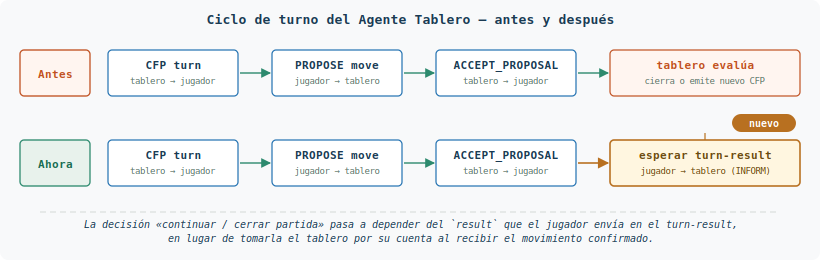
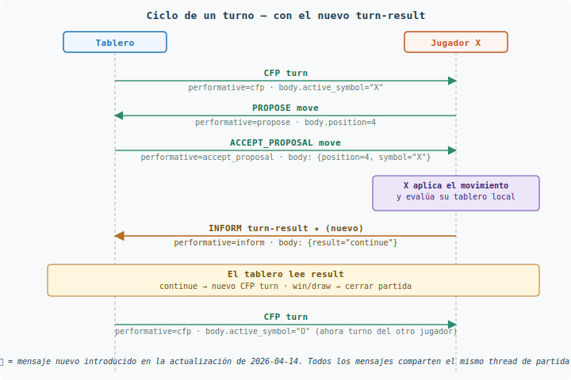

# Cambios a implementar — Notas para los alumnos

**Fechas:** 2026-04-14 (turn-result) · 2026-04-23 (thread único y
`game-start` enriquecido) · 2026-04-30 (vocabulario de
performativas + `ContenidoMensaje`) · **2026-04-30** (lanzador con
modalidades `laboratorio` / `torneo` y generación automática de
agentes)
**Alcance:** paquete `ontologia/`, `config/`, `main.py` y la suite
`tests/`
**Afecta a:** implementación del Agente Tablero y del Agente Jugador,
y configuración del entorno (lanzador y ficheros YAML)

Este documento es la vista de conjunto de los cambios que el alumno
debe contemplar para mantener al día su práctica.  Antes recogía solo
modificaciones de la ontología; con la última tanda incluye también
cambios de configuración y de lanzamiento del sistema.  Los cambios
llegan en cuatro tandas:

1. **Tanda de 2026-04-14** — se añade la acción `turn-result`
   (INFORM Jugador → Tablero) para cerrar el ciclo Contract Net de
   cada turno.
2. **Tanda de 2026-04-23** — se unifica la generación de threads con
   la nueva utilidad `crear_thread_unico`, se eleva el thread de la
   partida al cuerpo del `game-start` y se amplía la firma de
   `crear_mensaje_join`.
3. **Tanda de 2026-04-30 (ontología)** — se añade un vocabulario de
   constantes simbólicas para las performativas FIPA
   (`PERFORMATIVA_REQUEST`, `PERFORMATIVA_INFORM`, …) y los
   constructores `crear_cuerpo_*` pasan a devolver una tupla nombrada
   `ContenidoMensaje (performativa, cuerpo)` para que la performativa
   siempre viaje emparejada con su body. **Cambio de tipo de retorno:
   rompe la compatibilidad con la firma anterior.**
4. **Tanda de 2026-04-30 (lanzador)** — `main.py` deja de leer una
   lista plana de agentes y pasa a **generarlos automáticamente** a
   partir del usuario UJA y de la modalidad activa
   (`laboratorio` o `torneo`).  El supervisor sale de
   `config/agents.yaml` (se ejecuta por separado con
   `supervisor_main.py`) y los jugadores se reparten **uniformemente
   entre los niveles de estrategia** indicados por el alumno, con el
   nivel embebido en el nombre del agente.

La explicación detallada de la segunda tanda, con diagramas y
ejemplos, vive en
[`doc/GUIA_THREAD_Y_GAME_START.md`](doc/GUIA_THREAD_Y_GAME_START.md).
Este documento es la vista de conjunto: recoge todas las tandas en un
mismo sitio para que el alumno vea de un golpe qué tiene que adaptar
en su código y su configuración.

---

## 1. Resumen de cambios

| Elemento | Antes | Ahora |
|---|---|---|
| Subesquemas del `oneOf` | 12 | **13** |
| Entradas en `CAMPOS_POR_ACCION` | 9 | **10** |
| Mensaje Jugador → Tablero «resultado del turno» | no existía | `turn-result` (2026-04-14) |
| Performativas en `PERFORMATIVA_POR_ACCION` | 10 | **11** |
| Constantes simbólicas de performativas | no existían | **9** (`PERFORMATIVA_REQUEST`, …) (2026-04-30) |
| Conjunto agregado `PERFORMATIVAS_VALIDAS` | no existía | `frozenset` con las 9 constantes (2026-04-30) |
| Constructores `crear_cuerpo_*` en `ontologia.py` | 13 | **14** |
| Tipo de retorno de `crear_cuerpo_*` | `str` (solo body JSON) | **`ContenidoMensaje(performativa, cuerpo)`** (2026-04-30) |
| Campos del `game-start` | `opponent` | `opponent`, **`thread`** (2026-04-23) |
| Firma de `crear_cuerpo_game_start` | `(oponente)` | `(oponente, thread_partida)` (2026-04-23) |
| Firma de `crear_mensaje_join` | `(jid_tablero)` | `(jid_tablero, jid_jugador)` (2026-04-23) |
| Utilidad para generar threads únicos | no existía | **`crear_thread_unico`** (2026-04-23) |
| Reglas cruzadas en `validar_cuerpo` | 4 | **5** |
| Tests en `tests/test_ontologia.py` | 61 | **116** |

A efectos del protocolo, los cambios son **aditivos y bien
delimitados**: nada de lo que ya funcionaba ha cambiado de semántica.
Sí han cambiado **tres firmas/retornos** de la API pública:

- `crear_cuerpo_game_start` (2026-04-23) — argumentos.
- `crear_mensaje_join` (2026-04-23) — argumentos.
- **Todos los `crear_cuerpo_*` (2026-04-30)** — ahora devuelven una
  `ContenidoMensaje(performativa, cuerpo)` en lugar de `str`. Donde
  antes asignabas `mensaje.body = crear_cuerpo_X(...)` ahora hay que
  desempaquetar la tupla.

El compilador no puede avisarte de estos cambios; revisa los puntos
de llamada al actualizar tu código.

---

## 2. Qué se ha añadido

### 2.A Tanda de 2026-04-14 — `turn-result`

#### 2.A.1 Nuevo tipo de mensaje `turn-result`

Cierra un hueco del protocolo Contract Net: tras cada turno, el
**jugador activo** informa al tablero del estado de la partida según
su propia evaluación del tablero local.

| Campo | Tipo | Obligatorio | Valores |
|---|---|---|---|
| `action` | string | sí | `"turn-result"` |
| `result` | string | sí | `"continue"` \| `"win"` \| `"draw"` |
| `winner` | string \| null | condicional | `"X"` \| `"O"` \| `null` |

- Si `result == "win"` ⇒ `winner` **obligatorio** (y no nulo).
- Si `result == "draw"` ⇒ `winner` debe ser `null`.
- Si `result == "continue"` ⇒ `winner` debe ser `null`.

**Performativa FIPA:** `INFORM`. Se consulta con
`obtener_performativa("turn-result")`.

**Dirección:** Jugador activo → Tablero (punto a punto, identificado
por `thread` como el resto de mensajes de partida).

#### 2.A.2 Nuevo constructor `crear_cuerpo_turn_result`

```python
from ontologia import crear_cuerpo_turn_result

# Partida en curso — ni victoria ni empate
contenido = crear_cuerpo_turn_result("continue")

# El movimiento que acabo de confirmar me da tres en raya
contenido = crear_cuerpo_turn_result("win", "X")

# Tablero lleno sin ganador
contenido = crear_cuerpo_turn_result("draw")

# Uso del valor devuelto (a partir de 2026-04-30):
mensaje.set_metadata("performative", contenido.performativa)  # "inform"
mensaje.body = contenido.cuerpo
```

El constructor **valida por construcción**: si pasas
`crear_cuerpo_turn_result("win")` sin ganador, o
`crear_cuerpo_turn_result("continue", "X")` con ganador cuando no lo
hay, lanza `ValueError`. No hace falta validar los parámetros a mano
en el behaviour que lo invoca.

#### 2.A.3 Nuevas reglas cruzadas

El validador `validar_cuerpo` incluye la regla:

> Si `result == "continue"`, entonces `winner` debe ser `null`.

Esta regla complementa las tres que ya existían
(`win` ⇒ `winner` obligatorio, `draw` ⇒ `winner=null`,
`aborted` ⇒ `reason` obligatorio) y cierra el cuadro semántico del
campo `result` en cualquier mensaje.

Además la regla de `result="win"` se robustece: antes comprobaba
`"winner" not in cuerpo`, con lo que un mensaje con `winner: null`
explícito no disparaba; ahora se comprueba
`cuerpo.get("winner") is None`, que cubre ambos casos.

### 2.B Tanda de 2026-04-23 — thread único y `game-start`

#### 2.B.1 Utilidad `crear_thread_unico`

Se añade a `ontologia/ontologia.py`:

```python
from ontologia import (
    crear_thread_unico,
    PREFIJO_THREAD_JOIN, PREFIJO_THREAD_GAME, PREFIJO_THREAD_REPORT,
)

hilo = crear_thread_unico(str(self.agent.jid), PREFIJO_THREAD_GAME)
# → 'game-tablero_01-7f3cab92d4e14f7b9a1c0e2f8d5b6a3c'
```

El identificador combina **prefijo semántico** + **parte local del
JID emisor** + **UUID4 hexadecimal (128 bits)**. De esa forma es
imposible que dos agentes distintos del torneo generen el mismo
thread, ni siquiera aunque coincidan en el instante exacto de
creación.

**Regla general:** siempre que un agente necesite fijar el thread de
una conversación (`join`, `game-start`/partida, `game-report`…)
**debe** obtenerlo mediante `crear_thread_unico`. Las tres constantes
`PREFIJO_THREAD_*` existen para que todos los alumnos usen el mismo
vocabulario.

#### 2.B.2 El `game-start` incluye ahora `thread` en el cuerpo

El subesquema `MensajeGameStart` pasa a tener tres campos obligatorios:

| Campo | Tipo | Valor |
|---|---|---|
| `action` | string | `"game-start"` |
| `opponent` | string (no vacío) | JID del rival |
| `thread` | string (no vacío) | identificador de la partida |

Razón de ser: el `game-start` es el mensaje que cierra la inscripción
y abre la partida. Al incluir el thread también en el cuerpo, el
jugador puede construir el template de su behaviour de partida
**inmediatamente** al recibir `game-start`, sin esperar al primer
`CFP turn`. Evita una ventana de carrera en la que el turno podría
llegar antes de que el jugador haya registrado el filtro.

**Invariante:** `msg.thread == json.loads(msg.body)["thread"]`. Son
el mismo valor, en dos sitios, por conveniencia del receptor.

#### 2.B.3 Firma ampliada de `crear_cuerpo_game_start`

```python
# Antes (anterior a 2026-04-23, retorno str):
body = crear_cuerpo_game_start("jugador_o@localhost")

# Tras 2026-04-23 (sigue devolviendo str):
body = crear_cuerpo_game_start(
    oponente="jugador_o@localhost",
    thread_partida=thread_partida,
)

# Tras 2026-04-30 (devuelve ContenidoMensaje):
contenido = crear_cuerpo_game_start(
    oponente="jugador_o@localhost",
    thread_partida=thread_partida,
)
mensaje.set_metadata("performative", contenido.performativa)  # "inform"
mensaje.body = contenido.cuerpo
```

Si pasas una cadena vacía en cualquiera de los dos argumentos, el
constructor lanza `ValueError` (validación por construcción).

#### 2.B.4 Firma ampliada de `crear_mensaje_join`

```python
# Antes — el alumno tenía que añadir el thread a mano
mensaje = crear_mensaje_join(jid_tablero)
mensaje.thread = algun_identificador_generado_localmente

# Ahora — la función se encarga
mensaje = crear_mensaje_join(jid_tablero, str(self.agent.jid))
```

Internamente, `crear_mensaje_join` invoca `crear_thread_unico` con
`PREFIJO_THREAD_JOIN` y el JID del jugador, fijando `mensaje.thread`
antes de devolver el `Message`.

### 2.C Tanda de 2026-04-30 — vocabulario de performativas y `ContenidoMensaje`

Esta tanda persigue dos objetivos didácticos:

- Que **todos los agentes del torneo escriban exactamente la misma
  cadena** al fijar el `performative` de un mensaje (sin erratas,
  sin variantes en mayúsculas, sin guiones ni guiones bajos
  intercambiados).
- Que el **alumno no pueda desincronizar la performativa y el
  cuerpo**: como ambos viajan emparejados en el `ContenidoMensaje`
  que devuelven los constructores, no hay forma de elegir una
  performativa incompatible con la `action` del body.

#### 2.C.1 Vocabulario de constantes simbólicas

Se añaden a `ontologia/ontologia.py` y se re-exportan desde
`ontologia/__init__.py` las nueve performativas FIPA-ACL que usa el
sistema:

```python
from ontologia import (
    PERFORMATIVA_REQUEST,         # "request"
    PERFORMATIVA_AGREE,           # "agree"
    PERFORMATIVA_REFUSE,          # "refuse"
    PERFORMATIVA_FAILURE,         # "failure"
    PERFORMATIVA_INFORM,          # "inform"
    PERFORMATIVA_CFP,             # "cfp"
    PERFORMATIVA_PROPOSE,         # "propose"
    PERFORMATIVA_ACCEPT_PROPOSAL, # "accept_proposal"
    PERFORMATIVA_REJECT_PROPOSAL, # "reject_proposal"
    PERFORMATIVAS_VALIDAS,        # frozenset con las nueve
)
```

**Regla:** allí donde tu código escriba `"request"`, `"inform"`,
etc. como cadena literal (al fijar `performative` de un mensaje, al
construir un `Template`, al comparar la performativa de un mensaje
recibido…), debes sustituirla por la constante correspondiente. Así,
si alguien escribe mal `"REQUEST"` o `"requst"` el error salta en
*import time* (`NameError`), no en el torneo.

`PERFORMATIVA_POR_ACCION` sigue existiendo y ahora se define usando
estas constantes, así que su contenido es exactamente el mismo. La
función `obtener_performativa(accion)` no cambia.

#### 2.C.2 Tipo `ContenidoMensaje` (NamedTuple)

Se añade el tipo:

```python
class ContenidoMensaje(NamedTuple):
    performativa: str   # uno de los valores PERFORMATIVA_*
    cuerpo: str         # body JSON serializado, listo para mensaje.body
```

#### 2.C.3 Cambio de tipo de retorno de los constructores

**Todos** los `crear_cuerpo_*` devuelven ahora `ContenidoMensaje` en
lugar de `str`. La performativa se resuelve internamente y siempre es
coherente con la `action` del body:

```python
# Antes
mensaje.set_metadata("performative", obtener_performativa("turn"))
mensaje.body = crear_cuerpo_turn(simbolo_activo)

# Ahora
contenido = crear_cuerpo_turn(simbolo_activo)
mensaje.set_metadata("performative", contenido.performativa)
mensaje.body = contenido.cuerpo
```

`ContenidoMensaje` es una `NamedTuple`, así que también se puede
desempaquetar:

```python
performativa, cuerpo = crear_cuerpo_turn(simbolo_activo)
```

#### 2.C.4 Casos especiales: `move_confirmado`, `game-report` y `game-report-refused`

Tres constructores **sobreescriben** la performativa por defecto que
devolvería `obtener_performativa(accion)`, porque en su contexto la
acción no determina unívocamente el rol comunicativo. Si tu código
hacía la misma sobreescritura a mano, ahora ya viene resuelta:

| Constructor | Performativa devuelta | Por qué |
|---|---|---|
| `crear_cuerpo_move_confirmado(pos, simbolo)` | `ACCEPT_PROPOSAL` | El tablero confirma el `move` propuesto por el jugador (que viajaba con `PROPOSE`). |
| `crear_cuerpo_game_report(...)` | `INFORM` | La acción `game-report` del **supervisor → tablero** es REQUEST; la respuesta del **tablero → supervisor** con los datos de la partida es INFORM. |
| `crear_cuerpo_game_report_refused()` | `REFUSE` | El tablero rechaza entregar el informe porque la partida no ha finalizado. |

Los demás constructores devuelven la performativa que ya estaba en
el mapa `PERFORMATIVA_POR_ACCION`.

#### 2.C.5 ¿Y `obtener_performativa(accion)`?

La función sigue existiendo y devuelve la performativa por defecto
de cada acción. Su uso recomendado pasa a ser **excepcional**:
construir un `Template` para filtrar mensajes entrantes por
performativa cuando aún no hay un body con el que invocar
`crear_cuerpo_*`. En ese caso conviene usar las constantes
directamente:

```python
plantilla = Template()
plantilla.set_metadata("performative", PERFORMATIVA_REQUEST)
plantilla.set_metadata("ontology", ONTOLOGIA)
plantilla.set_metadata("conversation-id", "join")
```

---

## 3. Lo que NO cambia

- `game-over` sigue representando **cierres anómalos** (movimiento
  inválido, timeout individual, timeout doble). Su contrato no se
  toca: `reason` obligatorio con enum
  `{"invalid", "timeout", "both-timeout"}` y `winner` opcional
  (`null` en `both-timeout`).
- Los tres mensajes del protocolo supervisor (`game-report` en sus
  tres variantes) no cambian de campos.
- Los constructores previos `crear_cuerpo_join`,
  `crear_cuerpo_move`, `crear_cuerpo_turn`, `crear_cuerpo_game_over`,
  etc. mantienen firma y semántica. **Excepción**:
  `crear_cuerpo_game_start` y `crear_mensaje_join` sí han cambiado de
  firma (ver § 2.B.3 y § 2.B.4).
- La carga del esquema
  (`_DIRECTORIO_ACTUAL / "ontologia_tictactoe.schema.json"`) sigue
  siendo relativa al paquete `ontologia/`, sin cambios para el
  alumno.
- El identificador de conversación `conversation-id` solo se usa en
  los REQUEST que inician protocolo (`"join"` y `"game-report"`); el
  resto de mensajes se correlacionan por `thread`.

---

## 4. Qué debe cambiar el alumno en su implementación

### 4.1 Agente Tablero

#### 4.1.1 Ciclo de turnos — nuevo estado de espera (tanda 2026-04-14)

El ciclo de un turno añade un paso respecto a la versión anterior:



Consecuencias para el behaviour de turno:

- **Añade un estado nuevo** a la FSM del tablero (p. ej.
  `ESPERANDO_TURN_RESULT`) entre «movimiento confirmado» y
  «siguiente turno». Este estado filtra con `Template` por
  `performative="inform"` y `thread=<id_partida>`.
- **No emitas el siguiente `CFP turn`** hasta haber recibido y
  validado el `turn-result`. Si ya lo enviabas inmediatamente después
  del `ACCEPT_PROPOSAL`, debes aplazarlo.
- **Tiempo de espera:** decide un timeout razonable para
  `turn-result`. Si expira, cierra la partida con
  `crear_cuerpo_game_over("timeout", simbolo_rival)` porque el
  jugador activo ha incumplido el protocolo.
- **Doble verificación recomendada:** aunque el jugador te diga que
  `result="win"`, el tablero debería comprobar por sí mismo el
  estado de su tablero local antes de darlo por válido. La palabra
  del jugador es la que cierra formalmente la partida, pero el
  tablero es el árbitro último en caso de torneo (es una defensa
  simple contra agentes maliciosos de otros alumnos).

```python
# Dentro del behaviour que espera el turn-result
from ontologia import validar_cuerpo
import json

cuerpo = json.loads(msg.body)
resultado = validar_cuerpo(cuerpo)
if resultado["valido"]:
    if cuerpo["result"] == "continue":
        # Conmutar simbolo activo y emitir nuevo CFP turn
        ...
    elif cuerpo["result"] == "win":
        ganador = cuerpo["winner"]
        # Cerrar partida, almacenar ganador, eventualmente
        # responder a game-report del supervisor
        ...
    elif cuerpo["result"] == "draw":
        # Cerrar partida como empate
        ...
else:
    # Protocolo incumplido: turn-result malformado
    # Opcional: game-over con reason="invalid"
    ...
```

#### 4.1.2 Generación del thread de partida (tanda 2026-04-23)

Al formar pareja (tras enviar el segundo `join-accepted`), el tablero
debe generar **un thread único por partida** con la utilidad común y
usarlo en **todos** los mensajes de esa partida:

```python
from ontologia import (
    ONTOLOGIA,
    PREFIJO_THREAD_GAME,
    crear_cuerpo_game_start,
    crear_thread_unico,
)

thread_partida = crear_thread_unico(
    str(self.agent.jid), PREFIJO_THREAD_GAME,
)

for jid_jugador, jid_oponente in ((jid_x, jid_o), (jid_o, jid_x)):
    contenido = crear_cuerpo_game_start(
        oponente=str(jid_oponente),
        thread_partida=thread_partida,
    )
    mensaje = Message(to=str(jid_jugador))
    mensaje.set_metadata("ontology", ONTOLOGIA)
    mensaje.set_metadata("performative", contenido.performativa)
    mensaje.thread = thread_partida
    mensaje.body = contenido.cuerpo
    await self.send(mensaje)
```

> **Cambio 2026-04-30:** ya no es necesario importar
> `obtener_performativa`. El `contenido` devuelto trae la
> performativa correcta (`PERFORMATIVA_INFORM`) emparejada con el
> body.

A partir de aquí, todos los `CFP turn`, `ACCEPT_PROPOSAL`,
`turn-result` y (en su caso) `game-over` de esta partida se envían
con `msg.thread = thread_partida`.

#### 4.1.3 Impacto en el informe al supervisor

`game-report` hacia el supervisor no cambia de campos. Lo único que
cambia es que el tablero ahora **conoce antes** el resultado (se lo
ha dicho el jugador), así que puede construirlo con menos
ambigüedad. El valor del campo `result` en `game-report` puede
derivarse directamente del `result` del `turn-result` recibido,
excepto el caso `aborted`, que sigue viniendo de un cierre por
`game-over`.

### 4.2 Agente Jugador

#### 4.2.1 Usar `crear_mensaje_join` con la nueva firma

El `REQUEST join` debe construirse con los dos argumentos:

```python
from ontologia import crear_mensaje_join

mensaje = crear_mensaje_join(jid_tablero, str(self.agent.jid))
await self.send(mensaje)
```

`crear_mensaje_join` se encarga internamente de fijar el `thread`
con `crear_thread_unico`; el alumno no debe asignarlo a mano.

#### 4.2.2 Registrar el behaviour de partida al recibir `game-start`

El cuerpo del `game-start` trae el `thread` de la partida. El
jugador debe leerlo inmediatamente y registrar un behaviour de
partida cuyo `Template` filtre por ese thread, **antes** de
devolver el control al bucle SPADE:

```python
import json
from spade.template import Template
from ontologia import ONTOLOGIA

cuerpo = json.loads(msg.body)
thread_partida = cuerpo["thread"]
oponente = cuerpo["opponent"]

plantilla = Template()
plantilla.thread = thread_partida
plantilla.set_metadata("ontology", ONTOLOGIA)

self.agent.add_behaviour(
    BehaviourPartida(oponente, self.simbolo_propio),
    plantilla,
)
```

Así, cuando llegue el primer `CFP turn`, encontrará ya su template
registrado y se encaminará al behaviour correcto.

#### 4.2.3 Aplicar, evaluar, informar (ciclo de turno)

Tras recibir el `ACCEPT_PROPOSAL` del tablero con su propio
movimiento confirmado (es decir, cuando el `symbol` del mensaje
coincide con el símbolo propio del jugador), el jugador activo debe:

1. **Aplicar** la posición confirmada en su tablero local.
2. **Evaluar** si hay línea ganadora, empate (tablero lleno sin
   ganador) o continuación.
3. **Emitir** `turn-result` con la performativa `inform` al tablero,
   usando el constructor correspondiente.

```python
from ontologia import ONTOLOGIA, crear_cuerpo_turn_result

# Suponiendo que estrategia.evaluar(tablero_local, simbolo_propio)
# devuelve ("continue"|"win"|"draw", ganador_o_None).
resultado, ganador = evaluar(tablero_local, simbolo_propio)

contenido = crear_cuerpo_turn_result(resultado, ganador)

respuesta = Message(to=str(jid_tablero))
respuesta.set_metadata("ontology", ONTOLOGIA)
respuesta.set_metadata("performative", contenido.performativa)  # "inform"
respuesta.thread = thread_partida
respuesta.body = contenido.cuerpo
await self.send(respuesta)
```

> **Cambio 2026-04-30:** se importa solo el constructor; ya no hace
> falta `obtener_performativa`. El `thread` se asigna a
> `respuesta.thread` (atributo SPADE), no como metadato.

#### 4.2.4 Jugador no-activo

El `ACCEPT_PROPOSAL` también llega al jugador no-activo (el tablero
lo notifica a ambos para que mantengan su tablero local
sincronizado). El jugador no-activo debe:

- Aplicar el movimiento en su tablero local.
- **No** emitir `turn-result`. Esa responsabilidad es exclusiva del
  jugador activo.
- Esperar el siguiente mensaje del tablero (normalmente otro
  `CFP turn` o, si la partida terminó, la notificación
  correspondiente).

### 4.3 Validación recíproca

Los alumnos deben incluir en sus tests unitarios del behaviour del
tablero al menos dos escenarios nuevos para la tanda 2026-04-14:

1. **Secuencia feliz:** `CFP turn` → `PROPOSE move` →
   `ACCEPT_PROPOSAL` → `INFORM turn-result (continue)` → se emite
   nuevo `CFP turn`.
2. **Cierre por victoria:** igual pero con
   `INFORM turn-result (win, X)` → no se emite nuevo `CFP turn`, la
   partida cierra y el tablero queda listo para responder a
   `game-report`.

Un escenario adicional para el jugador:

3. Tras recibir `ACCEPT_PROPOSAL` con su propio símbolo, el jugador
   construye un `turn-result` con los campos correctos y lo envía
   con performativa `inform`.

Para la tanda 2026-04-23 conviene añadir además:

4. Tras recibir `game-start`, `self.agent.behaviours` contiene un
   behaviour cuyo template filtra exactamente el `thread` incluido
   en `body["thread"]`.
5. Dos invocaciones consecutivas de `crear_mensaje_join` con los
   mismos JIDs producen threads distintos (garantía del UUID4).

Para la tanda 2026-04-30 conviene añadir además:

6. Para cada constructor `crear_cuerpo_*` que use el alumno: el
   valor devuelto es una `ContenidoMensaje` con `performativa`
   correcta y `cuerpo` que pasa `validar_cuerpo`.
7. Cualquier asignación del estilo `mensaje.body = crear_cuerpo_X(...)`
   (sin `.cuerpo`) provoca un `TypeError` en SPADE al intentar
   serializar el body — verificar que ya no queda ninguna en el
   código del alumno.

---

## 5. Cambios en los tests del proyecto

- `tests/test_ontologia.py` acumula las tres tandas y pasa de 61 a
  **116 tests** verdes.
- Se renombró `test_esquema_tiene_12_subesquemas` a
  `test_esquema_tiene_13_subesquemas`.
- `test_todas_acciones_en_mapa` ahora espera
  `len(CAMPOS_POR_ACCION) == 10`.
- Tests específicos añadidos para la tanda 2026-04-23:
  `test_game_start_incluye_thread_en_body`,
  `test_game_start_con_thread_generado_dinamicamente`,
  `test_game_start_thread_vacio_lanza_error`,
  `test_game_start_sin_thread_en_body_falla_validacion`,
  `test_thread_generado_con_crear_thread_unico` y
  `test_threads_de_llamadas_distintas_son_distintos`.
- Tests específicos añadidos para la tanda 2026-04-30
  (clases `TestVocabularioPerformativas` y
  `TestContratoContenidoMensaje`):
  - `test_constantes_tienen_valores_fipa_canonicos`
  - `test_conjunto_validas_contiene_todas`
  - `test_mapa_accion_performativa_usa_constantes`
  - `test_<accion>_devuelve_<performativa>` para los 14
    constructores (incluidos los tres que sobreescriben performativa)
  - `test_namedtuple_es_iterable_como_tupla`
  - `test_cuerpo_es_json_valido`
  - `test_performativa_coincide_con_mapa_accion`

Para ejecutarlos:

```bash
pytest tests/test_ontologia.py -v
```

Si algún test de behaviours o de integración del alumno estaba
verificando `len(ACCIONES_VALIDAS) == 9` o similares, debe
actualizarse a 10. Si verificaba la firma antigua de
`crear_cuerpo_game_start` o `crear_mensaje_join`, también.

**Para la tanda 2026-04-30:** todo test del alumno que invoque un
`crear_cuerpo_*` y compare con `str` debe actualizarse para extraer
`.cuerpo`. Por ejemplo:

```python
# Antes
assert json.loads(crear_cuerpo_join())["action"] == "join"

# Ahora
assert json.loads(crear_cuerpo_join().cuerpo)["action"] == "join"
```

---

## 6. Mapa resumen del ciclo de un turno



El bloque nuevo respecto a versiones anteriores es el mensaje
`INFORM turn-result`. Todos los mensajes de la partida comparten el
mismo `thread` (el que el tablero generó con `crear_thread_unico` al
formar pareja y publicó en el cuerpo del `game-start`).

---

## 7. Checklist para el alumno

Antes de dar por terminada la actualización en su código:

### Tanda 2026-04-14 (turn-result)

- [ ] El Agente Tablero tiene un estado/behaviour que espera
      `turn-result` tras cada `ACCEPT_PROPOSAL` enviado.
- [ ] El Agente Tablero cierra la partida al recibir `result="win"` o
      `result="draw"` y no emite un nuevo `CFP turn`.
- [ ] El Agente Tablero emite `game-over` con `reason="timeout"` si
      expira la espera del `turn-result`.
- [ ] El Agente Jugador, cuando es activo, evalúa su tablero local
      tras aplicar el movimiento confirmado y emite `turn-result`
      con la performativa `inform`.
- [ ] El Agente Jugador usa `crear_cuerpo_turn_result` (nunca
      construye el JSON a mano).

### Tanda 2026-04-23 (thread único y `game-start`)

- [ ] Cualquier thread que el agente fije en un mensaje proviene de
      una llamada a `crear_thread_unico` con uno de los prefijos
      canónicos.
- [ ] El Agente Tablero genera un nuevo `thread_partida` al formar
      cada pareja (no una sola vez en `setup()`).
- [ ] El Agente Tablero construye `game-start` con
      `crear_cuerpo_game_start(oponente, thread_partida)` y fija el
      mismo valor en `msg.thread`.
- [ ] El Agente Jugador usa
      `crear_mensaje_join(jid_tablero, str(self.agent.jid))` (firma
      de dos argumentos) y no fija el thread a mano.
- [ ] El Agente Jugador, al recibir `game-start`, lee
      `body["thread"]` y registra su behaviour de partida con un
      `Template` que filtre por ese thread antes de devolver el
      control al bucle SPADE.

### Tanda 2026-04-30 (vocabulario y `ContenidoMensaje`)

- [ ] El alumno **no escribe cadenas literales** del estilo
      `"request"`, `"inform"`, `"propose"`, etc. en su código. En su
      lugar importa `PERFORMATIVA_REQUEST`, `PERFORMATIVA_INFORM`,
      … desde `ontologia`.
- [ ] Toda llamada a `crear_cuerpo_*(...)` en el código del alumno
      almacena el resultado en una variable (`contenido`,
      `mensaje_construido`, …) y usa **dos campos**:
      `contenido.performativa` para `mensaje.set_metadata("performative", ...)`
      y `contenido.cuerpo` para `mensaje.body`.
- [ ] No queda ningún `mensaje.body = crear_cuerpo_X(...)` (sin
      `.cuerpo`) en el código del alumno.
- [ ] No queda ninguna llamada superflua a
      `obtener_performativa(accion)` cuando ya se está usando
      `crear_cuerpo_*` para esa misma acción (la performativa
      ya viene en `contenido.performativa`).
- [ ] Si el alumno construye un `Template` para filtrar por
      performativa entrante, usa las constantes (`PERFORMATIVA_CFP`,
      `PERFORMATIVA_ACCEPT_PROPOSAL`, …) en vez de literales.
- [ ] El `move` confirmado por el tablero viaja con
      `PERFORMATIVA_ACCEPT_PROPOSAL` (lo aporta
      `crear_cuerpo_move_confirmado`); el alumno **no debe**
      sobreescribirlo a `PROPOSE`.

### Validación final

- [ ] Los tests de ontología pasan: `pytest tests/test_ontologia.py -v`
      devuelve **116 passed**.
- [ ] Los tests propios de behaviours cubren los escenarios
      descritos en § 4.3.

---

## 8. Guía rápida de migración para la tanda 2026-04-30

Esta sección es una *cheat sheet* para localizar y actualizar todos
los puntos de tu código afectados por la tanda 2026-04-30. Aplica
los pasos en este orden:

### 8.1 Buscar y reemplazar literales de performativas

En todos los ficheros `.py` de tu agente:

```bash
# Localiza cadenas literales de performativas (revisa caso a caso)
grep -nR --include='*.py' \
  -E '"(request|agree|refuse|failure|inform|cfp|propose|accept_proposal|reject_proposal)"' \
  src/
```

Sustituir por la constante simbólica importada:

| Literal | Constante |
|---|---|
| `"request"` | `PERFORMATIVA_REQUEST` |
| `"agree"` | `PERFORMATIVA_AGREE` |
| `"refuse"` | `PERFORMATIVA_REFUSE` |
| `"failure"` | `PERFORMATIVA_FAILURE` |
| `"inform"` | `PERFORMATIVA_INFORM` |
| `"cfp"` | `PERFORMATIVA_CFP` |
| `"propose"` | `PERFORMATIVA_PROPOSE` |
| `"accept_proposal"` | `PERFORMATIVA_ACCEPT_PROPOSAL` |
| `"reject_proposal"` | `PERFORMATIVA_REJECT_PROPOSAL` |

### 8.2 Buscar usos de los constructores `crear_cuerpo_*`

```bash
grep -nR --include='*.py' 'crear_cuerpo_' src/
```

Para cada hit aplica el patrón de migración:

```python
# ❌ Patrón antiguo (resulta en TypeError tras 2026-04-30)
mensaje.body = crear_cuerpo_X(...)
mensaje.set_metadata("performative", obtener_performativa("X"))

# ✅ Patrón nuevo
contenido = crear_cuerpo_X(...)
mensaje.body = contenido.cuerpo
mensaje.set_metadata("performative", contenido.performativa)
```

### 8.3 Eliminar imports superfluos

Si tras la migración tu agente ya no llama a `obtener_performativa`
en ningún sitio, **elimina el import** del módulo `ontologia` para
mantener el código limpio.

### 8.4 Verificar

```bash
pytest tests/test_ontologia.py -v
pytest tests/ -v   # tus tests propios
python main.py     # smoke test contra el servidor XMPP
```

Si los tests propios fallan con `TypeError: expected str, got
ContenidoMensaje`, todavía queda algún `mensaje.body = crear_cuerpo_X(...)`
sin migrar.

---

## 9. Tanda 2026-04-30 (lanzador) — Modalidades y generación automática de agentes

Esta tanda **no toca la ontología**: cambia cómo se construye el
conjunto de agentes que el lanzador `main.py` arranca.  El objetivo
es que el alumno escriba **cero JIDs** en el código y en la
configuración: basta con indicar su usuario UJA y la modalidad
(`laboratorio` o `torneo`) y el sistema genera automáticamente la
lista completa de agentes propios, con nombres únicos y puertos web
sin colisiones.

### 9.1 Resumen del cambio

| Elemento | Antes | Ahora |
|---|---|---|
| `config/agents.yaml` | Lista plana de agentes concretos (con JIDs) | **Plantillas** (`plantilla_tablero`, `plantilla_jugador`) y cantidades por modalidad |
| Agente supervisor en `agents.yaml` | Sí | **No** — se ejecuta aparte con `python supervisor_main.py --modo …` |
| Selección de modalidad | No existía | Sección `alumno.modalidad` en `config.yaml` (`laboratorio` \| `torneo`) |
| Estrategia de los jugadores | Campo escalar `nivel_estrategia` | **Lista** `niveles_estrategia` con reparto uniforme |
| Nombre de los agentes jugador | `jugador_<algo>` | **`jugador_<usuario>_n<NIVEL>_NN`** (nivel visible en el JID) |
| Asignación de puertos web a tableros | Manual en YAML | **Automática**: `puerto_web_base + índice` |
| Función pública en `config/configuracion.py` | `cargar_agentes` | `cargar_plantillas` + `generar_agentes` |

### 9.2 Cambios en `config/config.yaml`

Se añade una nueva sección `alumno`:

```yaml
alumno:
  # Nombre de usuario UJA del alumno (parte local del JID)
  usuario_uja: alumno_demo

  # Modalidad activa: "laboratorio" o "torneo"
  modalidad: laboratorio

  # Lista de niveles de estrategia que se desean probar.
  # 1=Posicional  2=Reglas  3=Minimax  4=LLM
  # En LABORATORIO los 12 jugadores se reparten uniformemente
  # entre los niveles indicados (con [1, 2, 3] → 4 jugadores
  # de cada estrategia).
  # En TORNEO se usa el primer nivel de la lista.
  niveles_estrategia: [1, 2, 3]
```

### 9.3 Cambios en `config/agents.yaml`

El fichero deja de contener una lista de agentes concretos.  Su
nuevo contenido se reduce a **plantillas y cantidades**:

```yaml
modalidades:
  laboratorio:
    num_tableros: 4
    num_jugadores: 12
  torneo:
    num_tableros: 1
    num_jugadores: 1

plantilla_tablero:
  clase: AgenteTablero
  modulo: agentes.agente_tablero
  parametros:
    puerto_web_base: 10080   # cada tablero usa puerto_web_base + índice

plantilla_jugador:
  clase: AgenteJugador
  modulo: agentes.agente_jugador
  parametros:
    max_partidas: 3
```

El **agente supervisor desaparece** de este fichero.  Se ejecuta
como proceso independiente:

```bash
python supervisor_main.py --modo laboratorio   # 30 salas (una por puesto)
python supervisor_main.py --modo torneo        # sala compartida
python supervisor_main.py --modo consulta      # solo dashboard histórico
```

### 9.4 Patrón de nombrado de los agentes generados

El lanzador construye los nombres con estos patrones:

- **Tableros:** `tablero_<usuario>_NN` (NN = `01`, `02`, …).
- **Jugadores:** `jugador_<usuario>_n<NIVEL>_NN`, con `<NIVEL>`
  indicando la estrategia (1–4) y `NN` el índice **dentro de ese
  nivel**.

Ejemplo con `usuario_uja: pjavier`, modalidad `laboratorio` y
`niveles_estrategia: [1, 2, 3]`:

| Tableros (4) | Jugadores Posicional (n1) | Jugadores Reglas (n2) | Jugadores Minimax (n3) |
|---|---|---|---|
| `tablero_pjavier_01` | `jugador_pjavier_n1_01` | `jugador_pjavier_n2_01` | `jugador_pjavier_n3_01` |
| `tablero_pjavier_02` | `jugador_pjavier_n1_02` | `jugador_pjavier_n2_02` | `jugador_pjavier_n3_02` |
| `tablero_pjavier_03` | `jugador_pjavier_n1_03` | `jugador_pjavier_n2_03` | `jugador_pjavier_n3_03` |
| `tablero_pjavier_04` | `jugador_pjavier_n1_04` | `jugador_pjavier_n2_04` | `jugador_pjavier_n3_04` |

En modalidad `torneo` se genera un único tablero
(`tablero_<usuario>_01`) y un único jugador con el primer nivel de
la lista (por ejemplo, `jugador_<usuario>_n3_01` si la lista empieza
en 3).

### 9.5 Reparto uniforme de jugadores entre estrategias

Con `num_jugadores = 12` y una lista de `K` niveles:

- Si `12 % K == 0` el reparto es **exactamente igual** entre todos
  los niveles.  Casos típicos: `K = 1, 2, 3, 4, 6, 12`.
- Si la división no es exacta, los **primeros** niveles de la
  lista reciben un jugador extra hasta agotar el resto.  Por
  ejemplo, `[1, 2, 3, 4, 5]` con 12 jugadores produce el reparto
  `3, 3, 2, 2, 2` (suma 12).

Esta política garantiza que el total siempre se preserva y que el
orden de la lista actúa como criterio determinista al deshacer
empates.

### 9.6 Asignación automática de puertos web

Cada agente tablero arranca su propio dashboard en
`puerto_web = puerto_web_base + índice_del_tablero` (con índice
empezando en 0).  Con `puerto_web_base = 10080`:

| Tablero | Puerto |
|---|---|
| `tablero_<usuario>_01` | 10080 |
| `tablero_<usuario>_02` | 10081 |
| `tablero_<usuario>_03` | 10082 |
| `tablero_<usuario>_04` | 10083 |

El alumno **no** tiene que escribir ningún puerto en el YAML; el
lanzador lo calcula y se asegura de que no haya colisiones entre
los tableros generados.

### 9.7 Nuevas funciones en `config/configuracion.py`

La antigua `cargar_agentes(ruta)` ya no existe.  Se sustituye por
dos funciones:

```python
from config.configuracion import cargar_configuracion, cargar_plantillas, generar_agentes

config      = cargar_configuracion()             # config.yaml resuelto
plantillas  = cargar_plantillas()                 # agents.yaml (plantillas)
definiciones = generar_agentes(config, plantillas)  # lista de agentes concretos
```

`generar_agentes(config, plantillas)` devuelve una lista de
diccionarios con la **misma estructura** que producía la antigua
`cargar_agentes` (claves `nombre`, `clase`, `modulo`, `nivel`,
`descripcion`, `parametros`, `activo`), de modo que el resto del
lanzador y los tests pueden tratar el resultado de manera idéntica.

Errores controlados:

- Falta de `alumno.usuario_uja` → `ValueError` claro.
- `niveles_estrategia` vacío o ausente → `ValueError`.
- Modalidad desconocida → `ValueError` con la lista de modalidades
  disponibles.

### 9.8 Cambios en `main.py`

El lanzador sigue **barajando** las definiciones antes de arrancar y
añade retardos aleatorios entre arranques (esa parte no cambia).  Lo
que cambia es la fuente de las definiciones:

```python
# Antes
definiciones = cargar_agentes(ruta_agentes, solo_activos=True)

# Ahora
plantillas   = cargar_plantillas(ruta_agentes)
definiciones = generar_agentes(config, plantillas)
```

### 9.9 Qué debe cambiar el alumno en su entorno

1. **Editar `config/config.yaml`** y rellenar la nueva sección
   `alumno` con su usuario UJA, la modalidad deseada y la lista de
   niveles de estrategia que quiera probar.
2. **No tocar** `config/agents.yaml` salvo que se quiera modificar
   el `puerto_web_base` o `max_partidas` por defecto.
3. **Eliminar de su código** cualquier import o referencia a
   `cargar_agentes`: usar `cargar_plantillas` + `generar_agentes`.
4. **Lanzar el supervisor en otra terminal** con
   `python supervisor_main.py --modo …` (laboratorio, torneo o
   consulta).
5. Verificar que `python main.py` muestra en el log la línea
   `Generados N agentes para modalidad '…'` con los nombres
   esperados antes del barajado.

### 9.10 Tests de la tanda

`tests/test_generacion_agentes.py` cubre las garantías clave de
esta tanda:

- 4 + 12 agentes en laboratorio, 1 + 1 en torneo.
- Patrón de nombrado y unicidad de los nombres generados.
- Asignación automática y sin colisiones del puerto web a los
  tableros.
- Distribución uniforme de los jugadores entre los niveles de
  estrategia (incluido el caso 12 ÷ 5 → `3, 3, 2, 2, 2`).
- Coincidencia entre el sufijo `n<nivel>` del nombre y el parámetro
  `nivel_estrategia` inyectado.
- Errores controlados ante datos faltantes o modalidad inválida.
- Que el supervisor **no** aparezca entre las plantillas.

Ejecución: `pytest tests/test_generacion_agentes.py -v`.

---

## 10. Referencias

- Paquete `ontologia/` del proyecto (contiene el esquema JSON
  generado, el mapa de campos por acción y el módulo `ontologia.py`
  con constructores, utilidades y validadores).
- `tests/test_ontologia.py` como ejemplo de uso correcto de los
  constructores y de las reglas cruzadas.
- [`doc/GUIA_THREAD_Y_GAME_START.md`](doc/GUIA_THREAD_Y_GAME_START.md)
  — guía didáctica completa de la tanda 2026-04-23, con diagramas
  SVG sobre la composición del thread único, el contrato del nuevo
  `game-start` y el modelo proactivo de registro del behaviour de
  partida por parte del jugador.
- [`doc/GUIA_TABLERO_TORNEO.md`](doc/GUIA_TABLERO_TORNEO.md) —
  metadatos por tipo de mensaje, protocolos de inscripción e informe
  al supervisor, y recomendaciones de interoperabilidad en torneo.
- Presentación «Ontología del Tic-Tac-Toe» (PLATEA) — diapositivas
  5, 8, 10, 12, 14 y 17 reflejan el contrato actualizado.
