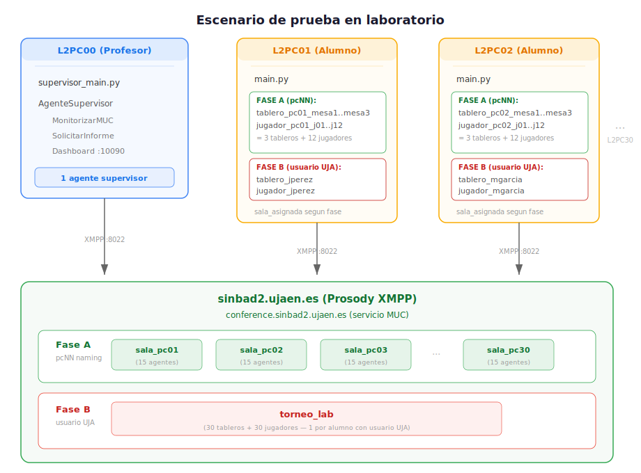
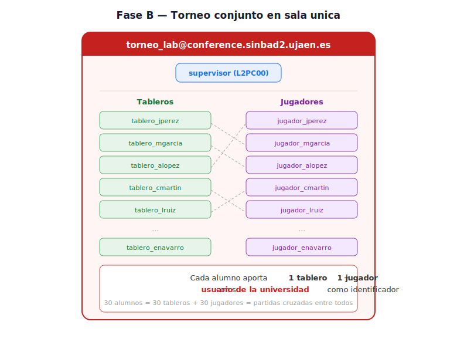
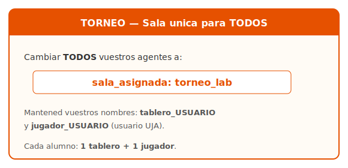
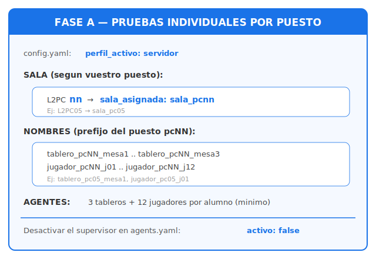
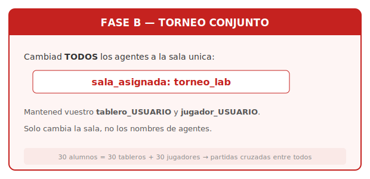

# Guía de prueba del Agente Supervisor en laboratorio

Guía paso a paso para probar el agente supervisor en un entorno real de
laboratorio. El profesor ejecuta el supervisor desde el ordenador
**L2PC00** y cada alumno ejecuta sus propios agentes desde su puesto
(**L2PC01** a **L2PC30**).

La prueba se organiza en **dos fases**:

- **Fase A — Pruebas individuales por puesto**: cada alumno trabaja en
  su propia sala MUC (`sala_pcNN`) con sus tableros y jugadores. Sirve
  para verificar el funcionamiento individual de los agentes de cada
  alumno (partidas completas, protocolo de inscripción, informes de
  partida) y que el supervisor los detecta correctamente. **Superar
  esta fase es el mínimo necesario para considerar la entrega
  completada.**

- **Fase B — Torneo conjunto**: todos los alumnos se unen a una única
  sala MUC compartida (`torneo_lab`), cada uno con un tablero y un
  jugador identificados por su usuario UJA. Se comprueba la
  interoperabilidad entre las implementaciones de diferentes alumnos.

---

## Índice

1. [Requisitos previos](#1-requisitos-previos)
2. [Escenario general](#2-escenario-general)
3. [Fase A — Pruebas individuales por puesto](#3-fase-a--pruebas-individuales-por-puesto)
   - [A.1 Fichero de salas del laboratorio](#a1-fichero-de-salas-del-laboratorio)
   - [A.2 Arrancar el supervisor en modo laboratorio](#a2-arrancar-el-supervisor-en-modo-laboratorio)
   - [A.3 Qué comunicar a los alumnos](#a3-qué-comunicar-a-los-alumnos)
   - [A.4 Qué debe hacer cada alumno en su puesto](#a4-qué-debe-hacer-cada-alumno-en-su-puesto)
   - [A.5 Verificar detección de agentes](#a5-verificar-detección-de-agentes)
   - [A.6 Parada de la Fase A](#a6-parada-de-la-fase-a)
4. [Fase B — Torneo conjunto en sala única](#4-fase-b--torneo-conjunto-en-sala-única)
   - [B.1 Arrancar el supervisor en modo torneo](#b1-arrancar-el-supervisor-en-modo-torneo)
   - [B.3 Qué comunicar a los alumnos para el torneo](#b3-qué-comunicar-a-los-alumnos-para-el-torneo)
   - [B.4 Qué debe hacer cada alumno para el torneo](#b4-qué-debe-hacer-cada-alumno-para-el-torneo)
   - [B.5 Verificar la interoperabilidad](#b5-verificar-la-interoperabilidad)
   - [B.6 Verificar recepción de informes](#b6-verificar-recepción-de-informes)
   - [B.7 Parada de la Fase B](#b7-parada-de-la-fase-b)
5. [Resolución de problemas](#5-resolución-de-problemas)
6. [Resumen rápido de órdenes](#6-resumen-rápido-de-órdenes)

---

## 1. Requisitos previos

### Nomenclatura de los ordenadores del laboratorio

Los ordenadores del laboratorio siguen el patrón **L2PCnn**:

| Puesto        | Identificador | Rol                |
|---------------|---------------|--------------------|
| Profesor      | **L2PC00**    | Ejecuta supervisor |
| Alumno 1      | **L2PC01**    | Ejecuta agentes    |
| Alumno 2      | **L2PC02**    | Ejecuta agentes    |
| ...           | ...           | ...                |
| Alumno 30     | **L2PC30**    | Ejecuta agentes    |

### En el ordenador del profesor (L2PC00)

- Python 3.12 con el entorno virtual del proyecto activado.
- Dependencias instaladas: `pip install -r requirements.txt`.
- Conectividad con el servidor XMPP `sinbad2.ujaen.es` en el puerto
  `8022`.
- Puerto `10090` libre (panel web del supervisor).

### En los ordenadores de los alumnos (L2PC01 a L2PC30)

Los ordenadores del laboratorio de la asignatura ya disponen de:

- Python 3.12 con el entorno virtual del proyecto.
- Dependencias instaladas (`spade`, `pyyaml`, etc.).
- Configuración XMPP con el perfil `servidor` apuntando a
  `sinbad2.ujaen.es:8022` (viene en la plantilla del proyecto).
- Conectividad con el servidor XMPP desde la red del laboratorio.

Cada alumno solo necesita tener **su código de agentes tablero y
jugador funcional**, probado previamente en local con `spade run`.

### Servidor XMPP

- Prosody en `sinbad2.ujaen.es` activo y accesible desde la red del
  laboratorio.
- Servicio MUC disponible en `conference.sinbad2.ujaen.es`.
- `auto_register: true` habilitado (registro automático de cuentas).

### Verificación rápida de conectividad

Pedir a un par de alumnos que ejecuten desde su terminal:

```bash
nc -zv sinbad2.ujaen.es 8022
```

Si responde `Connection ... succeeded`, la red del laboratorio tiene
acceso al servidor XMPP.

---

## 2. Escenario general



**Fase A**: cada alumno trabaja aislado en su sala (`sala_pcNN`) con
3 tableros y 12 jugadores identificados por el número de puesto
(`tablero_pc05_mesa1`, `jugador_pc05_j01`, ...). Se verifica el
funcionamiento individual completo: partidas, informes y detección.

**Fase B**: todos los alumnos confluyen en una única sala
(`torneo_lab`), cada uno con 1 tablero y 1 jugador identificados por
su usuario UJA (`tablero_jperez`, `jugador_jperez`). Se verifica la
interoperabilidad entre implementaciones de diferentes alumnos.

---

## 3. Fase A — Pruebas individuales por puesto

### A.1 Fichero de salas del laboratorio

El fichero `config/salas_laboratorio.yaml` ya viene preparado con una
sala por cada puesto (L2PC01 a L2PC30). Verificar que existe y que
`config/config.yaml` tiene el perfil `servidor` activo:

```yaml
xmpp:
  perfil_activo: servidor
```

### A.2 Arrancar el supervisor en modo laboratorio

Desde el directorio raíz del proyecto, en L2PC00:

```bash
python supervisor_main.py --modo laboratorio
```

Este modo lee automáticamente `config/salas_laboratorio.yaml` y:

1. Carga la configuración XMPP (perfil `servidor` →
   `sinbad2.ujaen.es:8022`).
2. **Crea las 30 salas MUC** en el servidor (un agente temporal se une
   brevemente a cada sala para que Prosody la cree).
3. Crea el agente supervisor (`supervisor@sinbad2.ujaen.es`).
4. El supervisor se une a todas las salas con apodo `supervisor`.
5. Inicia el panel web en el puerto `10090`.

Salida esperada:

```
HH:MM:SS [INFO] supervisor_main — Modo LABORATORIO — fichero de salas:
    config/salas_laboratorio.yaml
HH:MM:SS [INFO] main — Sala MUC 'sala_pc01@conference.sinbad2.ujaen.es' preparada
...
HH:MM:SS [INFO] main — Sala MUC 'sala_pc30@conference.sinbad2.ujaen.es' preparada
HH:MM:SS [INFO] agente_supervisor — Dashboard web del supervisor disponible en
    http://localhost:10090/supervisor
HH:MM:SS [INFO] supervisor_main — Supervisor en ejecución. Pulsa Ctrl+C para detener.
```

Abrir el panel en el navegador del profesor:

```
http://localhost:10090/supervisor
```

---

### A.3 Qué comunicar a los alumnos

Escribir en la pizarra o proyectar las reglas. La configuración XMPP
ya viene preparada en los ordenadores del laboratorio; los alumnos
solo necesitan verificar que `perfil_activo` es `servidor`.

#### Regla de la sala

Cada alumno usa como nombre de sala el identificador de su puesto:

```
Si estás en L2PCnn  →  sala_asignada: sala_pcnn
```

| Puesto  | `sala_asignada` en agents.yaml |
|---------|--------------------------------|
| L2PC01  | `sala_pc01`                    |
| L2PC05  | `sala_pc05`                    |
| L2PC12  | `sala_pc12`                    |
| L2PC30  | `sala_pc30`                    |

#### Convención de nombres de agentes (Fase A)

En esta fase cada alumno crea **3 tableros** y **12 jugadores**,
usando el número de su puesto como prefijo para evitar colisiones:

```
tablero_pcNN_mesaX    →  NN = número de puesto, X = número de mesa (1-3)
jugador_pcNN_jXX      →  NN = número de puesto, XX = número de jugador (01-12)
```

Ejemplos para el alumno en L2PC05:

| Agente                | JID resultante                              |
|-----------------------|---------------------------------------------|
| `tablero_pc05_mesa1`  | `tablero_pc05_mesa1@sinbad2.ujaen.es`       |
| `tablero_pc05_mesa2`  | `tablero_pc05_mesa2@sinbad2.ujaen.es`       |
| `tablero_pc05_mesa3`  | `tablero_pc05_mesa3@sinbad2.ujaen.es`       |
| `jugador_pc05_j01`    | `jugador_pc05_j01@sinbad2.ujaen.es`         |
| `jugador_pc05_j02`    | `jugador_pc05_j02@sinbad2.ujaen.es`         |
| ...                   | ...                                         |
| `jugador_pc05_j12`    | `jugador_pc05_j12@sinbad2.ujaen.es`         |

> **Recordar a los alumnos**: los prefijos `tablero_` y `jugador_` son
> obligatorios. El supervisor identifica el rol de cada agente por estos
> prefijos. Los 3 tableros y 12 jugadores son el **mínimo necesario**
> para verificar partidas simultáneas y concurrencia.

---

### A.4 Qué debe hacer cada alumno en su puesto

#### Paso 1: Verificar la configuración XMPP

Abrir `config/config.yaml` y comprobar que `perfil_activo` es
`servidor`:

```yaml
xmpp:
  perfil_activo: servidor    # <── NO "local"
```

#### Paso 2: Configurar los nombres de los agentes y la sala

Editar `config/agents.yaml` sustituyendo `NN` por el número de su
puesto en todos los nombres de agentes y en `sala_asignada`. A
continuación se muestra el ejemplo tal como lo configuraría un alumno
sentado en **L2PC05** (3 tableros completos y los 3 primeros
jugadores; repetir el patrón hasta `jugador_pc05_j12`):

```yaml
# ── Tableros (sustituir 05 por el número de vuestro puesto) ──
- nombre: tablero_pc05_mesa1
  clase: AgenteTablero
  modulo: agentes.agente_tablero
  nivel: 1
  descripcion: "Mesa 1 — L2PC05"
  parametros:
    id_tablero: pc05_mesa1
    puerto_web: 10080
    sala_asignada: sala_pc05       # <── Sala de su puesto
  activo: true

- nombre: tablero_pc05_mesa2
  clase: AgenteTablero
  modulo: agentes.agente_tablero
  nivel: 1
  descripcion: "Mesa 2 — L2PC05"
  parametros:
    id_tablero: pc05_mesa2
    puerto_web: 10081
    sala_asignada: sala_pc05
  activo: true

- nombre: tablero_pc05_mesa3
  clase: AgenteTablero
  modulo: agentes.agente_tablero
  nivel: 1
  descripcion: "Mesa 3 — L2PC05"
  parametros:
    id_tablero: pc05_mesa3
    puerto_web: 10082
    sala_asignada: sala_pc05
  activo: true

# ── Jugadores (sustituir 05 por el número de vuestro puesto) ──
# Crear 12 jugadores (j01 a j12). Variar nivel_estrategia (1-4).
- nombre: jugador_pc05_j01
  clase: AgenteJugador
  modulo: agentes.agente_jugador
  nivel: 1
  descripcion: "Jugador 01 — L2PC05"
  parametros:
    nivel_estrategia: 1
    max_partidas: 3
    sala_asignada: sala_pc05
  activo: true

- nombre: jugador_pc05_j02
  clase: AgenteJugador
  modulo: agentes.agente_jugador
  nivel: 1
  descripcion: "Jugador 02 — L2PC05"
  parametros:
    nivel_estrategia: 2
    max_partidas: 3
    sala_asignada: sala_pc05
  activo: true

- nombre: jugador_pc05_j03
  clase: AgenteJugador
  modulo: agentes.agente_jugador
  nivel: 1
  descripcion: "Jugador 03 — L2PC05"
  parametros:
    nivel_estrategia: 3
    max_partidas: 3
    sala_asignada: sala_pc05
  activo: true

# ... (repetir hasta jugador_pc05_j12)
```

#### Paso 3: Desactivar el supervisor en agents.yaml del alumno

Si el `agents.yaml` del alumno incluye una entrada para el supervisor,
debe desactivarla para que no interfiera con el del profesor:

```yaml
- nombre: supervisor
  # ...
  activo: false    # <── El supervisor lo ejecuta el profesor desde L2PC00
```

#### Paso 4: Arrancar los agentes

```bash
python main.py
```

El alumno verá en su terminal cómo sus 15 agentes (3 tableros +
12 jugadores) se conectan al servidor XMPP y se unen a la sala MUC
de su puesto.

---

### A.5 Verificar detección de agentes

Desde L2PC00:

1. Abrir el panel en `http://localhost:10090/supervisor`.
2. En la **barra lateral** aparecen las salas (`sala_pc01`, ...,
   `sala_pc30`).
3. Seleccionar la sala de un puesto.
4. Ir a la pestaña **Agentes**.
5. Comprobar que aparecen el tablero y el jugador del alumno.

Tabla de verificación:

| Comprobación                                       | Esperado                              |
|----------------------------------------------------|---------------------------------------|
| El supervisor aparece en todas las salas            | Sí, con apodo `supervisor`            |
| 3 tableros del puesto aparecen en su sala           | Sí, con prefijo `tablero_pcNN_`       |
| 12 jugadores del puesto aparecen en su sala         | Sí, con prefijo `jugador_pcNN_`       |
| Total de ocupantes por sala (sin contar supervisor) | 15 agentes                            |
| No hay agentes "cruzados" entre salas               | No (cada alumno solo en su sala)      |
| Los estados de los tableros cambian                 | `waiting` → `playing` → `finished`    |
| Se producen partidas completas                      | Sí (informes visibles en el panel)    |

---

### A.6 Parada de la Fase A

1. **Alumnos**: cada uno pulsa `Ctrl+C` en su terminal.
2. **Profesor**: pulsa `Ctrl+C` en la terminal del supervisor.

```
HH:MM:SS [INFO] supervisor_main — Señal de parada recibida. Deteniendo...
HH:MM:SS [INFO] agente_supervisor — Persistencia detenida correctamente
HH:MM:SS [INFO] supervisor_main — Supervisor detenido correctamente.
```

---

## 4. Fase B — Torneo conjunto en sala única

Tras completar la Fase A (cada puesto ha verificado que sus agentes
funcionan correctamente de forma individual), se pasa a la Fase B:
**una única sala MUC donde los agentes de todos los alumnos
interactúan entre sí**.

En esta fase, cada alumno crea **un único tablero** y **un único
jugador**, usando su **usuario de la universidad (UJA)** como
identificador (por ejemplo, `tablero_jperez` y `jugador_jperez`).
Esto garantiza nombres únicos en el servidor XMPP y permite
identificar fácilmente al autor de cada agente en el panel.



El objetivo es comprobar que:
- `jugador_jperez` puede jugar contra `jugador_mgarcia`.
- `tablero_alopez` puede gestionar una partida entre jugadores de
  cualquier otro alumno.
- Todos los tableros responden correctamente al protocolo
  `game-report` del supervisor.
- No hay incompatibilidades de protocolo entre implementaciones.

### B.1 Arrancar el supervisor en modo torneo

No es necesario editar ningún fichero. El modo torneo usa
automáticamente `config/sala_torneo.yaml` que define la sala única
`torneo_lab`:

```bash
python supervisor_main.py --modo torneo --db data/torneo_lab.db
```

Se usa `--db data/torneo_lab.db` para separar la base de datos del
torneo de la de las pruebas de la Fase A.

---

### B.3 Qué comunicar a los alumnos para el torneo

Comunicar (pizarra o proyector) un único cambio respecto a la Fase A:



Los alumnos **mantienen** los mismos nombres de agentes
(`tablero_USUARIO`, `jugador_USUARIO`). Solo cambia el valor de
`sala_asignada`.

---

### B.4 Qué debe hacer cada alumno para el torneo

#### Paso 1: Cambiar sala_asignada en agents.yaml

Sustituir la sala de su puesto por `torneo_lab` en sus dos agentes:

```yaml
# ANTES (Fase A):
    sala_asignada: sala_pc05

# DESPUÉS (Fase B — Torneo):
    sala_asignada: torneo_lab
```

Ejemplo del alumno **jperez** para el torneo:

```yaml
- nombre: tablero_jperez
  clase: AgenteTablero
  modulo: agentes.agente_tablero
  nivel: 1
  descripcion: "Tablero de Juan Pérez"
  parametros:
    id_tablero: jperez
    puerto_web: 10080
    sala_asignada: torneo_lab       # <── CAMBIADO (antes: sala_pc05)
  activo: true

- nombre: jugador_jperez
  clase: AgenteJugador
  modulo: agentes.agente_jugador
  nivel: 1
  descripcion: "Jugador de Juan Pérez"
  parametros:
    nivel_estrategia: 2
    max_partidas: 3
    sala_asignada: torneo_lab       # <── CAMBIADO (antes: sala_pc05)
  activo: true
```

#### Paso 2: Arrancar los agentes

```bash
python main.py
```

Todos los agentes de todos los alumnos se unirán a la misma sala
`torneo_lab`. Con 30 tableros y 30 jugadores disponibles, las
partidas se producirán de forma natural: cada jugador buscará
tableros disponibles y podrá inscribirse en el tablero de
**cualquier** otro alumno.

---

### B.5 Verificar la interoperabilidad

Desde el panel del profesor (`http://localhost:10090/supervisor`):

1. Seleccionar la sala `torneo_lab` en la barra lateral.

2. **Pestaña Agentes**: deben aparecer los agentes de **todos** los
   alumnos mezclados en la misma sala:
   - `tablero_jperez`, `tablero_mgarcia`, `tablero_alopez`, ...
   - `jugador_jperez`, `jugador_mgarcia`, `jugador_alopez`, ...

3. **Pestaña Informes**: conforme se completen partidas, aparecerán
   informes con **jugadores de diferentes alumnos**:
   ```
   tablero_alopez — Victoria X
     X: jugador_jperez
     O: jugador_mgarcia
     Turnos: 9
   ```

4. **Pestaña Clasificación**: el ranking global muestra a **todos los
   jugadores** ordenados por victorias. Es la clasificación real del
   torneo, donde cada entrada se identifica por el usuario UJA.

5. **Pestaña Registro**: registro cronológico unificado de todas las
   partidas.

Tabla de verificación:

| Comprobación                                                 | Esperado                     |
|--------------------------------------------------------------|------------------------------|
| Agentes de todos los alumnos visibles en la misma sala       | Sí                           |
| Jugadores de un alumno juegan contra jugadores de otro       | Sí (informes cruzados)       |
| Tableros de un alumno gestionan partidas de otros jugadores  | Sí                           |
| Todos los tableros responden al protocolo `game-report`      | Sí (informes recibidos)      |
| No hay errores de protocolo (tiempos de espera, rechazos inesperados) | Comprobar en Registro  |
| El ranking incluye a todos los jugadores por usuario UJA     | Sí                           |

---

### B.6 Verificar recepción de informes

Cuando un tablero termina una partida:

1. El tablero cambia su presencia a `status="finished"`.
2. El supervisor lo detecta y envía un `REQUEST` con
   `{"action": "game-report"}`.
3. El tablero responde con `AGREE` + `INFORM`.
4. El informe aparece en el panel.

**En la terminal del supervisor**:

```
HH:MM:SS [INFO] agente_supervisor — Presencia 'finished' detectada:
    tablero_alopez@conference.sinbad2.ujaen.es/tablero_alopez
    [sala: torneo_lab] → creando SolicitarInformeBehaviour
HH:MM:SS [INFO] supervisor_behaviours — [PROCESAR_INFORME] Informe recibido
    de tablero_alopez — Victoria X (jperez vs mgarcia) · 7 turnos
```

#### Problemas típicos de compatibilidad

- **Tiempo de espera en el informe**: el tablero no responde al `REQUEST` →
  falta implementación del protocolo `game-report`.
- **Partidas que no empiezan**: un jugador no consigue inscribirse en
  tableros de otros alumnos → incompatibilidad en el protocolo de
  inscripción.
- **Partidas abortadas**: el tablero o un jugador no gestionan
  correctamente los turnos → revisar el protocolo de turno.

El panel muestra el detalle de cada fallo en la pestaña Registro.

---

### B.7 Parada de la Fase B

1. Alumnos: `Ctrl+C`.
2. Profesor: `Ctrl+C`.

Los resultados del torneo quedan en `data/torneo_lab.db` y se pueden
consultar después desde el panel (selector de ejecuciones).

---

## 5. Resolución de problemas

### El supervisor no se conecta al servidor XMPP

- Verificar conectividad: `nc -zv sinbad2.ujaen.es 8022`.
- Comprobar que `perfil_activo` es `servidor` en `config/config.yaml`.
- Comprobar que `auto_register: true`.

### El supervisor no detecta las salas

Si el descubrimiento automático (XEP-0030) no encuentra las salas,
usar el modo manual como respaldo en `config/agents.yaml`:

```yaml
- nombre: supervisor
  # ...
  parametros:
    intervalo_consulta: 10
    puerto_web: 10090
    descubrimiento_salas: manual
    salas_muc:
      - sala_pc01
      - sala_pc02
      # ... hasta sala_pc30
      - sala_pc30
  activo: true
```

### Los agentes de un alumno no aparecen en el panel

1. Comprobar que usa `perfil_activo: servidor` (no `local`).
2. Comprobar que `sala_asignada` coincide **exactamente** con el
   nombre de la sala (ej: `sala_pc05`, no `sala_PC05`).
3. Verificar que los nombres contienen `tablero_` o `jugador_` como
   prefijo.
4. Esperar al menos 10 segundos (intervalo de monitorización).

### Conflictos de nombres de agentes (JID duplicado)

Si dos alumnos usan el mismo usuario UJA (imposible salvo error),
solo uno se conectará. Cada alumno debe usar **su propio** usuario
universitario.

### El supervisor detecta agentes pero no recibe informes

El tablero del alumno debe implementar correctamente:

1. **Presencia**: cambiar a `status="finished"` cuando la partida
   termine.
2. **Protocolo game-report**:
   - Recibir un mensaje `REQUEST` con ontología `tictactoe`.
   - Responder con `AGREE` + `INFORM` (o `INFORM` directo).
   - El `INFORM` debe llevar la misma `thread` y un cuerpo JSON
     con los datos de la partida.

Si el tablero no responde, el supervisor registra un evento de tiempo
de espera tras 10 segundos (visible en la pestaña Registro).

### El panel web no carga

- Verificar que el puerto `10090` no está ocupado: `lsof -i :10090`.
- Comprobar que no hay cortafuegos bloqueando el puerto.

### Prosody elimina las salas vacías

Las salas MUC se eliminan cuando el último ocupante se desconecta.
El supervisor las mantiene activas mientras esté conectado. Si se
reinicia, usar `--torneos` para que las vuelva a crear.

---

## 6. Resumen rápido de órdenes

### Profesor (L2PC00)

```text
# ── Fase A: Pruebas por puesto (salas individuales) ──
python supervisor_main.py --modo laboratorio

# ── Fase B: Torneo conjunto (sala única) ─────────────
python supervisor_main.py --modo torneo --db data/torneo_lab.db

# ── Consultar ejecuciones pasadas (sin XMPP) ────────
python supervisor_main.py --modo consulta
python supervisor_main.py --modo consulta --db data/torneo_lab.db

# ── Opciones útiles ──────────────────────────────────
python supervisor_main.py --modo laboratorio --intervalo 5
python supervisor_main.py --modo torneo --puerto 8080

# Dashboard web (solo en L2PC00)
# http://localhost:10090/supervisor
```

### Alumno (L2PC01 a L2PC30)

```text
# Verificar conectividad
nc -zv sinbad2.ujaen.es 8022

# Arrancar agentes
python main.py

# Parar agentes
Ctrl+C
```

### Datos que el profesor comunica a los alumnos

**Fase A** (escribir en pizarra/proyector):



**Fase B** (añadir/actualizar en pizarra):


