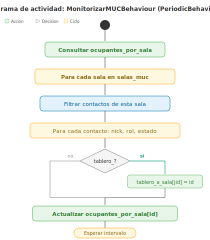
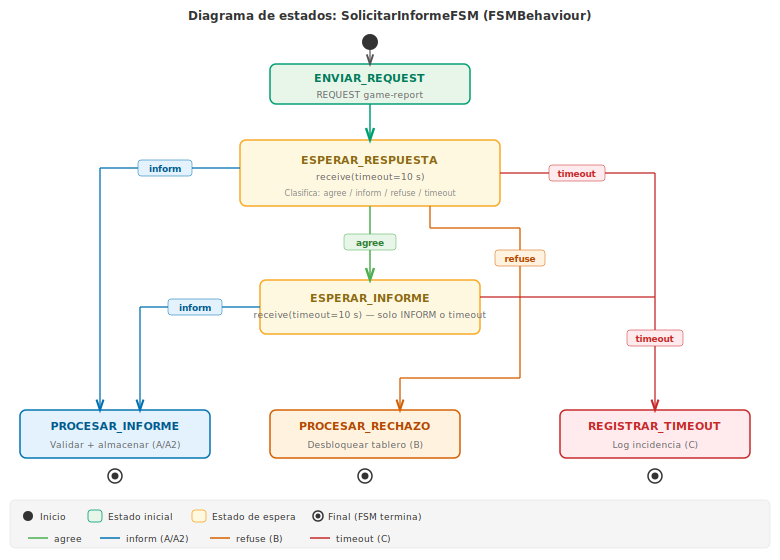

# Análisis y diseño de los comportamientos del Agente Supervisor

**Módulo:** [`supervisor_behaviours.py`](supervisor_behaviours.py)

**Documentación del agente:** [`doc/DOCUMENTACION_SUPERVISOR.md`](../doc/DOCUMENTACION_SUPERVISOR.md)

---

## Visión general

El agente supervisor utiliza dos comportamientos SPADE y una función
de respuesta a presencia que trabajan de forma coordinada:

1. **MonitorizarMUCBehaviour** se ejecuta periódicamente para registrar
   en el registro de depuración el estado de ocupación de las salas.
2. **La función de respuesta a presencia MUC** (`_on_presencia_muc`) captura en
   tiempo real las stanzas de presencia de las salas MUC para:
   - Mantener actualizada la lista de ocupantes del panel web.
   - Registrar entradas, salidas y cambios de estado de tableros.
   - Detectar tableros con `status="finished"` y crear una instancia
     del tercer componente.
3. **SolicitarInformeFSM** es una máquina de estados que gestiona,
   de principio a fin, la conversación con un tablero concreto para
   obtener su informe de partida. Se crea una instancia independiente
   por cada tablero finalizado, de modo que varias solicitudes pueden
   estar en curso simultáneamente.

A continuación se describe cada componente con su diagrama y su ficha
técnica.

---

## MonitorizarMUCBehaviour

Este comportamiento periódico registra en el registro de depuración un
resumen del número de ocupantes por sala. La lista de ocupantes se
mantiene actualizada en tiempo real mediante la función de respuesta a
presencia MUC (`_on_presencia_muc`), por lo que este comportamiento solo
proporciona un latido periódico para el registro. **No** detecta tableros
finalizados ni actualiza ocupantes: ambas tareas se delegan en la función
de respuesta a presencia MUC.

| Campo | Descripción |
|-------|-------------|
| **Agente** | Ag. Supervisor (`supervisor@{dominio}`) |
| **Tipo** | `PeriodicBehaviour` — se ejecuta cada `intervalo_consulta` segundos (por defecto 10) |
| **Inicio** | Se registra en `setup()` del agente. Se activa automáticamente cuando el agente arranca. No utiliza plantilla de filtrado porque no recibe mensajes. |
| **Secuencia** | 1) Para cada sala de `salas_muc`, leer `ocupantes_por_sala[sala_id]` → 2) Registrar en el registro de depuración el número de ocupantes |
| **Finalización** | No finaliza (es periódico). Si se necesita una parada ordenada, se invoca `self.kill()` desde el agente o al recibir la señal de parada. |
| **Acción principal** | Registrar un resumen periódico del estado de ocupación de las salas. La actualización de ocupantes y la detección de tableros finalizados se realizan en la función de respuesta a presencia MUC `_on_presencia_muc`. |
| **Excepciones** | Ninguna: la lectura del diccionario `ocupantes_por_sala` no puede fallar. |

---

## SolicitarInformeFSM

Cuando la función de respuesta a presencia MUC detecta que un tablero
ha pasado al estado «finalizado», crea una instancia de este
comportamiento para gestionar toda la conversación con ese tablero.
Se ha modelado como una **máquina de estados finitos**
(`FSMBehaviour` de SPADE) porque el protocolo FIPA-Request tiene
varias fases claramente diferenciadas y múltiples caminos posibles
(el tablero puede aceptar, rechazar o no responder). Cada estado
del FSM se corresponde con un paso del protocolo descrito en la
[documentación del supervisor](../doc/DOCUMENTACION_SUPERVISOR.md#6-protocolo-de-comunicación),
y las transiciones entre estados están determinadas por la
performativa del mensaje recibido o por el agotamiento del tiempo
de espera.

Dado que se crea una instancia independiente por cada tablero,
pueden coexistir varias máquinas de estados ejecutándose en paralelo
sin interferencia entre ellas, ya que cada una filtra únicamente los
mensajes de su propia conversación gracias al campo `thread`.

| Campo | Descripción |
|-------|-------------|
| **Agente** | Ag. Supervisor (`supervisor@{dominio}`) |
| **Tipo** | `FSMBehaviour` — máquina de estados finitos con 7 estados. Se autodestruye al alcanzar un estado final. |
| **Inicio** | Se crea de forma dinámica por la función de respuesta a presencia MUC `_on_presencia_muc()` cuando detecta un tablero con `status="finished"`. Plantilla de filtrado: `thread={hilo_único}` ∧ `ontology=tictactoe`. Se crea una instancia por cada tablero finalizado. Todos los estados comparten el buzón de mensajes del FSM y un contexto `ctx` con `jid_tablero`, `sala_id`, `hilo` y `mensaje`. El estado `ENVIAR_REQUEST` registra un evento de tipo `solicitud` en el registro al enviar el REQUEST. |
| **Estados** | `ENVIAR_REQUEST` (inicial) — envía la solicitud de informe al tablero. `ESPERAR_RESPUESTA` — espera la primera respuesta (tiempo límite configurable) y clasifica según la performativa recibida. `ESPERAR_INFORME` — espera el informe tras recibir un AGREE; un REFUSE no es posible aquí porque el tablero ya aceptó la solicitud. `PROCESAR_INFORME` (final) — valida y almacena el informe (CASO A/A2). `PROCESAR_RECHAZO` (final) — registra la razón del rechazo (CASO B). `REGISTRAR_TIMEOUT` — registra la incidencia de timeout; si quedan reintentos, transiciona a `REINTENTAR`; si se agotan, es final (CASO C). `REINTENTAR` (M-04) — espera con retroceso exponencial (timeout × 2^n), registra `LOG_ADVERTENCIA` + `LOG_SOLICITUD`, reenvía el REQUEST y transiciona a `ESPERAR_RESPUESTA`. |
| **Transiciones** | `ENVIAR_REQUEST` → `ESPERAR_RESPUESTA` (siempre). `ESPERAR_RESPUESTA` → `ESPERAR_INFORME` (agree) ∣ `PROCESAR_INFORME` (inform) ∣ `PROCESAR_RECHAZO` (refuse) ∣ `REGISTRAR_TIMEOUT` (tiempo agotado). `ESPERAR_INFORME` → `PROCESAR_INFORME` (inform) ∣ `REGISTRAR_TIMEOUT` (tiempo agotado). `REGISTRAR_TIMEOUT` → `REINTENTAR` (si reintentos < max). `REINTENTAR` → `ESPERAR_RESPUESTA` (siempre). |
| **Finalización** | Los estados `PROCESAR_INFORME`, `PROCESAR_RECHAZO` y `REGISTRAR_TIMEOUT` (cuando reintentos agotados) son finales: no indican un estado siguiente, lo que provoca la autodestrucción del FSM (`self.kill()`). |
| **Acción principal** | Modelar el protocolo FIPA-Request completo como una máquina de estados. Cada instancia del FSM es independiente y gestiona un único informe de un tablero concreto. |
| **Excepciones** | **E1 — Tiempo agotado (CASO C):** el tablero no responde en 10 s → `REGISTRAR_TIMEOUT` anota la incidencia (`LOG_TIMEOUT`) en el registro. **E2 — JSON no válido:** `PROCESAR_INFORME` no puede interpretar el cuerpo → registra un evento `LOG_ERROR` con el detalle del fallo y no almacena. **E3 — Validación fallida:** el contenido no cumple el esquema de la ontología → registra un evento `LOG_ERROR` con los errores concretos. **E4 — Rechazo (CASO B):** `PROCESAR_RECHAZO` registra un evento `LOG_ADVERTENCIA` con el motivo del rechazo traducido al español. **E5 — Performativa inesperada:** los estados de espera transicionan a `REGISTRAR_TIMEOUT` como respuesta segura por defecto. **E6 — Inconsistencia semántica (M-13):** tras almacenar un informe válido, `PROCESAR_INFORME` ejecuta `validar_semantica_informe()` y registra un `LOG_INCONSISTENCIA` por cada anomalía: turnos imposibles, tablero sin línea ganadora, empate con celdas vacías, jugador contra sí mismo, jugadores no observados en la sala (D-04), o informe duplicado. El informe sigue almacenado (la anomalía no lo invalida, solo lo señala). En todos los casos terminales, el FSM limpia la entrada correspondiente de `informes_pendientes`. |

---

## Función de respuesta a presencia MUC: `_on_presencia_muc`

Este componente no es un comportamiento SPADE, sino una función de
respuesta que el agente registra en el cliente XMPP subyacente
(slixmpp) durante la inicialización. Se invoca automáticamente cada vez que el cliente
recibe una stanza de presencia, y filtra las que provienen de las
salas MUC monitorizadas. El supervisor se une a las salas enviando
stanzas de presencia con namespace MUC (`_unirse_sala_muc`), lo que
garantiza recibir las presencias de todos los ocupantes.

### Responsabilidades

1. **Registro de entradas**: cuando un ocupante nuevo se une a una
   sala, se añade a `ocupantes_por_sala` y se registra un evento
   de tipo `entrada` en el registro.
2. **Registro de salidas**: cuando un ocupante envía presencia
   `unavailable`, se elimina de `ocupantes_por_sala` y se registra
   un evento de tipo `salida`.
3. **Cambios de estado de tableros**: cuando un tablero cambia su
   `status` (por ejemplo, `waiting` → `playing` → `finished`), se
   registra un evento de tipo `presencia` con la transición.
4. **Detección de tableros finalizados**: cuando un tablero cambia a
   `status="finished"`, se crea una instancia de `SolicitarInformeFSM`.

### Eventos registrados en el registro

| Tipo (constante)       | Cuándo | Detalle |
|------------------------|--------|---------|
| `entrada` (`LOG_ENTRADA`) | Nuevo ocupante se une a la sala | «Se ha unido a la sala (jugador/tablero)» |
| `salida` (`LOG_SALIDA`) | Ocupante abandona la sala | «Ha abandonado la sala» |
| `presencia` (`LOG_PRESENCIA`) | Tablero cambia de estado | «Cambio de estado: waiting → playing» |
| `solicitud` (`LOG_SOLICITUD`) | Se solicita informe al tablero | «Informe de partida solicitado» |
| `informe` (`LOG_INFORME`) | Se recibe informe válido | Detalle del resultado (victoria, empate) |
| `abortada` (`LOG_ABORTADA`) | Informe de partida abortada | Detalle con motivo traducido |
| `timeout` (`LOG_TIMEOUT`) | Tablero no responde a tiempo | «Sin respuesta tras N s» |
| `error` (`LOG_ERROR`) | Fallo en la comunicación del informe | JSON inválido, esquema incorrecto, o tablero desconectado con informe pendiente |
| `advertencia` (`LOG_ADVERTENCIA`) | Informe solicitado no recibido | Tablero rechazó (REFUSE) o supervisor finalizó antes. El detalle identifica el informe implicado |
| `inconsistencia` (`LOG_INCONSISTENCIA`) | Anomalía semántica en informe válido | Turnos imposibles, tablero sin línea ganadora, empate con celdas vacías, jugador contra sí mismo, jugadores no observados en la sala, o informe duplicado. La validación se ejecuta tras almacenar el informe (M-13) |

| Campo | Descripción |
|-------|-------------|
| **Agente** | Ag. Supervisor (`supervisor@{dominio}`) |
| **Tipo** | Función de respuesta a evento `presence` del cliente slixmpp — invocada por cada stanza de presencia recibida |
| **Inicio** | Se registra en `setup()` con `self.client.add_event_handler("presence", self._on_presencia_muc)` |
| **Secuencia** | 1) Recibir la stanza de presencia → 2) Extraer sala, nick, tipo, show, status y JID real del item MUC → 3) Filtrar: solo procesar presencias de salas monitorizadas, ignorar el propio nick del supervisor → 4) Si `type="unavailable"`: eliminar ocupante y registrar evento `LOG_SALIDA`; si es tablero con informe pendiente, registrar además un evento `LOG_ERROR` → 5) Si es nuevo: añadir a ocupantes y registrar evento `LOG_ENTRADA` → 6) Si es tablero y su estado cambió: registrar evento `LOG_PRESENCIA` con la transición → 7) Si es tablero con `status="finished"` y no está en `tableros_consultados`: añadir a `informes_pendientes` y crear `SolicitarInformeFSM` |
| **Acción principal** | Mantener actualizada la lista de ocupantes en tiempo real, registrar todos los eventos relevantes en el registro y detectar de forma reactiva los tableros finalizados. |
