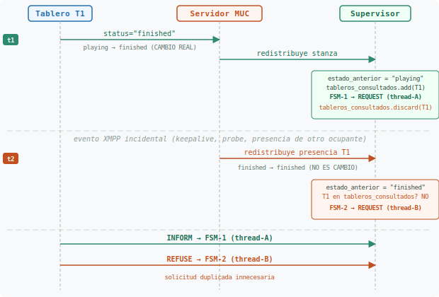
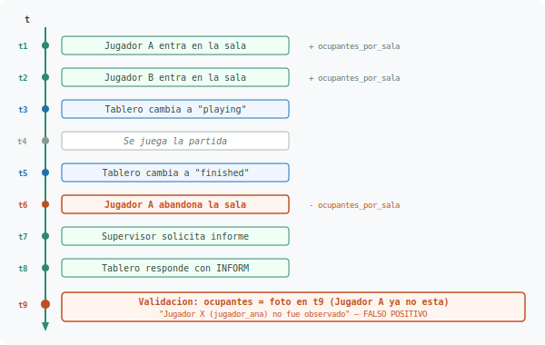
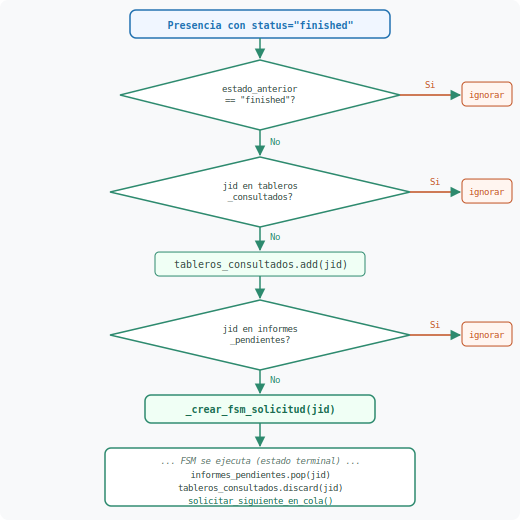
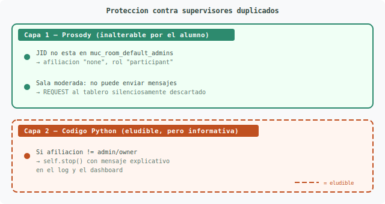
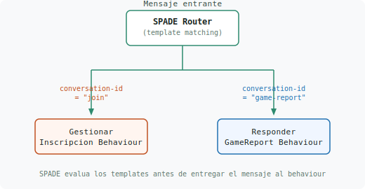
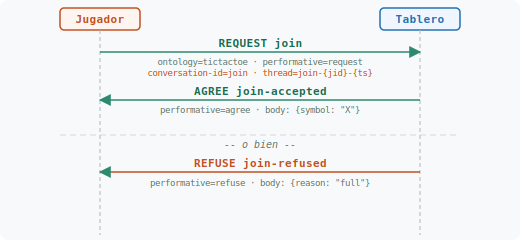
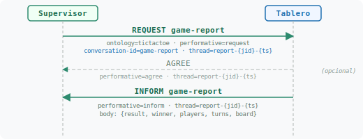

# Problemas detectados en torneo y soluciones propuestas

Este documento recoge diez problemas detectados durante las
pruebas de torneo multiagente, donde tableros y jugadores de
distintos alumnos conviven en las mismas salas MUC bajo la
supervision de un agente supervisor.

Los problemas se agrupan en tres categorias:

- **Protocolo y enrutamiento** (P-01, P-02, P-03): solicitudes
  duplicadas por redistribucion de presencia XMPP, multiples
  supervisores en la misma sala y ambiguedad en el enrutamiento
  de protocolos REQUEST que comparten ontologia y performativa.
- **Validacion semantica** (P-04, P-05, P-06, P-07): falsos
  positivos en la deteccion de jugadores no observados y de
  informes duplicados, solapamiento entre las pestanas Log e
  Incidencias del dashboard, y validacion incompleta de la
  coherencia de resultados del `game-report`.
- **Interfaz del dashboard** (P-08, P-09, P-10): degradacion
  visual por nombres de jugador excesivamente largos, ausencia
  de boton de finalizacion del torneo y contraste insuficiente
  en el modo nocturno.

**Origen:** pruebas de laboratorio de abril de 2026, donde el
supervisor registro rechazos (`REFUSE`) inesperados, falsos
positivos en varias validaciones, y problemas de usabilidad
en el dashboard durante torneos con agentes de multiples
alumnos.

---

## Índice

- [P-01](#p-01) Solicitudes duplicadas por `discard` prematuro ✅
- [P-02](#p-02) Múltiples supervisores en el mismo servidor
- [P-03](#p-03) Doble protocolo REQUEST en el tablero ✅
- [P-04](#p-04) Falsos positivos en validación de jugadores observados ✅
- [P-05](#p-05) Falsos positivos en detección de informes duplicados ✅
- [P-06](#p-06) Eventos duplicados entre Log e Incidencias ✅
- [P-07](#p-07) Validación incompleta de coherencia de resultados ✅
- [P-08](#p-08) Nombres de jugador excesivamente largos ✅
- [P-09](#p-09) Botón de finalización del torneo ✅
- [P-10](#p-10) Contraste del modo nocturno del dashboard ✅

- [Soluciones propuestas](#soluciones-propuestas)
- [Checklist de implementación](#checklist-de-implementacion)

---

## <a id="p-01"></a>P-01: Solicitudes duplicadas por `discard` prematuro y ausencia de comprobación de transición de estado

### Síntoma observado

El supervisor recibe `REFUSE` de tableros que ya habían entregado su
informe. El log muestra dos eventos `LOG_SOLICITUD` para el mismo
tablero en un intervalo muy corto, seguidos de un `LOG_INFORME` y un
`LOG_ADVERTENCIA` (rechazo).

El problema se reproduce incluso en un escenario mínimo con una sola
sala, un único tablero y dos jugadores, **sin que el tablero vuelva a
emitir una stanza con `status="finished"`**. Basta con que el servidor
MUC redistribuya la presencia existente del tablero (que sigue en
estado `"finished"`) por cualquier evento incidental del protocolo
XMPP.

### Causa raíz 1 — `discard` prematuro de la guardia

En `agente_supervisor.py`, el método `_on_presencia_muc` usa el
conjunto `tableros_consultados` como guardia contra detecciones
duplicadas. Sin embargo, la guardia se desactiva prematuramente:

```python
# agente_supervisor.py — líneas 488-522 (simplificado)

# Guardia: ¿ya se ha detectado este tablero?
if jid_tablero in self.tableros_consultados:    # línea 495
    return

self.tableros_consultados.add(jid_tablero)      # línea 498
# ... crear FSM o encolar ...
self.tableros_consultados.discard(jid_tablero)   # línea 522  ⚠
```

La línea 522 elimina la protección **inmediatamente después** de crear
el FSM, no cuando el FSM termina. Esto abre una ventana donde una
segunda presencia `"finished"` del mismo tablero pasa la guardia.

### Causa raíz 2 — Ausencia de comprobación de transición de estado

El handler `_on_presencia_muc` ya extrae el estado anterior del
ocupante en las líneas 448-456 y lo usa para registrar transiciones
en el log (líneas 472-479):

```python
# líneas 448-456 — se conoce el estado previo del tablero
estado_anterior = ""
for occ in ocupantes:
    if occ["nick"] == nick:
        estado_anterior = occ["estado"]   # ← ya disponible
        occ["estado"] = estado
        encontrado = True

# líneas 472-479 — detecta si el estado realmente cambió
elif estado_anterior and estado_anterior != estado \
        and nick.startswith("tablero_"):
    self.registrar_evento_log(...)        # solo si cambió
```

Sin embargo, la detección de tablero finalizado en la línea 489
**ignora esta información** y reacciona ante **cualquier** stanza con
`status="finished"`, tanto si es una transición real (`playing` →
`finished`) como si es una redistribución del mismo estado
(`finished` → `finished`):

```python
# línea 489 — no comprueba si el estado CAMBIÓ a "finished"
if not nick.startswith("tablero_") or status != "finished":
    return
```

Esta es la causa profunda: sin comprobación de transición, **una
redistribución de presencia sin cambio de estado** basta para
activar el mecanismo de solicitud de informe.

### Efecto combinado de ambas causas

La causa raíz 2 permite que cualquier redistribución de presencia
con el mismo `status="finished"` active la detección. La causa
raíz 1 impide que la guardia bloquee esa segunda activación. Juntas
hacen que el problema se manifieste incluso con un solo tablero que
solo emitió `"finished"` una vez.

### Secuencia de la duplicación



### Por qué llegan dos stanzas con `status="finished"`

El supervisor se une a las salas MUC mediante una stanza de presencia
directa (`_unirse_sala_muc`, línea 346), **sin usar** el plugin
`xep_0045` de slixmpp. Esto hace que slixmpp no distinga las
presencias MUC de las normales y dispare el evento `"changed_status"`
para **toda** stanza de presencia que llegue desde la sala, no solo
para cambios reales.

El servidor MUC puede redistribuir la presencia de un ocupante
(incluyendo su `status`) sin que este la reenvíe explícitamente:

| Causa                                              | El tablero reenvia `"finished"` |
|----------------------------------------------------|---------------------------------|
| Tablero actualiza cualquier atributo (`show`, `priority`) | No — solo actualiza otro campo, el MUC redistribuye la stanza completa |
| slixmpp genera presencia implícita (keepalive, probe) | No — es gestión interna del cliente XMPP |
| Otro ocupante se une o sale de la sala             | No (en algunas implementaciones MUC el servidor redistribuye presencias del resto) |
| Reconexión del supervisor (`_on_reconexion_sesion`) | No — el re-join provoca que el servidor envíe todas las presencias actuales |
| Código del tablero del alumno envía `"finished"` más de una vez | Sí — el tablero no es defensivo |

En todos los casos excepto el último, el tablero **no ha vuelto a
cambiar** a `"finished"` — simplemente sigue en ese estado y el
protocolo XMPP redistribuye su presencia.

### Agravante: permanencia variable en el estado `"finished"`

En un torneo real, cada alumno implementa la transicion
`finished → waiting` de forma diferente. Algunos tableros
cambian a `"waiting"` inmediatamente tras finalizar la partida;
otros permanecen en `"finished"` durante un tiempo (por ejemplo,
mientras persisten el resultado, esperan una pausa configurable
entre partidas, o simplemente no implementan la transicion de
vuelta a `"waiting"`).

Esta variabilidad afecta directamente a la **ventana de
vulnerabilidad** del problema:

| Comportamiento del tablero | Ventana de vulnerabilidad | Riesgo |
|----------------------------|---------------------------|--------|
| `finished → waiting` inmediato | Muy corta (milisegundos) | Bajo — la siguiente redistribucion tendra `status="waiting"`, no `"finished"` |
| `finished` durante segundos | Media (segundos) | Medio — varias redistribuciones pueden llegar con `"finished"` |
| `finished` indefinido (no vuelve a `waiting`) | Indefinida | Alto — cada evento XMPP genera una redistribucion con `"finished"` |

En un torneo con 15-20 tableros de distintos alumnos, la
probabilidad de que al menos un tablero permanezca en
`"finished"` el tiempo suficiente para recibir una
redistribucion es alta. Ademas, cuanto mayor es el numero de
ocupantes en la sala, mas frecuentes son los eventos XMPP que
provocan redistribuciones (entradas, salidas, cambios de estado
de otros agentes).

**Consecuencia para la solucion:** la comprobacion de transicion
de estado (`estado_anterior == "finished"` → ignorar) es
especialmente critica en este escenario. Sin ella, los tableros
que permanecen en `"finished"` generarian solicitudes duplicadas
de forma proporcional al tiempo que mantengan ese estado y al
numero de eventos XMPP en la sala.

### Agravante: sobrescritura en `informes_pendientes`

La función `_crear_fsm_solicitud` registra el tablero en un `dict`:

```python
self.informes_pendientes[jid_tablero] = sala_id   # sobrescribe
```

La segunda llamada sobrescribe la entrada de la primera. Ambos FSMs
siguen ejecutándose, pero el supervisor pierde la referencia al
primero. Cuando FSM-1 termina y ejecuta
`informes_pendientes.pop(jid_tablero)`, elimina la entrada que FSM-2
necesita para su limpieza.

→ **Solución:** [S-01](#s-01) — Comprobación de transición de estado y reubicación del `discard`.

---

## <a id="p-02"></a>P-02: Múltiples supervisores en el mismo servidor

### Escenario

Si un alumno lanza su propio agente supervisor mientras el del
profesor ya está activo, ambos monitorizan las mismas salas.

### Colisión de nick MUC (mismo apodo `"supervisor"`)

El supervisor se une con nick fijo `"supervisor"`
(`agente_supervisor.py`, línea 188). En XEP-0045, **los nicks son
únicos por sala**. El segundo supervisor recibe un error `409
Conflict` del servidor, pero el código actual no maneja esa
respuesta: `stanza.send()` no captura el resultado (líneas 346-356).

El segundo supervisor **cree que se ha unido**, no recibe presencias,
y falla silenciosamente. No causa solicitudes duplicadas, pero
confunde al alumno que no entiende por qué su supervisor no funciona.

### Nicks distintos (ej. `"supervisor"` y `"supervisor_alumno"`)

Si el alumno configura un nick diferente, ambos supervisores entran
en la sala. Entonces:

1. Ambos detectan `status="finished"` en sus handlers de presencia.
2. Ambos envían REQUEST `game-report` al tablero (con threads
   independientes).
3. El tablero recibe dos solicitudes y rechaza la segunda.
4. Cada supervisor ve un `REFUSE` que no esperaba.

### Contaminación del dashboard

Un segundo supervisor con nick distinto a `"supervisor"` no se filtra
en la línea 387. La función de clasificación de rol (línea 405) lo
etiqueta como `"jugador"` porque su nick no empieza por `"tablero_"`:

```python
rol = "tablero" if nick.startswith("tablero_") else "jugador"
```

Esto añade un falso jugador a la lista de ocupantes del dashboard.

### Limitación de cualquier enfoque del lado del cliente

Todas las comprobaciones que se ejecutan en el código Python del
agente son eludibles porque Python es un lenguaje interpretado: el
alumno puede modificar el fuente antes de ejecutar y eliminar o
alterar cualquier protección.

| Mecanismo del lado del cliente            | Cómo lo elude el alumno            |
|-------------------------------------------|------------------------------------|
| Nick fijo + error 409 Conflict            | Cambia `self.muc_apodo`            |
| `isinstance(agente, AgenteSupervisor)`    | Renombra o hereda de otra clase    |
| Atributo identificador en la presencia    | No lo incluye en la stanza         |
| Convención de nick (`startswith(...)`)    | Usa un nick fuera del patrón       |

El problema real es de **unicidad de rol**, no de nomenclatura ni de
código cliente. Lo que se necesita es un mecanismo que garantice, a
nivel del **servidor XMPP**, que solo un agente autorizado pueda
ejercer como supervisor en cada sala. El servidor Prosody lo
controlan los responsables del torneo, no los alumnos.

→ **Solución:** [S-02](#s-02) — Supervisor único por sala (afiliación MUC).

---

## <a id="p-03"></a>P-03: Doble protocolo REQUEST en el tablero

### Contexto

El tablero debe atender como participante dos protocolos REQUEST
que comparten la misma performativa FIPA y la misma ontología:

| Protocolo    | Iniciador  | Acción        | Performativa | Propósito                        |
|--------------|------------|---------------|--------------|----------------------------------|
| Inscripción  | Jugador    | `join`        | `request`    | El jugador pide unirse a la mesa |
| Informe      | Supervisor | `game-report` | `request`    | El supervisor pide el resultado  |

Ambos llegan con la misma metadata:

```
ontology     = "tictactoe"
performative = "request"
```

Si el tablero registra un único behaviour con template
`{ontology, performative}`, ambos tipos de REQUEST se entregan al
mismo behaviour. Cada alumno inventa su propia forma de distinguirlos
(parsear el body, inspeccionar el sender, etc.), y las interacciones
cruzadas en torneo se rompen.

### Requisito para torneo

Todos los agentes deben seguir la misma convención de enrutamiento:

1. Declarativa (basada en metadata, no en inspección del body).
2. Resuelta por SPADE antes de que el behaviour ejecute `run()`.
3. Un behaviour aislado por protocolo.
4. Compatible con la correlación por `thread` existente.

→ **Solución:** [S-03](#s-03) — Campo `conversation-id` en metadata.

---

## <a id="p-04"></a>P-04: Falsos positivos en validación de jugadores observados

### Síntoma observado

La pestaña de Incidencias del dashboard muestra advertencias del tipo:

```
Jugador X (jugador_ana) no fue observado como ocupante de la sala
```

Sin embargo, la pestaña de Agentes muestra (o mostró) a ese mismo
jugador como ocupante de la sala. El informe es legítimo: el jugador
participó en la partida, pero ya había abandonado la sala cuando el
supervisor procesó el informe.

### Causa raíz

La validación `_validar_jugadores_observados`
(`supervisor_behaviours.py`, línea 932) compara los jugadores del
informe contra `ocupantes_por_sala`, que es una **foto en tiempo
real** de quién está en la sala en este instante:

```python
# EstadoProcesarInforme.run() — línea 473
ocupantes = self.agent.ocupantes_por_sala.get(sala_id, [])
```

Pero `ocupantes_por_sala` se actualiza en tiempo real en el handler
de presencia (`_on_presencia_muc`). Cuando un jugador abandona la
sala, se elimina inmediatamente de la lista:

```python
# _on_presencia_muc — líneas 412-413
if tipo == "unavailable":
    self.ocupantes_por_sala[sala_id] = [
        o for o in ocupantes if o["nick"] != nick
    ]
```

### Secuencia temporal del falso positivo



El problema se agrava en torneo, donde los jugadores pueden
abandonar la sala rápidamente tras terminar una partida para unirse
a otra mesa.

### Lo que debería validarse

La validación tiene sentido como defensa contra tableros que
inventan jugadores fantasma en sus informes. Pero el criterio
correcto no es "¿están ahora en la sala?" sino **"¿estuvieron en
la sala en algún momento?"**. Más concretamente:

- Cuando el tablero cambia de `waiting` a `playing`, los jugadores
  que aparezcan después en el informe deberían haber sido
  observados como ocupantes activos en ese momento.
- Una vez que un jugador ha sido observado en la sala, el hecho de
  que abandone antes de que se procese el informe no invalida su
  participación.

### Impacto para el alumno

El alumno **no tiene que implementar nada** para evitar este falso
positivo. Es un defecto del supervisor, no del tablero ni del
jugador. El alumno puede ver incidencias en el dashboard que no
corresponden a errores reales en su código, lo que genera confusión
durante el desarrollo.

→ **Solución:** [S-04](#s-04) — Registro histórico de ocupantes (CORREGIDO).

---

## <a id="p-05"></a>P-05: Falsos positivos en detección de informes duplicados

### Síntoma observado

La pestaña de Incidencias muestra advertencias del tipo:

```
Informe duplicado: mismo tablero, jugadores y resultado que un
informe anterior
```

El informe corresponde a una partida legítima y distinta, pero el
supervisor la marca como duplicado porque coincide en contenido con
una partida previa del mismo tablero.

### Causa raíz

La función `_validar_informe_duplicado`
(`supervisor_behaviours.py`, líneas 984-1019) determina que un
informe es duplicado comparando **tres campos del contenido**:

```python
if (previo.get("board") == tablero
        and previo.get("players") == jugadores
        and previo.get("result") == resultado):
```

Estos tres campos (`board`, `players`, `result`) describen el
**resultado final de la partida**, no la **identidad de la
solicitud**. En Tic-Tac-Toe, con solo 9 celdas, es muy probable
que dos partidas distintas entre los mismos jugadores terminen con
el mismo tablero, el mismo resultado y el mismo ganador.

### Ejemplo concreto

En un torneo, `jugador_ana` (X) y `jugador_luis` (O) se enfrentan
dos veces en el mismo tablero. Ambas partidas terminan con victoria
de X por línea diagonal:

```
Partida 1 (thread: report-tablero_01-1713264000):
  board: ["X", "O", "", "O", "X", "", "", "", "X"]
  players: {"X": "jugador_ana@...", "O": "jugador_luis@..."}
  result: "win"

Partida 2 (thread: report-tablero_01-1713264120):
  board: ["X", "O", "", "O", "X", "", "", "", "X"]  ← idéntico
  players: {"X": "jugador_ana@...", "O": "jugador_luis@..."}
  result: "win"
```

La segunda partida se marca como duplicado aunque tiene un `thread`
distinto que la identifica inequívocamente como una solicitud
diferente.

### Relación con P-01

El problema tiene dos fuentes independientes:

| Fuente | Descripción |
|--------|-------------|
| **P-01 (doble detección)** | Dos FSMs solicitan el mismo informe al mismo tablero por `discard` prematuro (causa raíz 1) o por redistribución de presencia sin comprobación de transición (causa raíz 2). El tablero responde a ambos con el mismo contenido. Duplicado real pero causado por el supervisor, no por el tablero. |
| **Partidas repetidas (este P-05)** | Dos partidas legítimas terminan con resultado idéntico. Duplicado falso: son partidas distintas con threads distintos. |

Corregir ambas causas de P-01 elimina la primera fuente, pero
**no la segunda**. Dos partidas distintas pueden seguir produciendo
informes con contenido idéntico.

### Criterio correcto

La identidad de un informe no está en su contenido sino en la
**solicitud que lo originó**. Cada FSM del supervisor genera un
`thread` único (`report-{jid}-{timestamp}`) que identifica
inequívocamente una solicitud. Dos informes son duplicados si y
solo si corresponden al **mismo `thread`**, no si tienen el mismo
contenido.

### Impacto para el alumno

El alumno no tiene que implementar nada. Es un defecto de la
validación semántica del supervisor que genera incidencias falsas
en partidas legítimas, especialmente frecuentes en un torneo donde
los mismos jugadores se enfrentan varias veces.

→ **Solución:** [S-05](#s-05) — Detección de duplicados por `thread` (CORREGIDO).

---

## <a id="p-06"></a>P-06: Eventos duplicados entre pestañas Log e Incidencias

### Síntoma observado

Los mismos eventos aparecen tanto en la pestaña **Log** como en la
pestaña **Incidencias** del dashboard. Por ejemplo, un timeout
(`LOG_TIMEOUT`) se ve en ambas pestañas, lo que genera la impresión
de que hay más problemas de los que realmente existen y dificulta
localizar la información relevante.

### Causa raíz

Todos los eventos se almacenan en una única estructura
(`log_por_sala`). La API envía la lista completa al frontend sin
filtrar. La separación entre pestañas se realiza exclusivamente en
el JavaScript del cliente:

- **Pestaña Incidencias** (`renderIncidenciasPanel`): filtra y
  muestra solo los 5 tipos de incidencia (`error`, `advertencia`,
  `timeout`, `abortada`, `inconsistencia`).
- **Pestaña Log** (`renderLogPanel`): muestra **todos** los eventos
  sin ningún filtro.

El resultado es que los tipos de incidencia aparecen en ambas
pestañas:

| Tipo de evento | Log | Incidencias | Aparece en |
|----------------|-----|-------------|------------|
| `entrada`      | Si  | No          | Solo Log   |
| `salida`       | Si  | No          | Solo Log   |
| `presencia`    | Si  | No          | Solo Log   |
| `solicitud`    | Si  | No          | Solo Log   |
| `informe`      | Si  | No          | Solo Log   |
| `abortada`     | Si  | **Si**      | **Ambas**  |
| `timeout`      | Si  | **Si**      | **Ambas**  |
| `error`        | Si  | **Si**      | **Ambas**  |
| `advertencia`  | Si  | **Si**      | **Ambas**  |
| `inconsistencia` | Si | **Si**     | **Ambas**  |

### Diseño esperado

Cada evento debería aparecer en **exactamente una pestaña**:

- **Log**: flujo operativo normal (entradas, salidas, cambios de
  estado, solicitudes, informes recibidos).
- **Incidencias**: anomalías que requieren atención (errores,
  timeouts, rechazos, partidas abortadas, inconsistencias
  semánticas).

Así el profesor puede consultar el Log para ver el progreso del
torneo y las Incidencias para identificar rápidamente qué tableros
o jugadores tienen problemas.

→ **Solución:** [S-06](#s-06) — Separar Log e Incidencias sin solapamiento (CORREGIDO).

---

## <a id="p-07"></a>P-07: Validación incompleta de coherencia de resultados

### Síntoma observado

Un tablero reporta `result: "draw"` con `turns: 7`, pero el
supervisor no genera ninguna inconsistencia. En Tic-Tac-Toe un
empate legítimo requiere exactamente 9 movimientos (tablero
completo); un empate con menos turnos indica un error en la lógica
del tablero.

### Causa raíz

La validación semántica solo cubría un subconjunto de las
invariantes del juego. Un informe `game-report` contiene cuatro
campos interrelacionados — `result`, `winner`, `turns` y `board` —
y la coherencia entre ellos no se verificaba de forma completa.

### Mapa completo de validaciones

La siguiente tabla muestra **todas** las invariantes del
Tic-Tac-Toe que el supervisor debería comprobar. La columna
"Estado" indica si ya están implementadas, pendientes o no
aplicables.

**Convención del sistema:** `"X"` mueve primero. El primer
jugador que se inscribe recibe `"X"` y el segundo recibe `"O"`
(`README.md`, líneas 792-793). El primer `CFP turn` del tablero
usa `active_symbol="X"` (`ACTUALIZACION-ONTOLOGIA.md`, línea 295).
Esta convención no la impone el protocolo (el schema de `turn`
acepta tanto `"X"` como `"O"` como `active_symbol`), sino que es
una **decisión de diseño del tablero** documentada como requisito
para los alumnos. Esto determina la distribución esperada de fichas
en función del número de turnos.

#### Validaciones ya implementadas

| # | Invariante | Resultado | Función | Estado |
|---|------------|-----------|---------|--------|
| V1 | Victoria con menos de 5 turnos | `win` | `_validar_turnos` | ✅ Implementada |
| V2 | Más de 9 turnos | todos | `_validar_turnos` | ✅ Implementada |
| V3 | Empate con menos de 9 turnos | `draw` | `_validar_turnos` | ✅ Implementada |
| V4 | Celdas vacías en empate | `draw` | `_validar_tablero_resultado` | ✅ Implementada |
| V5 | Línea ganadora ausente en victoria | `win` | `_validar_tablero_resultado` | ✅ Implementada |
| V6 | Línea ganadora oculta en empate | `draw` | `_validar_tablero_resultado` | ✅ Implementada |
| V7 | Ambos jugadores son el mismo agente | todos | `_validar_jugador_contra_si_mismo` | ✅ Implementada |

#### Validaciones pendientes

| # | Invariante | Resultado | Función destino | Estado |
|---|------------|-----------|-----------------|--------|
| V8 | Equilibrio de fichas en empate: `abs(X - O) > 1` | `draw` | `_validar_tablero_resultado` | ❌ Pendiente |
| V9 | `turns` coherente con fichas en `board` | `win`, `draw` | `_validar_tablero_resultado` | ❌ Pendiente |
| V10 | Equilibrio de fichas en victoria | `win` | `_validar_tablero_resultado` | ❌ Pendiente |
| V11 | Convención X-primero: `num_x < num_o` es imposible | `win`, `draw` | `_validar_tablero_resultado` | ❌ Pendiente |

#### Detalle de cada validación pendiente

**V8 — Equilibrio de fichas en empate:**

En Tic-Tac-Toe con `"X"` moviendo primero:

- Tras 9 turnos: `"X"` ha movido en los turnos 1, 3, 5, 7, 9
  (5 fichas) y `"O"` ha movido en los turnos 2, 4, 6, 8
  (4 fichas).
- Un tablero completo válido tiene exactamente **5 `"X"` y
  4 `"O"`** (diferencia de 1 a favor de `"X"`).
- Cualquier otra distribución indica un error en la alternancia
  de turnos del tablero del alumno.

```python
# supervisor_behaviours.py — _validar_tablero_resultado
# Dentro del bloque: if resultado == "draw":

DIFERENCIA_MAXIMA_FICHAS = 1

num_o = tablero.count("O")
num_x = tablero.count("X")

if abs(num_o - num_x) > DIFERENCIA_MAXIMA_FICHAS:
    anomalias.append(
        f"Empate con distribución de fichas imposible: "
        f"{num_o} O y {num_x} X "
        f"(diferencia máxima permitida: "
        f"{DIFERENCIA_MAXIMA_FICHAS})",
    )
```

**V9 — `turns` coherente con fichas en `board`:**

El campo `turns` indica cuántos movimientos se hicieron. El
`board` debe contener exactamente ese número de fichas (X + O).
Esta validación aplica a `win` y `draw` (no a `aborted`, donde
el tablero puede tener estado inconsistente si la partida se
interrumpió):

```python
# supervisor_behaviours.py — _validar_tablero_resultado
# Fuera de cualquier bloque de resultado (aplica a win y draw):

if resultado in ("win", "draw"):
    num_fichas = tablero.count("X") + tablero.count("O")
    if num_fichas != turnos:
        anomalias.append(
            f"El tablero contiene {num_fichas} fichas pero "
            f"se reportan {turnos} turnos",
        )
```

Ejemplo: un informe con `turns: 5` y un `board` con 3 `"X"` y
4 `"O"` (7 fichas) es incoherente. Esta validación lo detecta
independientemente del resultado.

**V10 — Equilibrio de fichas en victoria:**

La distribución de fichas depende de la paridad de `turns`:

- Si `turns` es impar (5, 7, 9): el primer jugador (`"X"`) tiene
  `⌈turns/2⌉` fichas y el segundo (`"O"`) tiene `⌊turns/2⌋`.
  Diferencia = 1.
- Si `turns` es par (6, 8): ambos tienen `turns/2` fichas.
  Diferencia = 0.
- En ambos casos: `abs(X - O) ≤ 1`.

Un tablero con `turns: 7`, 6 `"X"` y 1 `"O"` es imposible (X no
puede haber movido 6 veces en 7 turnos aunque mueve primero,
porque solo tiene `⌈7/2⌉ = 4` turnos). La misma comprobación de
V8 (`abs(X - O) > 1`) es aplicable:

```python
# supervisor_behaviours.py — _validar_tablero_resultado
# Aplicar a win y draw (no a aborted):

if resultado in ("win", "draw"):
    num_o = tablero.count("O")
    num_x = tablero.count("X")
    if abs(num_o - num_x) > DIFERENCIA_MAXIMA_FICHAS:
        anomalias.append(
            f"Distribución de fichas imposible: "
            f"{num_o} O y {num_x} X "
            f"(diferencia máxima permitida: "
            f"{DIFERENCIA_MAXIMA_FICHAS})",
        )
```

Nota: V8, V9 y V10 se pueden unificar en una sola comprobación
dentro de un bloque `if resultado in ("win", "draw")` que valide
tanto el total de fichas contra `turns` (V9) como el equilibrio
entre X y O (V8/V10). V11 se añade en el mismo bloque.

**V11 — Convención X-primero (`num_x < num_o` es imposible):**

V8/V10 detectan cuando la diferencia entre fichas supera 1, pero
**no** detectan el caso en que la diferencia es exactamente 1 y
está invertida (O tiene más fichas que X). Por ejemplo, un empate
con 4X+5O cumple `abs(4-5) = 1 ≤ 1`, pero es imposible si X
mueve primero — debería ser 5X+4O.

La razón es que el primer jugador siempre tiene **igual o más**
fichas que el segundo:

- `turns` impar → `num_x = ⌈turns/2⌉`, `num_o = ⌊turns/2⌋` →
  `num_x = num_o + 1`.
- `turns` par → `num_x = num_o = turns/2`.
- En ambos casos: **`num_x ≥ num_o` siempre**.

Si `num_x < num_o`, el tablero del alumno está invirtiendo el
orden de movimiento (O movió primero en lugar de X). Esto viola
la convención del sistema y debe generar una incidencia:

```python
# supervisor_behaviours.py — _validar_tablero_resultado
# Dentro del bloque: if resultado in ("win", "draw"):

FICHA_PRIMERA = "X"

num_x = tablero.count("X")
num_o = tablero.count("O")

# V11: Convención X-primero.
# X mueve primero → siempre tiene >= fichas que O.
# Si num_x < num_o, el tablero invirtió el orden de
# movimiento (O movió primero), violando la convención.
if num_x < num_o:
    anomalias.append(
        f"El tablero contiene {num_x} X y {num_o} O, "
        f"lo que indica que O movió primero. La convención "
        f"del sistema requiere que {FICHA_PRIMERA} mueva "
        f"primero (y por tanto tenga igual o más fichas)",
    )
```

Esta validación es **complementaria** a V8/V10, no la sustituye.
Cada una detecta un subconjunto distinto de anomalías:

| Caso | V8/V10 (`abs > 1`) | V11 (`num_x < num_o`) |
|------|--------------------|-----------------------|
| 9t, 3X+6O | **Detecta** (`abs(3-6)=3>1`) | **Detecta** (3 < 6) |
| 9t, 4X+5O | No detecta (`abs(4-5)=1≤1`) | **Detecta** (4 < 5) |
| 7t, 3X+4O | No detecta (`abs(3-4)=1≤1`) | **Detecta** (3 < 4) |
| 7t, 6X+1O | **Detecta** (`abs(6-1)=5>1`) | No detecta (6 > 1) |
| 9t, 5X+4O | No detecta | No detecta — **correcto** |

### Verificación completa

| Caso | V1-V3 (turnos) | V4 (vacías) | V5-V6 (líneas) | V8-V10 (equilibrio) | V9 (turns vs board) | V11 (X-primero) |
|------|-----------------|-------------|-----------------|---------------------|---------------------|-----------------|
| `draw`, 9t, 5X+4O, sin línea | — | — | — | — | — | — | **Correcto** |
| `draw`, 7t, 4X+3O | V3 | V4 | — | — | — | — | Detectado |
| `draw`, 9t, 3X+6O | — | — | — | V8 | — | V11 | Detectado |
| `draw`, 9t, 4X+5O | — | — | — | — | — | **V11** | Detectado |
| `draw`, 9t, 2 vacías | — | V4 | — | — | V9 | — | Detectado |
| `win`, 5t, 3X+2O, línea X | — | — | — | — | — | — | **Correcto** |
| `win`, 3t | V1 | — | — | — | — | — | Detectado |
| `win`, 7t, 1X+6O | — | — | — | V10 | — | V11 | Detectado |
| `win`, 7t, 3X+4O | — | — | — | — | — | **V11** | Detectado |
| `win`, 5t, board 3 fichas | — | — | — | — | V9 | — | Detectado |
| `aborted`, 4t | — | — | — | — | — | — | **Correcto** |

### Nota sobre partidas abortadas

Una partida abortada (`result: "aborted"`) puede terminar con
cualquier número de turnos (incluso 0, si ambos jugadores fallan
en el primer turno). Las validaciones V8, V9, V10 y V11 no aplican
a partidas abortadas porque el estado del tablero puede ser
inconsistente si la partida se interrumpió antes de completarse.

### Nota sobre el orden de movimiento

La convención `"X"` mueve primero es la que usa el sistema
Tic-Tac-Toe de la asignatura (documentada en el `README.md` y en
el diagrama de protocolo de `ACTUALIZACION-ONTOLOGIA.md`). El
protocolo en sí (schema JSON de `turn`) **no impone** qué símbolo
va primero — acepta tanto `"X"` como `"O"` en `active_symbol` — ,
por lo que es una **decisión de implementación del tablero**.

Si en otra configuración moviera primero `"O"`, las cantidades
esperadas se invertirían (5 `"O"` y 4 `"X"`). La validación debe
parametrizarse con una constante (`FICHA_PRIMERA = "X"`) para
facilitar el cambio si fuera necesario.

→ **Solución:** [S-07](#s-07) — Validaciones cruzadas de coherencia de resultados.

---

## <a id="p-08"></a>P-08: Nombres de jugador excesivamente largos degradan la visualización

### Síntoma observado

En el dashboard del supervisor, las tablas de informes, la pestaña de
agentes y los registros del log muestran columnas desbordadas o líneas
truncadas de forma inconsistente cuando algún alumno configura un
nombre de jugador con muchos caracteres. Por ejemplo, un JID como
`jugador_alejandro_garcia_martinez_grupo3@xmpp.server` provoca que
las columnas de la tabla se expandan más allá del ancho visible,
desplazando el resto de la información y obligando al usuario a
hacer scroll horizontal para leer los datos completos.

### Causa raíz

Ni el supervisor ni el dashboard imponen un límite o aplican
truncamiento sobre la longitud de los nombres de jugador (nicks o
JIDs) al mostrarlos en la interfaz. Los nombres se renderizan tal
cual se reciben, sin restricción de ancho. En un entorno controlado
con pocos agentes esto no es problemático, pero en un torneo donde
cada alumno elige libremente el nombre de su agente, aparecen
identificadores de longitud muy variable.

Los puntos afectados son:

1. **Pestaña Agentes** (`renderAgentesPanel`): la columna de nick
   muestra el nombre completo sin truncar.
2. **Pestaña Informes** (`renderInformesPanel`): los campos
   `players.X` y `players.O` contienen JIDs completos que pueden
   ser muy largos.
3. **Pestaña Log** (`renderLogPanel`): el campo `agente` de cada
   evento se muestra íntegro.
4. **Pestaña Incidencias** (`renderIncidenciasPanel`): los mensajes
   de anomalía incluyen nicks y JIDs sin abreviar.
5. **Exportación CSV**: las columnas de jugadores contienen los JIDs
   completos, lo que dificulta abrir el CSV en hojas de cálculo con
   columnas de ancho fijo.

### Ejemplos de nombres problemáticos observados

| Nick del alumno                          | Longitud |
|------------------------------------------|----------|
| `jugador_alejandro_garcia_martinez_g3`   | 38 chars |
| `tablero_practica_final_grupo_2_v3`      | 34 chars |
| `jugador_test_prueba_entrega_final_def`  | 38 chars |

Frente a los nombres típicos de desarrollo (`jugador_ana`,
`tablero_01`) de 10-15 caracteres, estos nombres triplican el
espacio necesario.

### Impacto en la experiencia del profesor

- Las tablas del dashboard pierden su formato tabular, dificultando
  la lectura rápida de resultados durante un torneo en clase.
- Al proyectar el dashboard en pantalla, los nombres largos hacen
  que la información relevante (resultado, turnos, anomalías) quede
  fuera del área visible.
- La exportación CSV requiere ajustar manualmente el ancho de
  columnas para hacerla legible.

### Impacto para el alumno

El alumno no percibe el problema en sus pruebas locales porque
trabaja con pocos agentes y nombres cortos. El problema se
manifiesta exclusivamente en torneo, cuando convergen agentes de
múltiples alumnos con convenciones de nombrado heterogéneas.

→ **Solución:** [S-08](#s-08) — Truncamiento de nombres largos en la visualización (CORREGIDO).

---

## <a id="p-09"></a>P-09: Ausencia de botón de finalización del torneo en la interfaz web

### Tipo

Mejora de diseño — no es un error del sistema actual.

### Contexto

Actualmente, el supervisor no proporciona ningún mecanismo desde la
interfaz web para que el profesor pueda indicar que el torneo ha
finalizado. La única forma de detener el supervisor es cerrar el
proceso desde la terminal (`Ctrl+C`) o enviar una señal al proceso
Python. Esto presenta varios inconvenientes:

1. **Accesibilidad durante la clase:** cuando el profesor supervisa
   el torneo desde el dashboard proyectado en pantalla, necesita
   cambiar de contexto a la terminal para detener el sistema. Si la
   terminal está en otra ventana o en otro equipo (acceso remoto),
   la operación es incómoda.

2. **Cierre no controlado:** `Ctrl+C` envía `SIGINT` al proceso,
   lo que puede interrumpir operaciones en curso (FSMs activos,
   escrituras en SQLite, SSE abiertos). Un botón de finalización
   permitiría un cierre ordenado.

3. **Marca temporal de fin de ejecución:** el sistema de históricos
   registra el inicio de cada ejecución pero no tiene una marca
   explícita de finalización. Un botón permitiría registrar el
   instante exacto en que el profesor decide que el torneo ha
   terminado, útil para la consulta posterior.

4. **Generación de resumen final:** al finalizar el torneo, sería
   útil generar automáticamente un resumen (clasificación final,
   número total de partidas, incidencias acumuladas) que se muestre
   como último evento en el dashboard y se almacene en la base de
   datos.

### Elementos de diseño a considerar

- **Confirmación obligatoria:** un clic accidental no debe detener
  el torneo. Se requiere un diálogo de confirmación («¿Finalizar el
  torneo? Esta acción detendrá la monitorización de todas las
  salas»).

- **Ubicación en la interfaz:** el botón debe ser visible pero no
  intrusivo. La zona derecha del header (junto al reloj y el toggle
  de tema) es candidata natural.

- **Estilo visual:** debe distinguirse claramente de los botones de
  acción normal (exportar CSV, filtros) para evitar confusiones.
  Un color de advertencia suave y un icono distintivo son
  recomendables.

- **Protección contra usos no autorizados:** si el dashboard está
  accesible en red (M-10, autenticación HTTP Basic), el botón de
  finalización debe respetar la misma autenticación. No se debe
  poder detener el supervisor desde un navegador no autenticado.

### Impacto para el alumno

Ninguno. Es una funcionalidad exclusiva del profesor que no afecta
al comportamiento de los agentes jugador ni tablero.

→ **Solución:** [S-09](#s-09) — Botón de finalización del torneo (CORREGIDO).

---

## <a id="p-10"></a>P-10: Contraste insuficiente en el modo nocturno del dashboard

### Tipo

Mejora de diseño — refinamiento visual de la paleta existente.

### Síntoma observado

El modo nocturno del dashboard utiliza un fondo principal `#111816`
(RGB 17, 24, 22), que es perceptualmente casi negro. Aunque los
ratios de contraste WCAG AA se cumplen numéricamente, la
combinación de fondo casi-negro con texto claro produce fatiga
visual en sesiones prolongadas y reduce la percepción de
profundidad entre las capas de la interfaz (fondo, paneles,
tarjetas).

### Causa raíz

La paleta oscura original fue diseñada priorizando ratios de
contraste máximos (hasta 15.1:1 para texto primario), lo que
llevó a un fondo extremadamente oscuro. En la práctica:

1. **Fondo casi-negro (`#111816`):** luminancia relativa ≈ 0.009,
   prácticamente indistinguible del negro puro (`#000000`,
   luminancia 0). Produce un efecto visual «agujero» que puede
   resultar incómodo en entornos con poca luz ambiental.

2. **Jerarquía visual comprimida:** la diferencia entre `--body`
   (`#111816`) y `--card` (`#182420`) es de solo 7-12 unidades
   RGB, insuficiente para que las tarjetas destaquen claramente
   sobre el fondo sin depender del borde.

3. **Bordes demasiado sutiles:** `--border` (`#283e37`) tiene bajo
   contraste contra el fondo oscuro, lo que dificulta la
   separación visual entre secciones, especialmente en monitores
   con calibración imprecisa o al proyectar en clase.

### Valores actuales vs. corregidos

Los fondos se elevan ligeramente para salir de la zona
«casi-negro» (luminancia < 0.01) a una zona más cómoda
(luminancia ≈ 0.01-0.02), manteniendo todos los ratios WCAG AA
por encima de 4.5:1:

| Variable | Antes | Después | Motivo del cambio |
|----------|-------|---------|-------------------|
| `--body` | `#111816` | `#1a2420` | Fondo principal no-negro |
| `--card` | `#182420` | `#21302a` | Tarjetas más distinguibles |
| `--panel` | `#151d1a` | `#1e2823` | Paneles laterales |
| `--inner` | `#111816` | `#1a2420` | Coincide con body |
| `--input` | `#1c2a26` | `#253530` | Campos de entrada |
| `--surface` | `#1a2622` | `#223028` | Superficies intermedias |
| `--border` | `#283e37` | `#305048` | Bordes más visibles |
| `--border-light` | `#325048` | `#3a5f55` | Bordes claros |
| `--border-hover` | `#3d6558` | `#4a7568` | Hover en bordes |
| `--hover-bg` | `#1c2a26` | `#253530` | Fondo al pasar ratón |
| `--active-bg` | `#243832` | `#2c4540` | Fondo activo |

Los colores de texto no cambian. Los ratios de contraste
actualizados (contra el nuevo `--body` `#1a2420`):

| Variable | Color | Ratio anterior | Ratio nuevo | WCAG AA |
|----------|-------|----------------|-------------|---------|
| `--primary` | `#e8ece9` | 15.1:1 | 14.7:1 | Cumple |
| `--body-text` | `#c4cdc8` | 10.8:1 | 10.8:1 | Cumple |
| `--secondary` | `#94a39d` | 6.7:1 | 6.6:1 | Cumple |
| `--muted` | `#7f8e88` | 5.1:1 | 5.1:1 | Cumple |
| `--green` | `#4dd6a5` | 10.2:1 | 9.6:1 | Cumple |
| `--x-color` | `#e88a5a` | 7.3:1 | 6.8:1 | Cumple |
| `--o-color` | `#5ab8e8` | 8.5:1 | 8.0:1 | Cumple |
| `--aborted` | `#e8975a` | 7.6:1 | 7.5:1 | Cumple |

### Corrección aplicada

Los cambios se han implementado en `web/static/supervisor.css`,
sección `[data-theme="dark"]`. El tema claro no se ha modificado.

### Impacto para el alumno

Ninguno. Es un cambio puramente visual en el CSS del dashboard del
supervisor.

→ **Solución:** Ya corregido directamente en `web/static/supervisor.css`.

---

## <a id="soluciones-propuestas"></a>Soluciones propuestas

### <a id="s-01"></a>S-01: Comprobación de transición de estado y reubicación del `discard` (corrige P-01)

P-01 tiene dos causas raíz independientes que deben corregirse
conjuntamente:

1. **Causa raíz 1**: el `discard` de `tableros_consultados` se
   ejecuta inmediatamente en el handler de presencia, no cuando el
   FSM termina.
2. **Causa raíz 2**: la detección de `"finished"` reacciona ante
   cualquier stanza con ese status, sin comprobar si el estado
   **cambió** realmente (transición `playing → finished`) o si es
   una redistribución del mismo estado (`finished → finished`).

La corrección requiere dos cambios complementarios:

**Cambio 1 — Filtrar redistribuciones con `estado_anterior`
(corrige causa raíz 2):**

La variable `estado_anterior` ya existe en el flujo del handler
(línea 449). Solo hay que usarla como guardia adicional en la
detección de tablero finalizado:

```python
# agente_supervisor.py — _on_presencia_muc, tras línea 489

# ── Detección de tablero finalizado (paso 0) ─────────
if not nick.startswith("tablero_") or status != "finished":
    return

# Solo detectar si el estado CAMBIÓ a "finished",
# no si ya estaba en "finished" y la presencia se
# redistribuyó por un evento incidental del protocolo.
if estado_anterior == "finished":
    return
```

Esta comprobación se comporta correctamente en todos los escenarios:

| Escenario                                       | `estado_anterior` | `estado`     | ¿Detecta? |
|-------------------------------------------------|-------------------|--------------|-----------|
| Partida termina (`playing → finished`)          | `"playing"`       | `"finished"` | **Sí**    |
| Redistribución (`finished → finished`)          | `"finished"`      | `"finished"` | **No**    |
| Tablero nuevo entra ya en `finished` (reconexión) | `""`            | `"finished"` | **Sí**    |
| 2.ª partida tras ciclo completo                 | `"playing"`       | `"finished"` | **Sí**    |
| Tablero pasa a `waiting` (nueva partida)        | `"finished"`      | `"waiting"`  | **No** (no es `finished`) |
| Tablero permanece en `finished` largo tiempo    | `"finished"`      | `"finished"` | **No** (redistribuciones ignoradas) |
| Tablero cambia `finished → waiting` inmediato   | `"finished"`      | `"waiting"`  | **No** (ventana cerrada) |

El caso de reconexión del supervisor funciona correctamente: cuando
el supervisor se reconecta y recibe las presencias actuales de todos
los ocupantes, los tableros aparecen como **nuevos** ocupantes (no
están en `ocupantes_por_sala`) con `estado_anterior = ""`. Como
`"" != "finished"`, se detectan. Esto es necesario para que el
supervisor recupere los tableros que finalizaron durante la
desconexión.

**Cambio 2 — Mover `discard` al final del FSM y guardia en
`_crear_fsm_solicitud` (corrige causa raíz 1):**

Aunque el cambio 1 elimina la causa principal, el `discard` prematuro
sigue siendo un defecto de diseño que debe corregirse como defensa
en profundidad:

1. Eliminar la línea 522 de `_on_presencia_muc`:

   ```python
   # ELIMINAR esta línea:
   self.tableros_consultados.discard(jid_tablero)   # línea 522
   ```

2. Añadir guardia de duplicados en `_crear_fsm_solicitud`:

   ```python
   def _crear_fsm_solicitud(self, jid_tablero, sala_id):
       # Evitar crear un FSM duplicado para el mismo tablero
       if jid_tablero in self.informes_pendientes:
           logger.debug(
               "FSM ya activo para %s, ignorando duplicado",
               jid_tablero,
           )
           return

       self.informes_pendientes[jid_tablero] = sala_id
       # ... resto sin cambios ...
   ```

3. Añadir `discard` en cada estado terminal del FSM:

   ```python
   # En EstadoProcesarInforme, EstadoProcesarRechazo y
   # EstadoRegistrarTimeout (cuando agota reintentos):
   self.agent.informes_pendientes.pop(jid_tablero, None)
   self.agent.tableros_consultados.discard(jid_tablero)
   self.agent.solicitar_siguiente_en_cola()
   ```

**Flujo completo corregido (ambos cambios):**



La primera barrera (cambio 1) elimina la causa del problema. Las dos
siguientes (cambio 2) aportan defensa en profundidad contra
condiciones de carrera residuales.

---

### <a id="s-02"></a>S-02: Supervisor único por sala (corrige P-02)

El objetivo es garantizar que **solo un agente supervisor esté
activo** en cada sala MUC, independientemente del nick que utilice
y aunque el alumno modifique el código fuente del agente.

Como se analiza en P-02, cualquier comprobación que se ejecute en
el código Python del agente es eludible en un lenguaje interpretado.
La restricción debe residir en el **servidor Prosody**, que los
alumnos no controlan.

#### Contexto: afiliación y rol en XEP-0045

En el protocolo MUC (XEP-0045), cada ocupante de una sala tiene
dos propiedades gestionadas **por el servidor**:

**Afiliación** — Es persistente, está ligada al JID bare del
usuario (no al nick) y se almacena en la configuración de la sala
dentro de Prosody. Sobrevive a desconexiones: si el agente se va y
vuelve, conserva su afiliación. Solo un owner o admin de la sala
puede modificarla; un ocupante normal no puede autoasignarse una
afiliación superior.

Los niveles de afiliación, de mayor a menor privilegio, son:

| Afiliación | Significado | Quién la asigna |
|------------|-------------|-----------------|
| `owner`    | Creador/propietario de la sala. Puede destruirla y modificar cualquier configuración. | Prosody (al crear la sala) o un owner existente. |
| `admin`    | Administrador. Puede conceder/revocar membresía, expulsar ocupantes y moderar. | Un owner. |
| `member`   | Miembro conocido. En salas `members_only` es requisito para entrar. | Un owner o admin. |
| `none`     | Sin afiliación especial. Puede entrar en salas abiertas. | Por defecto para cualquier JID no registrado. |
| `outcast`  | Expulsado permanentemente (ban). No puede entrar. | Un owner o admin. |

**Rol** — Es temporal, dura lo que dure la sesión del ocupante en
la sala. Prosody lo asigna automáticamente al entrar, derivándolo
de la afiliación:

| Afiliación      | Rol asignado automáticamente |
|-----------------|-----------------------------|
| `owner`/`admin` | `moderator`                 |
| `member`/`none` | `participant`               |
| `outcast`       | (no puede entrar)           |

En una sala **moderada** (`muc_room_default_moderated = true`),
solo los ocupantes con rol `moderator` pueden enviar mensajes. Los
`participant` pueden estar presentes pero no pueden hablar.

La diferencia clave es que la **afiliación es persistente y
gestionada por el servidor**, mientras que el rol es efímero. Un
alumno puede modificar cualquier línea de Python, pero **no puede
cambiar su afiliación** porque esa información reside en Prosody.

#### Solución recomendada: afiliación `admin` + sala moderada

La solución combina dos mecanismos de Prosody que se refuerzan
mutuamente:

**Paso 1 — Configuración del servidor (Prosody):**

Pre-configurar el JID del supervisor del profesor como `admin` de
todas las salas MUC. Prosody le asignará automáticamente el rol
`moderator` al entrar. Opcionalmente, activar la moderación de
sala para que solo los moderadores puedan enviar mensajes:

```lua
-- prosody.cfg.lua — Componente MUC

Component "conference.localhost" "muc"
    -- ... configuración existente ...

    -- Afiliación admin para el supervisor del profesor.
    -- Prosody asigna automáticamente rol "moderator" a los
    -- ocupantes con afiliación admin/owner al entrar en la sala.
    -- Esta configuración es persistente y reside en el servidor:
    -- el alumno no puede modificarla desde el código del agente.
    muc_room_default_admins = { "supervisor@localhost" }

    -- Sala moderada: solo los moderadores (admin/owner) pueden
    -- enviar mensajes. Un supervisor no autorizado podrá entrar
    -- y observar, pero no podrá enviar REQUEST a los tableros.
    -- NOTA: activar solo si se desea bloquear activamente al
    -- supervisor no autorizado. Si se prefiere solo detectar y
    -- advertir, mantener en false.
    muc_room_default_moderated = true  -- (actualmente false)
```

Para el servidor del laboratorio (`sinbad2.ujaen.es`), la
configuración equivalente usa el JID del dominio de producción:

```lua
muc_room_default_admins = { "supervisor@sinbad2.ujaen.es" }
```

**Paso 2 — Comprobación en el agente (Python):**

Tras unirse a la sala, el supervisor consulta su propia afiliación
mediante una IQ query al servicio MUC. La afiliación viene incluida
en la stanza de presencia que el servidor MUC envía de vuelta tras
el join, dentro del elemento `<x xmlns="...muc#user"><item>`:

```xml
<!-- Presencia de vuelta del servidor tras unirse a la sala -->
<presence from="sala@conference.localhost/supervisor">
  <x xmlns="http://jabber.org/protocol/muc#user">
    <item affiliation="admin" role="moderator"/>
  </x>
</presence>
```

El supervisor extrae la afiliación de esa respuesta:

```python
# agente_supervisor.py — en setup(), tras unirse a cada sala

AFILIACIONES_AUTORIZADAS = ("admin", "owner")

for sala in self.salas_muc:
    self._unirse_sala_muc(sala["jid"], self.muc_apodo)

    # Consultar la afiliación que Prosody asignó a este JID.
    # La afiliación es persistente y gestionada por el servidor;
    # no puede ser alterada desde el código del agente.
    mi_afiliacion = self._obtener_mi_afiliacion(sala["jid"])

    if mi_afiliacion not in AFILIACIONES_AUTORIZADAS:
        logger.critical(
            "Este agente no tiene afiliación de supervisor "
            "en %s (afiliación actual: '%s'). Solo los "
            "agentes con afiliación admin/owner pueden "
            "actuar como supervisor. Deteniendo.",
            sala["jid"], mi_afiliacion,
        )
        self.registrar_evento_log(
            LOG_ERROR, self.muc_apodo,
            f"Supervisor no autorizado: afiliación "
            f"'{mi_afiliacion}' insuficiente (se requiere "
            f"admin/owner). El agente se detendrá.",
            sala["id"],
        )
        await self.stop()
        return
```

El método `_obtener_mi_afiliacion` consulta el elemento `<item>`
de la propia presencia MUC del supervisor, que slixmpp ya parsea
si el plugin `xep_0045` está registrado (línea 182):

```python
def _obtener_mi_afiliacion(self, jid_sala: str) -> str:
    """Obtiene la afiliación de este agente en la sala MUC.

    La afiliación la asigna Prosody en función de la
    configuración de la sala (muc_room_default_admins) y
    el JID bare del agente. No puede ser modificada por
    el cliente.

    Returns:
        Cadena con la afiliación: 'owner', 'admin',
        'member', 'none' o 'outcast'.
    """
    afiliacion = "none"
    try:
        plugin_muc = self.client.plugin["xep_0045"]
        mi_nick = plugin_muc.our_nicks.get(jid_sala, "")
        if mi_nick:
            info = plugin_muc.rooms[jid_sala].get(
                mi_nick, {},
            )
            afiliacion = info.get("affiliation", "none")
    except (KeyError, AttributeError):
        pass
    return afiliacion
```

**Paso 3 — Efecto combinado:**

| Componente | Función |
|------------|---------|
| `muc_room_default_admins` (Prosody) | Asigna afiliación `admin` al JID del supervisor autorizado. Persistente, inalterable por el cliente. |
| `muc_room_default_moderated` (Prosody) | Impide que agentes sin rol `moderator` envíen mensajes. Un supervisor no autorizado no puede enviar REQUEST a los tableros. |
| Comprobación de afiliación (Python) | El agente se autodetiene si no tiene la afiliación esperada. Proporciona un mensaje de error claro al alumno. |

La protección funciona en capas:



Incluso si el alumno elimina la comprobación Python (capa 2), la
capa 1 sigue activa: en una sala moderada, su supervisor no podrá
enviar REQUEST a los tableros porque Prosody descarta los mensajes
de los ocupantes sin rol `moderator`.

#### Opciones complementarias (del lado del cliente)

Estas opciones son eludibles pero mejoran la experiencia del alumno
con mensajes de error claros:

**Manejo del error 409 Conflict:**

El nick fijo `"supervisor"` (línea 188) provoca un `409 Conflict`
si otro supervisor con el mismo nick ya está en la sala. Manejar
este error en `_unirse_sala_muc` proporciona un mensaje inmediato
al segundo supervisor. Es útil como complemento pero no es
suficiente por sí solo: el alumno puede cambiar el nick en el
código.

**Clasificación de rol en el dashboard:**

Ampliar la clasificación de rol en `_on_presencia_muc` para
reconocer `"supervisor"` como rol distinto de `"jugador"`:

```python
# En _on_presencia_muc (reemplazando línea 405):
rol = "jugador"
if nick.startswith("tablero_"):
    rol = "tablero"
elif nick.startswith("supervisor"):
    rol = "supervisor"
```

Evita que un segundo supervisor contamine el dashboard como falso
jugador. Depende de convención de nick, pero es útil para la
visualización.

**Recomendación:** La afiliación MUC como mecanismo principal (es
la única protección que el alumno no puede eludir), complementada
con el manejo del 409 Conflict y la clasificación de rol del
dashboard para mejorar la experiencia de error.

---

### <a id="s-03"></a>S-03: Campo `conversation-id` en metadata (corrige P-03)

#### Fundamento FIPA-ACL

El estándar FIPA-ACL define el parámetro `conversation-id` como
identificador de una secuencia de mensajes relacionados. En nuestro
sistema, cada acción que inicia un protocolo REQUEST establece un
`conversation-id` que identifica el **tipo de conversación**. Esto
permite a SPADE enrutar el mensaje al behaviour correcto mediante
template matching, antes de que se ejecute ninguna lógica de negocio.

#### Valores definidos

| `conversation-id` | Quién lo establece | Cuándo                          |
|--------------------|--------------------|---------------------------------|
| `"join"`           | Jugador            | Al enviar REQUEST de inscripción |
| `"game-report"`    | Supervisor         | Al solicitar informe de partida  |

#### Enrutamiento en el tablero



#### Cambios necesarios

**1. Ontología (`ontologia/ontologia.py`)**

Añadir la constante y la función auxiliar:

```python
CONVERSATION_ID_POR_ACCION: dict[str, str] = {
    "join": "join",
    "game-report": "game-report",
}


def obtener_conversation_id(accion: str) -> str:
    """Devuelve el conversation-id asociado a una acción REQUEST."""
    resultado = CONVERSATION_ID_POR_ACCION[accion]
    return resultado
```

**2. Supervisor — envío del REQUEST**

En `EstadoEnviarRequest.run()` y `EstadoReintentar.run()`, añadir:

```python
mensaje.set_metadata("conversation-id", "game-report")
```

**3. Tablero simulado (`tests/simuladores/tablero_simulado.py`)**

Actualizar el template del behaviour:

```python
plantilla = Template()
plantilla.set_metadata("ontology", ONTOLOGIA)
plantilla.set_metadata("performative", "request")
plantilla.set_metadata("conversation-id", "game-report")
```

**4. Patrón obligatorio para el tablero del alumno**

```python
async def setup(self):
    # ── Behaviour 1: inscripciones de jugadores ──────────
    plantilla_join = Template()
    plantilla_join.set_metadata("ontology", ONTOLOGIA)
    plantilla_join.set_metadata("performative", "request")
    plantilla_join.set_metadata("conversation-id", "join")

    self.add_behaviour(
        GestionarInscripcionBehaviour(), plantilla_join,
    )

    # ── Behaviour 2: informes para el supervisor ─────────
    plantilla_report = Template()
    plantilla_report.set_metadata("ontology", ONTOLOGIA)
    plantilla_report.set_metadata("performative", "request")
    plantilla_report.set_metadata("conversation-id", "game-report")

    self.add_behaviour(
        ResponderGameReportBehaviour(), plantilla_report,
    )
```

**5. Función de conveniencia para el jugador del alumno**

La ontología proporciona `crear_mensaje_join(jid_tablero, jid_jugador)`
que construye un Message SPADE completo con toda la metadata ya
configurada (incluido el `thread` único generado con
`crear_thread_unico`). El alumno solo necesita llamarla y enviar:

```python
from ontologia.ontologia import crear_mensaje_join

mensaje = crear_mensaje_join(jid_tablero, str(self.agent.jid))
await self.send(mensaje)
```

Esto equivale a construir el mensaje manualmente, pero evita
que el alumno olvide algún campo de metadata:

```python
# Equivalente manual (no recomendado):
from ontologia.ontologia import (
    ONTOLOGIA, PREFIJO_THREAD_JOIN,
    crear_cuerpo_join, crear_thread_unico,
)

mensaje = Message(to=jid_tablero)
mensaje.set_metadata("ontology", ONTOLOGIA)
mensaje.set_metadata("performative", "request")
mensaje.set_metadata("conversation-id", "join")
mensaje.thread = crear_thread_unico(
    str(self.agent.jid), PREFIJO_THREAD_JOIN,
)
mensaje.body = crear_cuerpo_join()
await self.send(mensaje)
```

#### Flujo completo de cada protocolo

**Protocolo de inscripción (jugador → tablero):**



**Protocolo de informe (supervisor → tablero):**



#### Reglas para las respuestas

Las respuestas (AGREE, INFORM, REFUSE, FAILURE) **no necesitan**
`conversation-id`. La correlación se realiza por `thread`:

- El **supervisor** crea un FSM con template `{thread, ontology}`.
- El **jugador** espera respuesta con template que incluya su
  `thread`.

**Regla**: toda respuesta debe copiar el `thread` del mensaje
original. El uso de `mensaje.make_reply()` lo garantiza
automáticamente.

```python
respuesta = mensaje.make_reply()  # copia thread, sender→to
respuesta.set_metadata("ontology", ONTOLOGIA)
respuesta.set_metadata("performative", "agree")
respuesta.body = crear_cuerpo_join_accepted("X")
await self.send(respuesta)
```

#### Resumen de metadata por tipo de mensaje

| Mensaje                | ontology    | performative     | conversation-id | thread               |
|------------------------|-------------|------------------|-----------------|----------------------|
| JOIN (request)         | tictactoe   | request          | **join**        | join-{jid}-{ts}      |
| JOIN-ACCEPTED (agree)  | tictactoe   | agree            | —               | (hereda del request) |
| JOIN-REFUSED (refuse)  | tictactoe   | refuse           | —               | (hereda del request) |
| GAME-REPORT (request)  | tictactoe   | request          | **game-report** | report-{jid}-{ts}    |
| GAME-REPORT (agree)    | tictactoe   | agree            | —               | (hereda del request) |
| GAME-REPORT (inform)   | tictactoe   | inform           | —               | (hereda del request) |
| GAME-REPORT (refuse)   | tictactoe   | refuse           | —               | (hereda del request) |
| GAME-START (inform)    | tictactoe   | inform           | —               | (propio)             |
| TURN (cfp)             | tictactoe   | cfp              | —               | (propio)             |
| MOVE (propose)         | tictactoe   | propose          | —               | (propio)             |

Solo los mensajes que **inician** un protocolo REQUEST llevan
`conversation-id`. El resto se correlaciona por `thread`.

#### Alternativas consideradas y descartadas

**Behaviour único con despacho por body:** descartada porque mezcla
responsabilidades de dos protocolos en un behaviour, un body
malformado colapsa ambos protocolos y no aprovecha el sistema de
templates de SPADE.

**Filtrado por prefijo de thread:** descartada porque SPADE no
soporta comodines en templates. El `thread` requiere coincidencia
exacta.

**Filtrado por sender:** descartada porque acopla el tablero a los
nombres de agentes externos. Frágil ante renombramientos y viola el
principio de comunicación por protocolo, no por identidad.

---

### <a id="s-04"></a>S-04: Registro histórico de ocupantes (corrige P-04)

El supervisor necesita un registro que recuerde a todos los agentes
que **han estado** en la sala, no solo a los que están ahora.

**Opción A — Conjunto `ocupantes_historicos_por_sala` (recomendada):**

Añadir un nuevo atributo al supervisor que acumule todos los JIDs y
nicks que se han visto en cada sala, sin eliminarlos al recibir
`unavailable`:

```python
# En setup() del AgenteSupervisor:
self.ocupantes_historicos_por_sala: dict[str, set[str]] = {
    s["id"]: set() for s in self.salas_muc
}
```

En `_on_presencia_muc`, al registrar un nuevo ocupante (cuando
`encontrado` es `False`), añadir al histórico:

```python
if not encontrado:
    ocupantes.append({...})
    # Registrar en el histórico (JID y nick)
    historico = self.ocupantes_historicos_por_sala.get(
        sala_id, set(),
    )
    if jid_bare:
        historico.add(jid_bare)
    historico.add(nick)
    self.ocupantes_historicos_por_sala[sala_id] = historico
```

Modificar `EstadoProcesarInforme` para pasar el histórico a la
validación en lugar de la foto en tiempo real:

```python
# En EstadoProcesarInforme.run() — sustituir línea 473:
# Antes:
ocupantes = self.agent.ocupantes_por_sala.get(sala_id, [])

# Después:
ocupantes_historicos = \
    self.agent.ocupantes_historicos_por_sala.get(
        sala_id, set(),
    )
```

Y adaptar `_validar_jugadores_observados` para aceptar un conjunto
de cadenas (JIDs + nicks) en vez de una lista de dicts:

```python
def _validar_jugadores_observados(
    cuerpo: dict, observados: set[str],
) -> list[str]:
    """Compara los jugadores del informe con los ocupantes que
    han sido observados en la sala en algún momento.

    Args:
        cuerpo: Cuerpo del informe validado por la ontología.
        observados: Conjunto de JIDs y nicks de agentes que han
            sido observados en la sala durante la ejecución.

    Returns:
        Lista de anomalías detectadas.
    """
    anomalias = []

    if not observados:
        return anomalias

    jugadores = cuerpo.get("players", {})

    for ficha in ("X", "O"):
        jid_jugador = jugadores.get(ficha, "")
        if not jid_jugador:
            continue

        nick_jugador = jid_jugador.split("@")[0] \
            if "@" in jid_jugador else jid_jugador

        presente = (
            jid_jugador in observados
            or nick_jugador in observados
        )

        if not presente:
            anomalias.append(
                f"Jugador {ficha} ({nick_jugador}) no fue "
                f"observado como ocupante de la sala",
            )

    return anomalias
```

Ventaja: cambio mínimo, el histórico solo crece (no se pierde
información), y la validación detecta jugadores fantasma reales
(que nunca estuvieron en la sala) sin generar falsos positivos
por jugadores que ya abandonaron.

Inconveniente: el histórico crece sin límite durante la ejecución.
En un torneo con muchas partidas, el conjunto puede ser grande.
En la práctica esto no es un problema: cada entrada es un string
corto (JID o nick) y un torneo universitario típico tiene decenas
de agentes, no miles.

**Opción B — No eliminar de `ocupantes_por_sala` al irse:**

En lugar de un nuevo atributo, marcar al ocupante como `"ausente"`
en vez de eliminarlo:

```python
if tipo == "unavailable":
    for o in ocupantes:
        if o["nick"] == nick:
            o["estado"] = "ausente"
```

Ventaja: no necesita estructura adicional.

Inconveniente: contamina la lista de ocupantes del dashboard con
agentes que ya no están. Habría que filtrarlos en los handlers web
para que la pestaña Agentes siga mostrando solo los presentes.
Añade complejidad al código del dashboard sin beneficio claro.

**Recomendación:** Opción A. Es más limpia porque separa la
estructura para el dashboard (foto en tiempo real) del registro para
validación (histórico acumulativo). Cada estructura sirve su
propósito sin contaminar a la otra.

---

### <a id="s-05"></a>S-05: Detección de duplicados por `thread` (corrige P-05)

Sustituir la comparación por contenido del informe por una
comparación basada en el `thread` de la solicitud que lo originó.

**Opción A — Registrar threads procesados (recomendada):**

Mantener un conjunto de threads cuyo informe ya se ha recibido y
almacenado. Si llega un segundo informe con el mismo thread, es un
duplicado real. Si el thread es distinto, es una partida nueva
aunque el contenido sea idéntico.

1. Añadir un atributo al supervisor:

```python
# En setup() del AgenteSupervisor:
self.threads_procesados_por_sala: dict[str, set[str]] = {
    s["id"]: set() for s in self.salas_muc
}
```

2. En `EstadoProcesarInforme`, registrar el thread al almacenar el
   informe y pasar los threads procesados a la validación:

```python
# Tras almacenar el informe con éxito:
hilo = self.ctx["hilo"]
self.agent.threads_procesados_por_sala.setdefault(
    sala_id, set(),
).add(hilo)

# Al llamar a la validación:
threads_procesados = \
    self.agent.threads_procesados_por_sala.get(
        sala_id, set(),
    )
anomalias = validar_semantica_informe(
    cuerpo, ocupantes, informes_previos, threads_procesados,
)
```

3. Reescribir `_validar_informe_duplicado` para usar el thread:

```python
def _validar_informe_duplicado(
    hilo: str, threads_procesados: set[str],
) -> list[str]:
    """Detecta si el informe es un duplicado por thread.

    Un informe es duplicado si ya se procesó otro informe
    para la misma solicitud (mismo thread). Dos partidas
    distintas con contenido idéntico pero threads distintos
    NO son duplicados.

    Args:
        hilo: Thread de la solicitud actual.
        threads_procesados: Threads ya procesados en la sala.

    Returns:
        Lista con una anomalía si se detecta duplicado.
    """
    anomalias = []
    if hilo in threads_procesados:
        anomalias.append(
            f"Informe duplicado: ya se recibió un informe "
            f"para la solicitud {hilo}",
        )
    return anomalias
```

Ventaja: criterio exacto, sin falsos positivos. Si se corrige P-01,
este caso no debería ocurrir nunca, pero la comprobación actúa como
red de seguridad.

**Opción B — Eliminar la validación de duplicados:**

Si P-01 se corrige correctamente, no deberían llegar informes
duplicados. Se podría eliminar `_validar_informe_duplicado` por
completo.

Inconveniente: si un tablero del alumno tiene un bug que le hace
responder dos veces al mismo REQUEST, el supervisor no lo detectaría.

**Recomendación:** Opción A. Mantener la validación como red de
seguridad pero con el criterio correcto (thread, no contenido).

---

### <a id="s-06"></a>S-06: Separar Log e Incidencias sin solapamiento (corrige P-06)

**Opción A — Filtro excluyente en el frontend (recomendada):**

En `supervisor.js`, la función `renderLogPanel` debe excluir los
tipos que ya se muestran en Incidencias. El cambio es una única
línea de filtro:

```javascript
// En renderLogPanel(), antes de iterar sobre los eventos:
const TIPOS_INCIDENCIA = [
    "error", "advertencia", "timeout", "abortada",
    "inconsistencia",
];

// Filtrar para que el Log solo muestre eventos operativos
const eventosLog = sala.log.filter(
    (e) => TIPOS_INCIDENCIA.indexOf(e.tipo) === -1
);
```

Así cada pestaña muestra un subconjunto disjunto:

| Pestaña | Tipos mostrados |
|---------|-----------------|
| Log | `entrada`, `salida`, `presencia`, `solicitud`, `informe` |
| Incidencias | `error`, `advertencia`, `timeout`, `abortada`, `inconsistencia` |

Ventaja: cambio mínimo (solo frontend), sin impacto en el backend
ni en la persistencia. La estructura `log_por_sala` sigue siendo
la fuente única de verdad y la exportación CSV puede seguir
generando ambos subconjuntos a partir de la misma lista.

**Opción B — Filtro en el backend (API):**

Crear dos endpoints separados que devuelvan cada subconjunto ya
filtrado:

```
GET /supervisor/api/estado  →  incluye log_operativo y
                                log_incidencias por separado
```

Inconveniente: duplica la lógica de filtrado entre backend y
frontend, y rompe la estructura actual del JSON que consume el
dashboard. Más cambios para el mismo resultado.

**Opción C — Dos listas separadas en el agente:**

Sustituir `log_por_sala` por dos estructuras:
`log_operativo_por_sala` y `log_incidencias_por_sala`. Cada llamada
a `registrar_evento_log` insertaría en una u otra según el tipo.

Inconveniente: duplica la lógica de inserción, complica la
exportación CSV unificada, y rompe la ordenación cronológica global
(ya no hay una única lista temporal). Excesivo para el problema.

**Recomendación:** Opción A. Una línea de filtro en el frontend
resuelve el solapamiento sin tocar el backend. Mantiene la
consistencia con la exportación CSV, que ya usa `_TIPOS_INCIDENCIA`
para filtrar al generar el CSV de incidencias
(`supervisor_handlers.py`, línea 465).

---

### <a id="s-07"></a>S-07: Validaciones cruzadas de coherencia de resultados (corrige P-07)

Las validaciones V1-V7 ya están implementadas. Las pendientes
(V8-V11) se implementan como extensiones de
`_validar_tablero_resultado` en `supervisor_behaviours.py`,
dentro de un bloque `if resultado in ("win", "draw")`:

```python
# supervisor_behaviours.py — _validar_tablero_resultado
# Nuevo bloque para V8-V11 (tras las validaciones existentes):

DIFERENCIA_MAXIMA_FICHAS = 1
FICHA_PRIMERA = "X"

if resultado in ("win", "draw"):
    num_x = tablero.count("X")
    num_o = tablero.count("O")

    # V9: turns coherente con fichas en board
    num_fichas = num_x + num_o
    if num_fichas != turnos:
        anomalias.append(
            f"El tablero contiene {num_fichas} fichas "
            f"pero se reportan {turnos} turnos",
        )

    # V8/V10: equilibrio de fichas
    if abs(num_x - num_o) > DIFERENCIA_MAXIMA_FICHAS:
        anomalias.append(
            f"Distribución de fichas imposible: "
            f"{num_x} X y {num_o} O (diferencia máxima "
            f"permitida: {DIFERENCIA_MAXIMA_FICHAS})",
        )

    # V11: convención X-primero
    if num_x < num_o:
        anomalias.append(
            f"El tablero contiene {num_x} X y {num_o} O, "
            f"lo que indica que O movió primero. La "
            f"convención requiere que {FICHA_PRIMERA} "
            f"mueva primero",
        )
```

Las constantes `DIFERENCIA_MAXIMA_FICHAS` y `FICHA_PRIMERA` se
definen en la sección de constantes de validación (tras
`MAX_TURNOS`, línea 121).

El detalle de cada validación, la tabla de verificación completa
y las notas sobre partidas abortadas y orden de movimiento están
documentados en [P-07](#p-07).

---

### <a id="s-08"></a>S-08: Truncamiento de nombres largos en la visualización (corrige P-08)

**Opción A — Truncamiento con CSS en el dashboard (recomendada):**

Aplicar un ancho máximo a las celdas de tabla que contienen nicks o
JIDs, usando `text-overflow: ellipsis` para truncar visualmente sin
perder el dato completo (accesible vía tooltip `title`):

```css
/* En supervisor.css o en un bloque <style> del dashboard */
.celda-agente {
    max-width: 20ch;
    overflow: hidden;
    text-overflow: ellipsis;
    white-space: nowrap;
}
```

En el JavaScript del dashboard, al crear las celdas de tabla que
contienen nombres de agente, añadir la clase y el atributo `title`:

```javascript
// En renderInformesPanel, renderLogPanel, etc.
const celda = document.createElement("td");
celda.classList.add("celda-agente");
celda.textContent = nombreAgente;
celda.title = nombreAgente;  // tooltip con el nombre completo
```

Ventaja: cambio exclusivamente visual, no altera los datos
subyacentes. El nombre completo sigue disponible al pasar el ratón
por encima (tooltip). No requiere cambios en el backend ni en la
ontología.

Inconveniente: el truncamiento es puramente visual. Si se copia
texto de la tabla, se copia el nombre completo. Esto puede ser una
ventaja o un inconveniente según el caso de uso.

**Opción B — Función de truncamiento en JavaScript:**

Crear una función auxiliar que recorte los nombres a un máximo de
caracteres, añadiendo `"…"` al final si se supera el límite:

```javascript
const MAX_LONGITUD_NOMBRE = 20;

function truncarNombre(nombre) {
    let resultado = nombre;
    if (nombre.length > MAX_LONGITUD_NOMBRE) {
        resultado = nombre.substring(0, MAX_LONGITUD_NOMBRE) + "…";
    }
    return resultado;
}
```

Aplicar esta función en todos los puntos donde se renderizan
nombres de agente en el dashboard, combinándola con el atributo
`title` para mantener accesible el nombre completo.

Ventaja: control explícito sobre la longitud máxima mostrada.
Permite elegir distintos límites según la columna (por ejemplo,
más espacio para la columna de informes que para la de log).

Inconveniente: requiere localizar y modificar cada punto de
renderizado. Si se añade una nueva pestaña o tabla en el futuro,
hay que recordar aplicar la función.

**Opción C — Combinar A y B (recomendada para torneo):**

Usar CSS (`text-overflow: ellipsis`) como mecanismo principal para
mantener el formato tabular, y aplicar la función de truncamiento
solo en los puntos donde el CSS no es suficiente (por ejemplo,
mensajes de texto en el log de incidencias donde el nombre aparece
dentro de una frase, no en una celda de tabla).

**Opción D — Validación de longitud en el supervisor:**

Añadir una comprobación en `_on_presencia_muc` que registre una
advertencia cuando un nick supere un umbral (por ejemplo, 25
caracteres):

```python
MAX_LONGITUD_NICK = 25

if len(nick) > MAX_LONGITUD_NICK:
    self.registrar_evento_log(
        LOG_ADVERTENCIA, nick,
        f"Nick excesivamente largo ({len(nick)} caracteres). "
        f"Se recomienda usar nombres de menos de "
        f"{MAX_LONGITUD_NICK} caracteres.",
        sala_id,
    )
```

Ventaja: alerta al alumno de que su nombre puede causar problemas
de visualización. Útil como medida educativa.

Inconveniente: no resuelve el problema de visualización por sí
sola; es complementaria a las opciones A/B/C.

**Recomendación:** Opción C + D. La combinación de CSS y
truncamiento JavaScript resuelve el problema visual, y la
advertencia del supervisor educa al alumno para que use nombres
razonables en futuras entregas.

---

### <a id="s-09"></a>S-09: Botón de finalización del torneo (corrige P-09)

Implementación de un botón en el header del dashboard que permite
al profesor finalizar el torneo de forma ordenada sin necesidad de
cambiar a la terminal. Funciona en los tres modos de ejecución del
supervisor.

#### Comportamiento por modo de ejecución

| Modo | Qué hace el botón | Qué ocurre en el proceso |
|------|-------------------|--------------------------|
| **Torneo** | Registra evento en el log de cada sala, notifica SSE, invoca `detener_persistencia()` y activa `evento_parada` | El bucle principal sale de `await evento_parada.wait()`, ejecuta `agente.stop()` y termina |
| **Laboratorio** | Idéntico a torneo (misma ruta de código) | Idéntico a torneo |
| **Consulta** | Cierra el almacén SQLite de solo lectura y activa `evento_parada` | El bucle principal sale del wait, ejecuta `runner.cleanup()` y termina |

#### Componentes implementados

**1. Backend — endpoint POST (`supervisor_handlers.py`):**

```
POST /supervisor/api/finalizar-torneo
```

El handler `handler_finalizar_torneo` detecta el modo de ejecución
a través de `request.app["modo"]` y ejecuta la secuencia adecuada:

- **Modos torneo/laboratorio**: registra evento de advertencia en
  cada sala, notifica SSE, invoca `detener_persistencia()`.
- **Modo consulta**: cierra el almacén de solo lectura (no hay
  agente XMPP ni salas activas).
- **Ambos**: activa `request.app["evento_parada"]` para que el
  proceso principal de `supervisor_main.py` termine ordenadamente.

**2. Integración con `supervisor_main.py`:**

El `evento_parada` (antes solo accesible para señales del SO)
se expone en `app["evento_parada"]` para que el handler web pueda
activarlo en los tres modos:

- `ejecutar_modo_activo()`: almacena `evento_parada` en
  `agente.web.app["evento_parada"]` y `app["modo"]` con el valor
  `"laboratorio"` o `"torneo"`.
- `ejecutar_modo_consulta()`: almacena `evento_parada` y
  `app["modo"] = "consulta"` directamente en la app web.

Además, ambas funciones abren automáticamente el dashboard en el
navegador por defecto del sistema (`webbrowser.open()`) tras
arrancar el servidor web, para que el profesor no tenga que copiar
la URL manualmente.

**3. Frontend — botón siempre visible (`supervisor.html` +
`supervisor.js`):**

- Botón en el header, a la izquierda del toggle de tema. Siempre
  visible en los tres modos.
- **Texto adaptado al modo**: en modos torneo/laboratorio muestra
  `"Finalizar torneo"`; en modo consulta muestra
  `"Cerrar dashboard"`.
- **Mensaje de confirmación adaptado**: `window.confirm()` con
  texto distinto según el modo (finalizar torneo vs cerrar
  dashboard).
- `finalizarTorneo()`: envía `POST` al endpoint. Desactiva el
  botón durante la operación y muestra "Finalizando...".

**4. Estilo visual (`supervisor.css`):**

- Clase `.sv-finalizar-btn`: borde y texto en color `--aborted`
  (naranja), fondo transparente. Al pasar el ratón, fondo naranja
  con texto blanco.
- Estado `:disabled`: opacidad reducida, cursor `not-allowed`.

**5. Icono del header:**

El icono del header se ha cambiado de `♟` (peón de ajedrez) a
`#` (cuadrícula de Tic-Tac-Toe), con estilo en negrita y color
`--green` para que sea visualmente representativo del juego.

#### Protección contra usos no autorizados

El middleware de autenticación HTTP Basic (`crear_middleware_auth`)
se aplica a **todas** las rutas no estáticas. El endpoint POST de
finalización no es una excepción: requiere las mismas credenciales
que el acceso al dashboard. No se puede finalizar desde un
navegador no autenticado.

---

## Impacto en los tests existentes

1. **Tablero simulado**: actualizar template del behaviour.
2. **Tests del FSM**: los que construyen mensajes REQUEST
   manualmente deben añadir `conversation-id`. Los que verifican
   respuestas no cambian.
3. **Tests de integración**: funcionarán tras actualizar el tablero
   simulado.

---

## <a id="checklist-de-implementacion"></a>Checklist de implementación

### P-01 — Solicitudes duplicadas ✅

**Cambio 1 — Comprobación de transición de estado (causa raíz 2):**

- ✅ En `_on_presencia_muc`: `if estado_anterior == "finished": return`.
- ✅ Test: dos presencias `"finished"` consecutivas → solo un FSM
      (`test_redistribucion_finished_no_crea_fsm`).
- ✅ Test: secuencia `finished → waiting → playing → finished` →
      segundo FSM creado
      (`test_ciclo_finished_waiting_finished_crea_segundo_fsm`).
- ✅ Test: tablero nuevo con `status="finished"` (reconexión) →
      detectado correctamente
      (`test_tablero_nuevo_en_finished_es_detectado`).
- ✅ Test: tablero permanece en `"finished"` largo tiempo con
      multiples redistribuciones → solo un FSM
      (`test_permanencia_larga_en_finished_no_duplica`).

**Cambio 2 — Reubicación del `discard` (causa raíz 1):**

- ✅ Eliminado `tableros_consultados.discard()` del handler de
      presencia (se sustituye por comentario explicativo).
- ✅ Guardia de duplicados en `_crear_fsm_solicitud`:
      `if jid_tablero in self.informes_pendientes: return`.
- ✅ `discard` en estados terminales del FSM:
      `EstadoProcesarInforme`, `EstadoProcesarRechazo` y
      `EstadoRegistrarTimeout` (cuando reintentos agotados).
- ✅ Test invertido: `test_tablero_finished_permanece_bloqueado`
      (antes `test_tablero_finished_queda_desbloqueado`).
- ✅ Tests `TestDesbloqueoEnEstadosTerminales` (6 tests):
      desbloqueo en informe valido, JSON invalido, rechazo,
      timeout definitivo, timeout parcial no desbloquea, y
      ciclo completo finished→waiting→finished.

### P-02 — Supervisores duplicados

**Cambio 1 — Configuración de Prosody (servidor):**

- ⬚ `muc_room_default_admins = { "supervisor@localhost" }`.
- ⬚ Evaluar `muc_room_default_moderated = true`.
- ⬚ Verificación manual de afiliación `admin` / rol `moderator`.

**Cambio 2 — Comprobación de afiliación en el agente (Python):**

- ⬚ Implementar `_obtener_mi_afiliacion(jid_sala)`.
- ⬚ En `setup()`: detener agente si afiliación ≠ admin/owner.
- ⬚ Registrar `LOG_ERROR` con mensaje explicativo.
- ⬚ Test: JID no autorizado → agente se detiene.
- ⬚ Test: JID autorizado → arranque normal.

**Cambio 3 — Manejo del error 409 Conflict (complementario):**

- ⬚ Capturar respuesta de `stanza.send()` y detectar 409.
- ⬚ Registrar `LOG_ERROR` y devolver `False`.

**Cambio 4 — Clasificación de rol en el dashboard:**

- ⬚ Reconocer `"supervisor"` como rol en `_on_presencia_muc`.
- ⬚ Test: nick `"supervisor_alumno"` → rol `"supervisor"`.

### P-03 — Doble REQUEST en el tablero ✅

- ✅ `CONVERSATION_ID_POR_ACCION` y `obtener_conversation_id()`
      en `ontologia/ontologia.py`.
- ✅ `crear_mensaje_join(jid_tablero, jid_jugador)` en
      `ontologia/ontologia.py`: construye un Message SPADE completo
      con toda la metadata (ontology, performative, conversation-id,
      thread único y body) para que el
      alumno no tenga que recordar cada campo manualmente.
- ✅ Metadata `conversation-id = "game-report"` en
      `EstadoEnviarRequest` y `EstadoReintentar`
      (`supervisor_behaviours.py`).
- ✅ Template del tablero simulado actualizado con
      `performative = "request"` y
      `conversation-id = "game-report"`.
- ✅ Tests `TestConversationId` (7 tests): constante, funcion
      y errores por accion sin conversation-id.
- ✅ Tests `TestCrearMensajeJoin` (8 tests): destinatario,
      ontologia, performative, conversation-id, body, JSON valido,
      JID externo e interoperabilidad con template del tablero.
- ✅ Tests `test_incluye_conversation_id_game_report` y
      `test_reenvio_incluye_conversation_id` en supervisor.
- ✅ Documentado en `GUIA_TABLERO_TORNEO.md`.

### P-04 — Falsos positivos en validación de jugadores ✅

- ✅ `ocupantes_historicos_por_sala` en `setup()` de
      `agente_supervisor.py` (acumula JIDs + nicks, nunca elimina).
- ✅ Registro en el histórico en `_on_presencia_muc` al detectar
      nuevo ocupante (JID bare + nick).
- ✅ `EstadoProcesarInforme` pasa el histórico a
      `validar_semantica_informe` en vez de la foto en tiempo real.
- ✅ `_validar_jugadores_observados` reescrita: recibe
      `set[str]` en vez de `list[dict]`.
- ✅ `validar_semantica_informe`: parámetro renombrado de
      `ocupantes` a `observados` (`set[str] | None`).
- ✅ Test: jugadores presentes por JID → sin anomalía.
- ✅ Test: jugador no observado → inconsistencia.
- ✅ Test: ambos no observados → dos anomalías.
- ✅ Test: histórico vacío → sin validación.
- ✅ Test: reconocimiento por nick.
- ✅ Test: jugador que abandonó antes del informe → sin falso
      positivo (escenario principal de P-04).

### P-05 — Falsos positivos en detección de duplicados ✅

- ✅ `threads_procesados_por_sala` en `setup()` de
      `agente_supervisor.py`.
- ✅ Registrar thread en `EstadoProcesarInforme` tras la
      validación (no antes, para no detectarse a sí mismo).
- ✅ `_validar_informe_duplicado` reescrita: compara por `hilo`
      contra `threads_procesados` en vez de por contenido.
- ✅ `validar_semantica_informe` actualizada: recibe `hilo` y
      `threads_procesados` en lugar de `informes_previos`.
- ✅ Test: thread ya procesado → duplicado detectado.
- ✅ Test: thread nuevo → sin duplicado.
- ✅ Test: sin threads previos → sin duplicado.
- ✅ Test: contenido idéntico con threads distintos → no
      marcado como duplicado.

### P-06 — Eventos duplicados entre Log e Incidencias ✅

- ✅ Filtro excluyente en `renderLogPanel`.
- ✅ `tiposLeyenda` solo con tipos operativos.
- ✅ Paginación usa `eventosLog`.
- ✅ CSV de log sin filtrar (trazabilidad completa).
- ✅ Test `test_log_panel_filtra_tipos_incidencia`.
- ✅ Test `test_log_panel_usa_eventos_filtrados`.
- ✅ Test `test_leyenda_log_no_incluye_tipos_incidencia`.

### P-07 — Validación de coherencia de resultados ✅

**V1-V7 (ya implementadas):**

- ✅ V3: empate con `turns < 9` → inconsistencia.
- ✅ Docstring de `_validar_turnos` actualizado.
- ✅ V1, V2 no alteradas.
- ✅ `aborted` no afectada.

**V8 — Equilibrio de fichas en empate:**

- ✅ Constante `DIFERENCIA_MAXIMA_FICHAS = 1`.
- ✅ `abs(count("X") - count("O")) > 1` en win/draw.
- ✅ Test: 5X+4O → sin anomalía.
- ✅ Test: 3X+6O → inconsistencia.

**V9 — `turns` vs fichas en `board`:**

- ✅ `count("X") + count("O")` = `turns` para win/draw.
- ✅ Test: `win`, 5t, 3 fichas → inconsistencia.
- ✅ Test: empate 9t, 9 fichas → sin anomalía.
- ✅ `aborted` no afectada.

**V10 — Equilibrio de fichas en victoria:**

- ✅ Unificado con V8 en bloque `if resultado in ("win", "draw")`.
- ✅ Test: `win`, 7t, 4X+3O → sin anomalía.
- ✅ Test: `win`, 7t, 1X+6O → inconsistencia.

**V11 — Convención X-primero:**

- ✅ Constante `FICHA_PRIMERA = "X"`.
- ✅ `num_x < num_o` → anomalía.
- ✅ Test: empate 4X+5O → inconsistencia.
- ✅ Test: `win`, 7t, 3X+4O → inconsistencia.
- ✅ Test: empate 5X+4O → sin anomalía.
- ✅ Test: `win`, 5t, 3X+2O → sin anomalía.
- ✅ `aborted` no afectada.
- ✅ Docstring de `_validar_tablero_resultado` actualizado.

### P-08 — Nombres de jugador excesivamente largos ✅

**CSS — truncamiento con ellipsis:**

- ✅ `.sv-ocupante-nick`: ellipsis + `max-width: 25ch`.
- ✅ `.sv-informe-player-name`: ellipsis + `flex: 1`.
- ✅ `.sv-ranking-alumno`: ellipsis.
- ✅ `.sv-log-de`: ellipsis + `max-width: 25ch`.
- ✅ `.sv-ranking-name`: `min-width: 0`.

**JS — tooltips:**

- ✅ `title` en agentes, informes, ranking, log e incidencias.

**Tests:**

- ✅ `test_css_truncamiento_ocupantes`.
- ✅ `test_css_truncamiento_ranking`.
- ✅ `test_css_truncamiento_log_de`.
- ✅ `test_css_truncamiento_informe_player`.
- ✅ `test_js_tooltip_en_paneles`.

**Nota:** puramente visual. Persistencia y CSV no afectados.

### P-09 — Botón de finalización del torneo ✅

**Implementación:**

- ✅ Endpoint `POST /supervisor/api/finalizar-torneo`.
- ✅ Botón en header con texto adaptado al modo.
- ✅ Confirmación `window.confirm()` con mensaje diferenciado.
- ✅ Pantalla de finalización al completar.
- ✅ `evento_parada` expuesto en `app` (tres modos).
- ✅ Cierre de conexiones SSE antes de `evento_parada.set`.

**Tests (14):**

- ✅ Torneo: devuelve 200, `detener_persistencia`, evento log,
      `evento_parada`.
- ✅ Laboratorio: devuelve 200, `detener_persistencia`.
- ✅ Consulta: devuelve 200, cierra almacén, sin eventos,
      `evento_parada`.
- ✅ GET → 405, HTML con botón, JS con funciones, CSS con estilo.

### P-10 — Contraste del modo nocturno ✅

- ✅ 11 variables de fondo/borde elevadas en tema oscuro.
- ✅ Ratios WCAG AA > 4.5:1 verificados.
- ✅ Tema claro no modificado.
