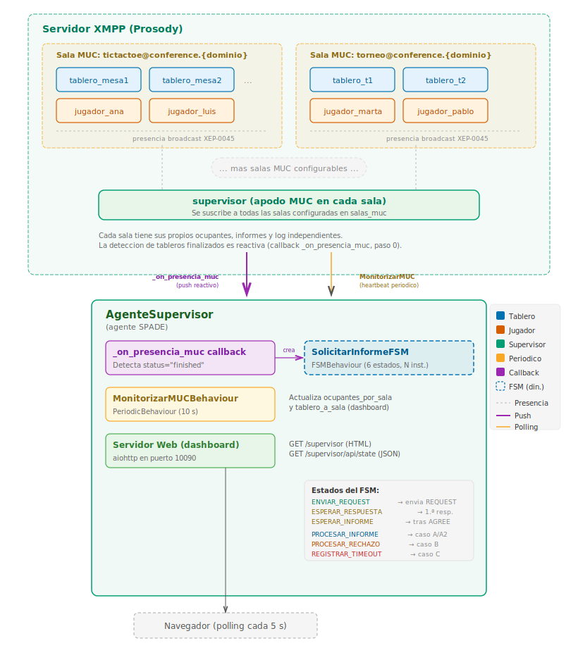
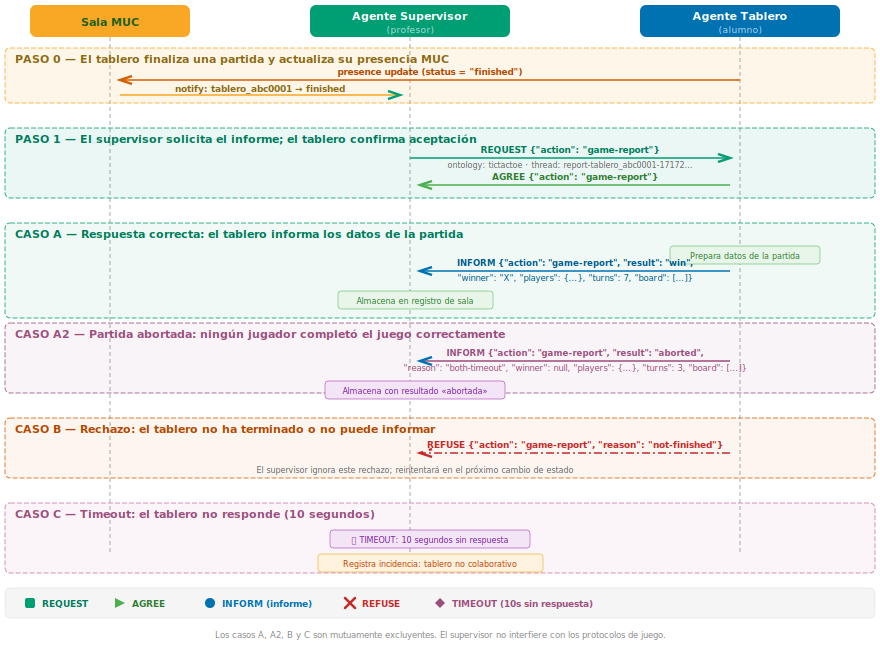
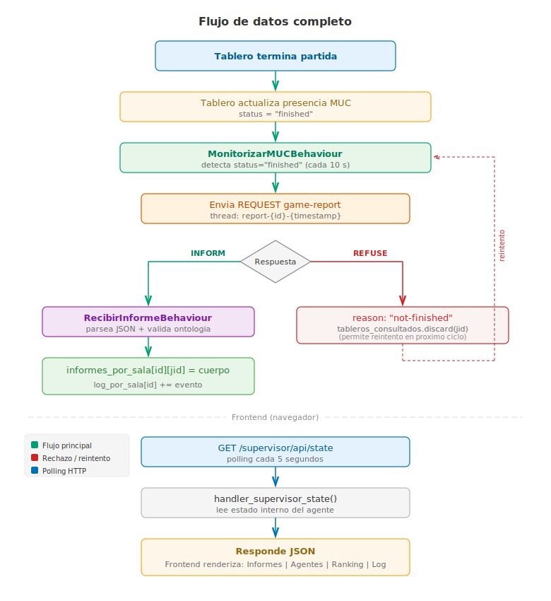

# Análisis y Diseño — Agente Supervisor

**Proyecto:** Tic-Tac-Toe Multiagente

**Asignatura:** Sistemas Multiagente — Universidad de Jaén

**Fecha:** 2026-03-30

**Rama:** `feature/agente-supervisor`

---

## 1. Propósito

El Agente Supervisor es un agente SPADE de solo lectura que permite al
profesor observar en tiempo real el estado del sistema multiagente sin
interferir en la lógica de juego. Sus responsabilidades son:

- Unirse a una o varias salas MUC como observador.
- Detectar tableros cuyas partidas han finalizado (presencia XEP-0045).
- Solicitar informes de partida (`game-report`) a dichos tableros.
- Recopilar y almacenar los informes recibidos, organizados por sala.
- Persistir los datos en una base de datos SQLite para que sobrevivan
  a los reinicios del agente.
- Ofrecer un panel web con la presencia, los informes, la clasificación
  y el registro de eventos de cada sala monitorizada, con la posibilidad
  de revisar ejecuciones pasadas.

---

## 2. Arquitectura general

El sistema se organiza en tres niveles que se comunican entre sí:

1. **Servidor XMPP (Prosody).** Aloja una o varias salas de
   conversación multiusuario (MUC). Dentro de cada sala conviven los
   agentes tablero, los agentes jugador y el supervisor. Todos ellos
   comparten su presencia mediante el protocolo XEP-0045: cuando un
   agente cambia de estado, la sala notifica automáticamente a los
   demás ocupantes.

2. **Agente Supervisor.** Se conecta al servidor XMPP y se suscribe
   a las salas configuradas. Internamente contiene tres componentes:
   una función de respuesta a presencia que detecta tableros
   finalizados de forma inmediata, un comportamiento periódico que
   mantiene actualizada la información para el panel web, y una
   máquina de estados (FSM) que se instancia dinámicamente para
   gestionar la solicitud de cada informe de partida. Todos los
   informes y eventos se persisten en una base de datos SQLite
   para conservarlos entre ejecuciones.

3. **Panel web.** Un servidor HTTP integrado en SPADE que expone una
   página web y una API JSON. El navegador del profesor consulta
   periódicamente esta API y representa gráficamente la presencia, los
   informes, la clasificación y el registro de eventos de cada sala.
   Además, incorpora un selector de ejecuciones que permite revisar
   los datos almacenados en sesiones anteriores.

El siguiente diagrama muestra estos tres niveles y las conexiones
entre ellos:



El supervisor localiza las salas MUC mediante el parámetro
`descubrimiento_salas` de `agents.yaml`, que admite dos modos:

- **`auto`** (por defecto): descubre las salas consultando el servicio
  `conference.{dominio}` mediante XEP-0030 (Service Discovery). Es el
  modo recomendado cuando se usa el Agente Organizador (opción C) o la
  creación de salas desde `main.py` (opción B), ya que el supervisor
  encuentra las salas automáticamente sin configuración adicional.
- **`manual`**: usa exclusivamente la lista `salas_muc` indicada en
  los parámetros del agente.

Si ningún modo devuelve salas, se utiliza la sala por defecto del perfil
XMPP (`sala_tictactoe` en `config.yaml`) como mecanismo de
retrocompatibilidad.

---

## 3. Ficheros del sistema

| Fichero | Responsabilidad |
|---------|-----------------|
| `agentes/agente_supervisor.py` | Clase `AgenteSupervisor(Agent)` — inicialización, estado interno multisala, registro de comportamientos, persistencia SQLite y arranque del servidor web |
| `behaviours/supervisor_behaviours.py` | `MonitorizarMUCBehaviour` (periódico, recorre todas las salas) y `SolicitarInformeFSM` (máquina de estados que gestiona la solicitud de un informe y lo persiste) |
| `persistencia/almacen_supervisor.py` | Clase `AlmacenSupervisor` — capa de persistencia SQLite para ejecuciones, informes y eventos |
| `web/supervisor_handlers.py` | Manejadores HTTP: panel web HTML, API JSON `/api/state` (en vivo), `/api/ejecuciones` (historial) y ficheros estáticos |
| `web/templates/supervisor.html` | Plantilla HTML del panel (estructura, disposición, selector de ejecuciones y ventana de detalle) |
| `web/static/supervisor.css` | Hojas de estilo con paleta WCAG AA, modo oscuro/claro, selector de ejecuciones y tipografías accesibles |
| `web/static/supervisor.js` | Lógica JavaScript sin dependencias: consulta periódica, historial de ejecuciones, representación de paneles, clasificación y tablero SVG |
| `supervisor_main.py` | Lanzador independiente con tres modos de ejecución: `consulta`, `laboratorio` y `torneo` |
| `agentes/agente_organizador.py` | Clase `AgenteOrganizador(Agent)` — opción C: crea salas MUC de torneos y se mantiene como ocupante (desactivado por defecto) |
| `config/agents.yaml` | Definición de los agentes: nombre, clase, módulo y parámetros |
| `config/config.yaml` | Perfiles XMPP (local / servidor) y LLM |
| `config/salas_laboratorio.yaml` | 30 salas MUC individuales, una por puesto del laboratorio (L2PC01 a L2PC30). Usado por `--modo laboratorio` |
| `config/sala_torneo.yaml` | Sala MUC única compartida (`torneo_lab`) para el torneo conjunto. Usado por `--modo torneo` |
| `config/torneos.yaml` | Definición de torneos genérica (uso con `main.py` o con la opción `--torneos` heredada) |

---

## 4. Estado interno del agente

El método `setup()` de `AgenteSupervisor` inicializa las estructuras de
datos en memoria (organizadas por sala) y el almacén de persistencia:

| Atributo | Tipo | Descripción |
|----------|------|-------------|
| `salas_muc` | `list[dict]` | Lista de salas monitorizadas, cada una con su `id` y su `jid` |
| `informes_por_sala` | `dict[str, dict[str, dict]]` | Informes indexados primero por sala y luego por el JID del tablero que los envió |
| `tableros_consultados` | `set[str]` | JID de tableros bloqueados temporalmente durante la creación del FSM (evita duplicados dentro de la misma función de respuesta; se desbloquea inmediatamente después) |
| `tablero_a_sala` | `dict[str, str]` | Correspondencia JID del tablero → identificador de sala (para asignar los informes recibidos) |
| `ocupantes_por_sala` | `dict[str, list[dict]]` | Ocupantes MUC de cada sala, con apodo, JID, rol y estado |
| `log_por_sala` | `dict[str, list[dict]]` | Registro cronológico de eventos por sala, con tipo, origen, detalle y marca temporal |
| `informes_pendientes` | `dict[str, str]` | Solicitudes de informe en curso (JID del tablero → identificador de sala). Se rellena al crear un `SolicitarInformeFSM` y se vacía cuando el FSM alcanza un estado terminal. Al detener el supervisor, las entradas restantes se registran como advertencias |
| `almacen` | `AlmacenSupervisor` | Capa de persistencia SQLite. Almacena informes, eventos y metadatos de cada ejecución en el fichero configurado (por defecto `data/supervisor.db`) |

Los datos en memoria son la fuente principal para la ejecución en
curso. El almacén SQLite se alimenta de forma simultánea cada vez que
se recibe un informe o se registra un evento, de modo que los datos
sobreviven a un reinicio del agente. Las ejecuciones pasadas se
consultan exclusivamente a través del almacén.

Al finalizar la ejecución, el almacén filtra automáticamente las salas
sin actividad: solo se conservan en ``salas_json`` las salas que
registraron al menos un evento o un informe. Las salas configuradas
pero sin actividad se descartan de la persistencia, aunque durante la
ejecución en vivo se muestran todas en la interfaz web.

---

## 5. Comportamientos

El agente supervisor utiliza dos comportamientos SPADE y una función
de respuesta a presencia que trabajan de forma coordinada:

1. **MonitorizarMUCBehaviour** — Comportamiento periódico que registra
   el estado de ocupación de las salas en el registro de depuración.
2. **`_on_presencia_muc`** — Manejador de presencia MUC que mantiene
   actualizada la lista de ocupantes, registra entradas, salidas y
   cambios de estado de tableros, y detecta tableros finalizados.
3. **SolicitarInformeFSM** — Máquina de estados finitos (6 estados)
   que gestiona la solicitud de un informe de partida a un tablero.

La documentación detallada de cada componente (diagramas, fichas
técnicas, secuencias y excepciones) se encuentra en el README de la
carpeta de comportamientos:

> **[`behaviours/BEHAVIOURS_SUPERVISOR.md` — Análisis de los comportamientos del supervisor](../behaviours/BEHAVIOURS_SUPERVISOR.md)**

---

## 6. Protocolo de comunicación

### 6.1 Ontología

Nombre: `tictactoe`
Formato del cuerpo: JSON
Validación: esquema JSON mediante `ontologia.ontologia.validar_cuerpo()`

### 6.2 Diagrama de secuencia del protocolo FIPA-Request

El siguiente diagrama muestra el protocolo completo de recolección
de resultados entre el supervisor y los tableros, incluyendo todos
los casos posibles (respuesta correcta, partida abortada, rechazo
y tiempo agotado):



### 6.3 Performativas FIPA-ACL utilizadas por el supervisor

| Acción | Performativa | Dirección | Descripción |
|--------|-------------|-----------|-------------|
| `game-report` | `request` | Supervisor → Tablero | Solicita el informe de la partida |
| (aceptación) | `agree` | Tablero → Supervisor | Confirma que procesará la solicitud |
| (informe) | `inform` | Tablero → Supervisor | Envía el informe completo de la partida finalizada |
| (rechazo) | `refuse` | Tablero → Supervisor | Indica que la partida aún no ha terminado |

### 6.4 Casos del protocolo

| Caso | Condición | Respuesta del tablero | Acción del supervisor |
|------|-----------|----------------------|----------------------|
| **A** | Partida finalizada con resultado | AGREE + INFORM (result: win/draw) | Almacena el informe en la sala correspondiente |
| **A2** | Partida abortada | AGREE + INFORM (result: aborted, reason) | Almacena el informe con resultado «abortada» |
| **B** | Partida no terminada | REFUSE (reason: not-finished) | Registra la razón del rechazo (el tablero ya fue desbloqueado en la función de respuesta) |
| **C** | Tablero no responde | (sin respuesta en 10 s) | Registra la incidencia como tablero no colaborativo |

Los casos son mutuamente excluyentes. El supervisor no interfiere con
los protocolos de juego entre tableros y jugadores.

### 6.5 Estructura del informe recibido (INFORM)

```json
{
    "action": "game-report",
    "result": "win" | "draw" | "aborted",
    "winner": "X" | "O" | null,
    "players": {
        "X": "jugador_alice@sinbad2.ujaen.es",
        "O": "jugador_bob@sinbad2.ujaen.es"
    },
    "turns": 7,
    "board": ["X", "O", "X", "", "X", "O", "O", "X", ""],
    "reason": "both-timeout",
    "ts": "16:05:23"
}
```

---

## 7. Panel web

### 7.1 Servidor

- Biblioteca: aiohttp (integrado en SPADE mediante `self.web`).
- Puerto por defecto: **10090** (configurable en `agents.yaml`).
- Escucha en: `0.0.0.0` (accesible desde cualquier interfaz de red).

### 7.2 Rutas disponibles

| Método | Ruta | Respuesta |
|--------|------|-----------|
| GET | `/supervisor` | Página HTML del panel |
| GET | `/supervisor/api/state` | JSON con el estado en vivo (todas las salas) |
| GET | `/supervisor/api/ejecuciones` | JSON con la lista de ejecuciones guardadas |
| GET | `/supervisor/api/ejecuciones/{id}` | JSON con los datos completos de una ejecución pasada (mismo formato que `/api/state`) |
| GET | `/supervisor/static/{fichero}` | Ficheros estáticos (CSS, JS) |

### 7.3 API JSON — Estructura de `/supervisor/api/state`

```json
{
    "salas": [
        {
            "id": "tictactoe",
            "nombre": "Sala principal",
            "jid": "tictactoe@conference.sinbad2.ujaen.es",
            "descripcion": "Sala de partidas Tic-Tac-Toe",
            "ocupantes": [
                { "nick": "tablero_mesa1", "jid": "...", "rol": "tablero", "estado": "online" },
                { "nick": "jugador_alice", "jid": "...", "rol": "jugador", "estado": "online" },
                { "nick": "supervisor",    "jid": "...", "rol": "supervisor", "estado": "online" }
            ],
            "informes": [
                {
                    "id": "informe_001",
                    "tablero": "tablero_mesa1",
                    "ts": "16:05:23",
                    "resultado": "victoria",
                    "ficha_ganadora": "X",
                    "jugadores": { "X": "jugador_alice@...", "O": "jugador_bob@..." },
                    "turnos": 7,
                    "tablero_final": ["X","O","X","","X","O","O","X",""]
                }
            ],
            "log": [
                { "ts": "16:05:23", "tipo": "informe", "de": "tablero_mesa1", "detalle": "Victoria de X (alice) contra bob · 7 turnos" }
            ]
        },
        {
            "id": "torneo",
            "nombre": "Sala principal",
            "jid": "torneo@conference.sinbad2.ujaen.es",
            "descripcion": "Sala de partidas Tic-Tac-Toe",
            "ocupantes": [],
            "informes": [],
            "log": []
        }
    ],
    "timestamp": "16:05:30"
}
```

### 7.4 Interfaz de usuario

- **Tecnología:** JavaScript puro (sin bibliotecas externas).
- **Consulta periódica:** cada 5 segundos a la ruta `/supervisor/api/state`.
- **Tipografías:** Atkinson Hyperlegible (texto) + JetBrains Mono (código).
- **Accesibilidad:** paleta WCAG AA (contraste >= 4.5:1), roles ARIA y navegación por teclado.
- **Temas:** oscuro (por defecto) y claro, con selector persistente en almacenamiento local.
- **Selector de ejecuciones:** un desplegable en la cabecera que permite
  alternar entre «En vivo» (consulta periódica normal) y cualquier
  ejecución pasada almacenada en la base de datos. Al seleccionar una
  ejecución pasada, se realiza una consulta única a
  `/supervisor/api/ejecuciones/{id}`, se detiene la consulta periódica,
  se muestra un aviso de «modo histórico» y se oculta la pestaña
  «Agentes» (las ejecuciones pasadas no conservan datos de presencia).

### 7.5 Pestañas del panel

| Pestaña | Contenido |
|---------|-----------|
| **Informes** | Cuadrícula de tarjetas con resultado, tablero SVG en miniatura, jugadores y turnos. Se puede filtrar por resultado (todos / victorias / empates / abortadas). Al pulsar una tarjeta se abre una ventana con el detalle. |
| **Agentes** | Lista de ocupantes MUC agrupados por rol (tablero, jugador, supervisor) con su estado de presencia. |
| **Clasificación** | Tabla de posiciones calculada a partir de los informes de la sala activa. Ordenada por: % de victorias → victorias → menos abortadas → menos derrotas. Medallas para los 3 primeros. |
| **Registro** | Cronología de eventos observados en la sala activa: informes recibidos, partidas abortadas, cambios de presencia y desconexiones. |

### 7.6 Componentes visuales destacados

- **Tablero SVG:** representación vectorial del estado final con fichas X/O y línea ganadora. Accesible con `aria-label` descriptivo.
- **Ventana de detalle:** muestra el informe completo con tablero SVG grande (200 px), jugadores con indicador de resultado, datos técnicos (tablero emisor, hora, turnos, motivo).
- **Barra lateral:** lista de salas MUC monitorizadas con contador de agentes e informes por sala. Permite seleccionar la sala activa.
- **Resumen global:** 6 cajas con los indicadores principales (en sala, informes, victorias, empates, abortadas, jugadores) que se actualizan según la sala seleccionada.

---

## 8. Configuración

### 8.1 Parámetros del agente (agents.yaml)

```yaml
- nombre: supervisor
  clase: AgenteSupervisor
  modulo: agentes.agente_supervisor
  nivel: 1
  parametros:
    intervalo_consulta: 10    # Segundos entre consultas MUC
    puerto_web: 10090         # Puerto del panel web
    # Lista de salas MUC a monitorizar (opcional).
    # Si se omite, usa la sala por defecto del perfil XMPP.
    # salas_muc:
    #   - tictactoe
    #   - torneo
    #   - practica_grupo_a
  activo: true
```

### 8.2 Conexión XMPP (config.yaml)

| Perfil | Servidor | Puerto | Dominio |
|--------|----------|--------|---------|
| `local` | localhost | 5222 | localhost |
| `servidor` | sinbad2.ujaen.es | 8022 | sinbad2.ujaen.es |

Servicio MUC: `conference.{dominio}`
Sala por defecto: `tictactoe` (configurable mediante `salas_muc`)
Apodo del supervisor en cada sala MUC: `supervisor`

### 8.3 Modos de ejecución

El lanzador `supervisor_main.py` ofrece tres modos de ejecución
mediante el argumento obligatorio `--modo`. Cada modo está diseñado
para una fase concreta de la sesión de laboratorio:

| Modo | Orden | Descripción |
|------|-------|-------------|
| **consulta** | `--modo consulta` | Solo arranca el panel web para revisar ejecuciones pasadas almacenadas en SQLite. **No requiere conexión XMPP** ni activa comportamientos de descubrimiento o comunicación. |
| **laboratorio** | `--modo laboratorio` | Crea una sala MUC por cada puesto del laboratorio (L2PC01 a L2PC30) leyendo `config/salas_laboratorio.yaml`. Arranca el supervisor completo con todos sus comportamientos. |
| **torneo** | `--modo torneo` | Crea una única sala MUC compartida (`torneo_lab`) leyendo `config/sala_torneo.yaml`. Arranca el supervisor completo. |

Cada modo usa un fichero de configuración de salas distinto, lo que
permite mantener separadas las definiciones de cada escenario sin
necesidad de editar ficheros entre fases:

```
config/salas_laboratorio.yaml  ← modo laboratorio (30 salas individuales)
config/sala_torneo.yaml        ← modo torneo (1 sala compartida)
(ninguno)                      ← modo consulta (sin XMPP)
```

#### Modo consulta

Permite al profesor revisar los datos de ejecuciones anteriores sin
necesidad de conectarse al servidor XMPP. Arranca únicamente un
servidor web `aiohttp` independiente (sin agente SPADE) que sirve el
panel con acceso al almacén SQLite.

```bash
python supervisor_main.py --modo consulta
python supervisor_main.py --modo consulta --db data/torneo_lab.db
```

El panel muestra el selector de ejecuciones históricas. La
pestaña «Agentes» y el estado en vivo no están disponibles (no hay
conexión XMPP).

#### Modo laboratorio

Diseñado para la **Fase A** de la sesión: cada alumno trabaja en su
propia sala MUC aislada. El supervisor se une a las 30 salas
simultáneamente y monitoriza la presencia de cada puesto.

```bash
python supervisor_main.py --modo laboratorio
python supervisor_main.py --modo laboratorio --intervalo 5
```

Lee automáticamente `config/salas_laboratorio.yaml`, que define las
salas `sala_pc01` a `sala_pc30`.

#### Modo torneo

Diseñado para la **Fase B** de la sesión: todos los alumnos conectan
sus agentes a una única sala compartida. Se recomienda usar una base
de datos separada para conservar los resultados del torneo de forma
independiente.

```bash
python supervisor_main.py --modo torneo --db data/torneo_lab.db
```

Lee automáticamente `config/sala_torneo.yaml`, que define la sala
`torneo_lab`.

#### Opciones comunes a todos los modos

```bash
--config CONFIG    Ruta a config.yaml (default: config/config.yaml)
--db DB            Ruta al fichero SQLite (default: data/supervisor.db)
--puerto PUERTO    Puerto del panel web (default: 10090)
--intervalo N      Segundos entre consultas MUC (default: 10, solo modos activos)
```

El fichero SQLite se crea automáticamente en la ruta indicada por
`--db`. El directorio `data/` está excluido del control de versiones
en `.gitignore`.

#### Archivos de persistencia específicos por propósito

La opción `--db` permite utilizar un fichero SQLite distinto para
cada modo o sesión de trabajo. Esto resulta especialmente útil para
mantener las ejecuciones organizadas por propósito, de forma que la
revisión posterior sea más ordenada y cada fichero contenga solo las
ejecuciones relevantes para un contexto concreto.

Por ejemplo, las pruebas individuales de la Fase A y el torneo de la
Fase B generan datos de naturaleza muy distinta. Si ambos modos
comparten el mismo fichero, el selector de ejecuciones del panel web
mezclará sesiones de prueba con sesiones de torneo, lo que dificulta
la revisión. Separar los ficheros permite al profesor consultar
después únicamente las ejecuciones del torneo o únicamente las de las
pruebas individuales, sin tener que distinguir entre ellas:

```text
# Fase A — las ejecuciones se guardan en el fichero por defecto
python supervisor_main.py --modo laboratorio

# Fase B — las ejecuciones del torneo se guardan aparte
python supervisor_main.py --modo torneo --db data/torneo_lab.db

# Revisión posterior — consultar solo las ejecuciones del torneo
python supervisor_main.py --modo consulta --db data/torneo_lab.db

# Revisión posterior — consultar solo las ejecuciones de laboratorio
python supervisor_main.py --modo consulta
```

Se pueden crear tantos ficheros como se necesite para organizar la
información. Cada fichero es independiente y acumula todas las
ejecuciones realizadas con esa ruta:

```text
data/supervisor.db        ← ejecuciones del modo laboratorio (por defecto)
data/torneo_lab.db        ← ejecuciones del torneo conjunto
data/torneo_2026-04-08.db ← ejecuciones de un torneo en una fecha concreta
data/prueba_rapida.db     ← ejecuciones de pruebas puntuales
```

Panel web disponible en: `http://localhost:10090/supervisor`

---

## 9. Gestión de torneos y creación de salas MUC

### 9.1 Escenario distribuido (uso habitual)

En el funcionamiento habitual de la asignatura, el sistema se ejecuta
de forma distribuida en el laboratorio:

- **El profesor** ejecuta el supervisor desde L2PC00.
- **Cada alumno** ejecuta su agente tablero (`tablero_USUARIO`) y su
  agente jugador (`jugador_USUARIO`) desde su puesto (L2PC01 a
  L2PC30), conectándose al servidor XMPP de la asignatura.

Todos los participantes comparten el mismo servidor XMPP
(`sinbad2.ujaen.es`), pero cada uno arranca sus agentes de forma
independiente. El profesor selecciona el modo de ejecución adecuado
según la fase de la sesión.

### 9.2 Ficheros de configuración de salas

Los escenarios de salas MUC se definen en ficheros YAML separados,
uno por cada modo de ejecución activo. Esto evita tener que editar
ficheros entre fases:

| Fichero | Modo | Contenido |
|---------|------|-----------|
| `config/salas_laboratorio.yaml` | `--modo laboratorio` | 30 salas individuales (`sala_pc01` a `sala_pc30`), una por puesto del laboratorio |
| `config/sala_torneo.yaml` | `--modo torneo` | Sala única compartida (`torneo_lab`) para el torneo conjunto |

Ambos ficheros usan el mismo formato YAML que `torneos.yaml` (clave
`torneos` con una lista de entradas con `nombre`, `sala`,
`descripcion`). Las listas de `tableros` y `jugadores` son
informativas en modo distribuido.

### 9.3 Flujos de ejecución por modo

#### Modo laboratorio (Fase A — pruebas individuales)

1. **El profesor** ejecuta:
   ```bash
   python supervisor_main.py --modo laboratorio
   ```
   Esto lee `config/salas_laboratorio.yaml`, crea las 30 salas MUC y
   arranca el supervisor.
2. **El profesor** comunica a los alumnos la regla de la sala:
   `L2PCnn → sala_asignada: sala_pcnn`.
3. **Cada alumno** configura `sala_asignada` con la sala de su puesto
   y arranca sus agentes (`python main.py`).
4. El supervisor detecta los agentes en cada sala.

#### Modo torneo (Fase B — torneo conjunto)

1. **El profesor** ejecuta:
   ```bash
   python supervisor_main.py --modo torneo --db data/torneo_lab.db
   ```
   Esto lee `config/sala_torneo.yaml`, crea la sala `torneo_lab` y
   arranca el supervisor.
2. **El profesor** comunica a los alumnos:
   `sala_asignada: torneo_lab`.
3. **Cada alumno** cambia `sala_asignada` a `torneo_lab` y arranca
   sus agentes.
4. Con 30 tableros y 30 jugadores en la misma sala, se producen
   partidas cruzadas. El supervisor recoge los informes y muestra
   la clasificación global.

#### Modo consulta (revisión de datos)

```bash
python supervisor_main.py --modo consulta
python supervisor_main.py --modo consulta --db data/torneo_lab.db
```

No se conecta al servidor XMPP. Solo arranca el panel web para
revisar las ejecuciones almacenadas en la base de datos SQLite.

#### Flujo local (pruebas en un solo ordenador)

Cuando se ejecuta `main.py`, el lanzador lee `config/torneos.yaml`,
crea las salas e inyecta `sala_asignada` en cada agente
automáticamente:

```bash
python main.py
```

### 9.4 Formatos de torneo personalizados

El formato YAML de los ficheros de salas permite definir cualquier
organización. Además de los ficheros predefinidos, el profesor puede
crear ficheros personalizados:

**Fase de grupos + final:**

```yaml
torneos:
  - nombre: grupo_a
    sala: grupo_a
    descripcion: "Fase de grupos — Grupo A"

  - nombre: grupo_b
    sala: grupo_b
    descripcion: "Fase de grupos — Grupo B"

  - nombre: final
    sala: final_torneo
    descripcion: "Final — ganadores de cada grupo"
```

Para usar un fichero personalizado sin los modos predefinidos, se
puede recurrir a la opción heredada `--torneos` de `main.py`.

### 9.5 Opción C — Agente Organizador de Torneos

Esta opción utiliza un agente SPADE dedicado (`AgenteOrganizador`)
que crea las salas y se mantiene conectado como ocupante de cada una
durante toda su ejecución. Está pensada para escenarios donde se
necesite que las salas persistan mientras el sistema esté activo, o
para futuras ampliaciones donde el organizador gestione
emparejamientos o fases de un torneo de forma autónoma.

**Está desactivado por defecto** (`activo: false` en `agents.yaml`).
Para utilizarlo:

1. Editar `config/agents.yaml` y cambiar `activo: true` en la entrada
   del organizador.
2. Asegurarse de que `config/torneos.yaml` contiene los torneos.
3. Ejecutar el sistema con `python main.py`.

```yaml
# En agents.yaml — activar el organizador
- nombre: organizador
  clase: AgenteOrganizador
  modulo: agentes.agente_organizador
  parametros:
    ruta_torneos: config/torneos.yaml
  activo: true      # ← cambiar a true
```

**Flujo:**
1. El organizador arranca como cualquier otro agente SPADE.
2. Lee `torneos.yaml` y se une a cada sala (creándola si no existe).
3. Se mantiene como ocupante de las salas durante toda la ejecución,
   evitando que el servidor las elimine por inactividad.
4. Los alumnos conectan sus agentes a las salas.
5. El supervisor descubre las salas vía XEP-0030 y las monitoriza.

**Ventajas:** las salas persisten mientras el organizador esté
conectado, y la arquitectura queda preparada para que futuros alumnos
amplíen el organizador con lógica de emparejamiento, fases
eliminatorias, clasificaciones automáticas, etc.

### 9.6 ¿Cuándo usar cada modo/opción?

| Escenario | Modo / opción recomendada |
|-----------|--------------------------|
| Fase A — cada alumno prueba en su sala aislada | `--modo laboratorio` |
| Fase B — torneo conjunto de toda la clase | `--modo torneo --db data/torneo_lab.db` |
| Revisar resultados de sesiones anteriores | `--modo consulta --db data/torneo_lab.db` |
| Pruebas locales con todos los agentes en un ordenador | `python main.py` (con `config/torneos.yaml`) |
| Pruebas rápidas sin torneos | Ninguna — se usa la sala por defecto (`tictactoe`) |
| Torneos prolongados (varias horas/días) | Opción C — el organizador mantiene las salas activas |
| Futuras ampliaciones con lógica de torneo autónoma | Opción C — ampliar `AgenteOrganizador` |

---

## 10. Flujo de datos completo (ejecución en vivo)



---

## 11. Dependencias

| Paquete | Versión | Uso |
|---------|---------|-----|
| `spade` | >= 4.1.2 | Plataforma de agentes, presencia y servidor web |
| `aiohttp` | >= 3.9 | Manejadores HTTP del panel (integrado en SPADE) |
| `pyyaml` | >= 6.0 | Lectura de config.yaml y agents.yaml |
| `jsonschema` | >= 4.20.0 | Validación de mensajes contra la ontología |
| `sqlite3` | (biblioteca estándar) | Persistencia de informes, eventos y ejecuciones |

---

## 12. Incidencia resuelta

**Error detectado:** `'Contact' object has no attribute 'get'`
**Fichero:** `behaviours/supervisor_behaviours.py:73`
**Causa:** El código original trataba los objetos devueltos por
`get_contacts()` como diccionarios (`datos.get("presence", {})`).
En SPADE 4.x esta función devuelve objetos `Contact` cuya presencia
se obtiene con el método `get_presence()`, que retorna un
`PresenceInfo`.
**Corrección inicial:** Se creó la función auxiliar
`_obtener_estado_contacto()`.
**Corrección definitiva:** Se reemplazó `MonitorizarMUCBehaviour`
(que usaba `get_contacts()`) por el manejador de presencia MUC
`_on_presencia_muc`, que captura las stanzas de presencia en tiempo
real directamente desde el cliente slixmpp. Esto resuelve el problema
de raíz y además permite detectar entradas, salidas y cambios de
estado.

---

## 13. Limitaciones conocidas

1. **~~Presencia MUC mediante suscripción directa~~ (resuelta).**
   El supervisor ahora se une a las salas MUC enviando stanzas de
   presencia con namespace MUC (XEP-0045) mediante el método
   `_unirse_sala_muc()`. Esto reemplaza el anterior
   `presence.subscribe()` que no realizaba un join MUC real y no
   permitía ver los ocupantes de la sala.

2. **Un único informe por tablero y sala (en memoria).** El diccionario
   `informes_por_sala[sala_id]` usa el JID del tablero como clave,
   por lo que si un tablero ejecuta múltiples partidas en la misma sala
   durante una ejecución, solo se conserva el último informe en memoria.
   Sin embargo, la base de datos SQLite sí almacena todos los informes
   recibidos, de modo que el histórico completo puede consultarse en
   ejecuciones pasadas.

3. **Panel web sin autenticación.** El servidor web escucha en
   `0.0.0.0:10090` pero no implementa autenticación ni HTTPS. Solo es
   adecuado para su uso en red local o en entornos de desarrollo.

4. **Sin datos de presencia en ejecuciones pasadas.** Los ocupantes de
   las salas MUC solo están disponibles en la ejecución en curso
   (datos volátiles que dependen de la conexión XMPP). Al revisar una
   ejecución pasada, la pestaña «Agentes» no se muestra.

---

## 14. Pruebas

El agente supervisor cuenta con dos niveles de pruebas:

- **Tests unitarios:** 189 tests en 6 ficheros que se ejecutan sin
  SPADE ni servidor XMPP, utilizando objetos simulados.
- **Tests de integración:** 23 tests que arrancan agentes SPADE reales
  contra un servidor XMPP y verifican escenarios completos de
  laboratorio con agentes simulados.

### 14.1 Organización de los tests

Cada fichero de test se centra en un componente del sistema. Esta
separación permite ejecutar las pruebas de forma individual para
aislar problemas, o todas juntas para verificar que no hay
interferencias entre componentes.

| Fichero | Tests | Componente verificado |
|---------|------:|----------------------|
| `tests/test_almacen_supervisor.py` | 28 | Capa de persistencia SQLite (`AlmacenSupervisor`), filtrado de salas sin actividad |
| `tests/test_supervisor_behaviours.py` | 30 | Funciones auxiliares, los 6 estados del FSM y tipos de evento `LOG_*` |
| `tests/test_agente_supervisor.py` | 33 | Métodos del agente y manejador de presencia MUC (`_on_presencia_muc`) |
| `tests/test_supervisor_handlers.py` | 25 | Funciones de conversión (incl. JID MUC vs real) y las 4 rutas HTTP |
| `tests/test_creacion_salas.py` | 13 | Creación de salas MUC y visibilidad en el supervisor |
| `tests/test_integracion_supervisor.py` | 23 | Tests de integración con agentes SPADE reales (requiere servidor XMPP) |

### 14.2 Tipos de pruebas

Las pruebas se clasifican en tres categorías según lo que verifican:

**Pruebas de funciones puras.** Verifican funciones que reciben una
entrada y devuelven un resultado sin efectos secundarios. Son las más
sencillas de escribir y mantener porque no requieren objetos simulados. Ejemplos:
`_determinar_rol`, `_construir_detalle_informe`, `_mapear_resultado`,
`_nombre_legible_sala`, `_convertir_informes`.

**Pruebas con objetos simulados.** Verifican componentes que
interactúan con el agente o con otros módulos. Se construye un objeto
que imita los atributos del agente real (salas, informes, almacén,
etc.) y se comprueba que el componente modifica el estado como se
espera. Esta técnica permite probar cada estado del FSM, la función
de respuesta a presencia y el método de registro de eventos de forma
aislada, sin arrancar el agente ni la plataforma SPADE.

**Pruebas HTTP con cliente de aiohttp.** Verifican que las rutas del
panel web devuelven las respuestas esperadas. Se crea una aplicación
aiohttp con las rutas del supervisor y un agente simulado inyectado.
El módulo `pytest-aiohttp` proporciona un cliente HTTP de pruebas que
realiza peticiones reales contra la aplicación sin necesidad de abrir
un puerto de red.

### 14.3 Detalle por fichero

#### `test_almacen_supervisor.py` — Persistencia SQLite

Verifica todas las operaciones de la base de datos. Cada test utiliza
un fichero SQLite temporal que se elimina al finalizar.

| Clase de test | Qué se comprueba |
|---------------|------------------|
| `TestInicializacion` | El constructor crea el fichero, crea directorios intermedios si no existen, y el identificador de ejecución empieza como `None` |
| `TestCrearEjecucion` | Devuelve un id positivo, lo asigna al atributo, genera ids distintos para ejecuciones sucesivas, y almacena la configuración de salas |
| `TestFinalizarEjecucion` | Establece la fecha de fin, la ejecución activa tiene fin nulo, finalizar sin ejecución no lanza excepciones, filtra salas sin actividad (solo se conservan las que tienen eventos o informes), y conserva salas con solo informes |
| `TestGuardarInforme` | El informe se puede recuperar con los mismos datos, se pueden guardar varios en la misma sala o en salas distintas, y guardar sin ejecución no falla |
| `TestGuardarEvento` | El evento se recupera con los mismos campos, se devuelven en orden cronológico inverso, y los eventos de salas distintas se separan |
| `TestListarEjecuciones` | Sin ejecuciones devuelve lista vacía, con una devuelve un elemento, con varias aparecen en orden descendente, y cada entrada tiene los campos esperados |
| `TestAislamientoEjecuciones` | Los informes y eventos de una ejecución no aparecen al consultar otra diferente |

#### `test_supervisor_behaviours.py` — Funciones auxiliares y estados del FSM

Verifica la lógica de las funciones puras y de cada estado de la
máquina de estados. Los estados se prueban con un agente simulado
(`SimpleNamespace`) y métodos `send`/`receive` sustituidos por objetos simulados
asíncronos.

| Clase de test | Qué se comprueba |
|---------------|------------------|
| `TestDeterminarRol` | Clasifica correctamente tableros, supervisor, jugadores y apodos desconocidos |
| `TestConstruirDetalleInforme` | Genera texto descriptivo para victoria, empate, partida abortada y con campos vacíos |
| `TestEstadoEnviarRequest` | Envía un mensaje al tablero y transiciona a `ESPERAR_RESPUESTA` |
| `TestEstadoEsperarRespuesta` | Transiciona a `ESPERAR_INFORME` (agree), `PROCESAR_INFORME` (inform), `PROCESAR_RECHAZO` (refuse), `REGISTRAR_TIMEOUT` (sin respuesta) o `REGISTRAR_TIMEOUT` (performativa inesperada) |
| `TestEstadoEsperarInforme` | Transiciona a `PROCESAR_INFORME` (inform), `REGISTRAR_TIMEOUT` (sin respuesta), y verifica que un REFUSE en este punto se trata como performativa inesperada (no transiciona a `PROCESAR_RECHAZO`) |
| `TestEstadoProcesarInforme` | Almacena el informe en memoria, registra evento en el registro, persiste en el almacén si está disponible, es estado final (no establece siguiente estado), y no lanza excepciones con JSON no válido |
| `TestEstadoProcesarRechazo` | Registra la razón del rechazo y es estado final |
| `TestEstadoRegistrarTimeout` | Registra un evento de tipo `timeout` y es estado final |

#### `test_agente_supervisor.py` — Métodos del agente

Verifica los métodos internos del agente sin pasar por el constructor
de SPADE. Se crea una instancia vacía (`object.__new__`) a la que se
le inyectan manualmente los atributos necesarios.

| Clase de test | Qué se comprueba |
|---------------|------------------|
| `TestIdentificarSala` | Identifica correctamente JIDs de cada sala, devuelve cadena vacía si no pertenece a ninguna, y funciona con y sin recurso en el JID |
| `TestObtenerSalaDeTablero` | Encuentra el tablero en el mapeo, busca por JID sin recurso si el completo no está, usa la primera sala como valor por defecto, y devuelve vacío si no hay salas |
| `TestRegistrarEventoLog` | Añade el evento al registro de la sala indicada, los más recientes van primero, sin sala usa la primera, persiste en el almacén, y el evento incluye marca temporal |
| `TestOnPresenciaDisponible` | Crea un FSM cuando un tablero pasa a `finished`, marca el tablero como consultado, no crea FSM si ya estaba consultado, ignora estados distintos de `finished`, ignora jugadores, ignora salas desconocidas, registra evento de presencia y registra la correspondencia tablero→sala |

#### `test_supervisor_handlers.py` — Panel web

Verifica tanto las funciones de conversión (sin servidor HTTP) como
las rutas HTTP completas mediante el cliente de pruebas de aiohttp.
Los tests HTTP que necesitan base de datos crean un almacén SQLite
temporal con una ejecución finalizada.

| Clase de test | Qué se comprueba |
|---------------|------------------|
| `TestMapearResultado` | Traduce `win`→`victoria`, `draw`→`empate`, `aborted`→`abortada`, valores ya en español se mantienen, valores desconocidos pasan sin cambios |
| `TestNombreLegibleSala` | Nombre simple devuelve «Sala principal», nombre con guión bajo se capitaliza |
| `TestConvertirInformes` | Diccionario vacío devuelve lista vacía, convierte victoria y abortada, genera ids secuenciales, el tablero final tiene 9 elementos |
| `TestHandlerIndex` | `GET /supervisor` devuelve HTML con código 200, `GET /supervisor/` también funciona |
| `TestHandlerState` | Devuelve JSON con clave `salas` y `timestamp`, la sala incluye informes convertidos y la lista de ocupantes |
| `TestHandlerListarEjecuciones` | Devuelve una lista con al menos un elemento, cada ejecución tiene los campos `id`, `inicio`, `fin` y `num_salas` |
| `TestHandlerDatosEjecucion` | La ejecución pasada contiene salas con informes y eventos, los ocupantes están vacíos, una ejecución inexistente devuelve salas vacías, y un id no numérico también |

### 14.4 Cómo ejecutar las pruebas

Todas las órdenes se ejecutan desde la raíz del proyecto con el
entorno virtual activado:

```bash
source venv_sma/bin/activate
```

**Ejecutar todos los tests del supervisor:**

```bash
pytest tests/test_almacen_supervisor.py \
       tests/test_supervisor_behaviours.py \
       tests/test_agente_supervisor.py \
       tests/test_supervisor_handlers.py -v
```

**Ejecutar un fichero individual** (útil cuando se trabaja en un
componente concreto):

```bash
pytest tests/test_almacen_supervisor.py -v      # Persistencia
pytest tests/test_supervisor_behaviours.py -v   # Comportamientos y FSM
pytest tests/test_agente_supervisor.py -v        # Métodos del agente
pytest tests/test_supervisor_handlers.py -v      # Panel web
```

**Ejecutar una clase de tests concreta** (útil para depurar un
grupo de pruebas relacionadas):

```bash
pytest tests/test_supervisor_behaviours.py::TestEstadoEsperarRespuesta -v
pytest tests/test_agente_supervisor.py::TestOnPresenciaDisponible -v
```

**Ejecutar un test individual** (útil para depurar un caso concreto):

```bash
pytest tests/test_supervisor_behaviours.py::TestEstadoEsperarInforme::test_refuse_no_transiciona_a_procesar_rechazo -v
```

**Ejecutar todos los tests del proyecto** (incluye también los de la
ontología y cualquier otro fichero de tests que exista):

```bash
pytest tests/ -v
```

### 14.5 Requisitos para ejecutar los tests

- Python 3.12 con el entorno virtual del proyecto activado.
- Las dependencias de test están en `requirements.txt`: `pytest`,
  `pytest-asyncio` y `pytest-timeout`.
- Además se necesita `pytest-aiohttp` (instalado como dependencia
  adicional) para los tests HTTP del panel web.
- No se necesita servidor XMPP ni Prosody en ejecución.
- No se necesita conexión a Internet.
- El fichero `pytest.ini` en la raíz del proyecto configura
  `asyncio_mode = auto` para que las pruebas asíncronas funcionen
  correctamente.

---

## 15. Diagramas

Todos los diagramas SVG del proyecto se encuentran en
[`doc/svg/`](svg/):

| Diagrama | Fichero | Descripción |
|----------|---------|-------------|
| Arquitectura | [`arquitectura.svg`](svg/arquitectura.svg) | Servidor XMPP con múltiples salas MUC, agente supervisor con sus comportamientos y servidor web |
| Flujo de datos | [`flujo-datos.svg`](svg/flujo-datos.svg) | Recorrido completo desde que un tablero finaliza hasta que la interfaz web lo muestra |
| Protocolo de informes | [`protocolo-informe-supervisor.svg`](svg/protocolo-informe-supervisor.svg) | Diagrama de secuencia FIPA-Request con los 4 casos (A, A2, B, C) |
| MonitorizarMUCBehaviour | [`behaviour-monitorizar-muc.svg`](svg/behaviour-monitorizar-muc.svg) | Diagrama de actividad del comportamiento periódico de actualización de ocupantes |
| SolicitarInformeFSM | [`behaviour-solicitar-informe.svg`](svg/behaviour-solicitar-informe.svg) | Diagrama de estados de la máquina de estados del protocolo FIPA-Request (6 estados, 3 finales) |
