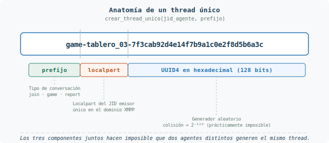
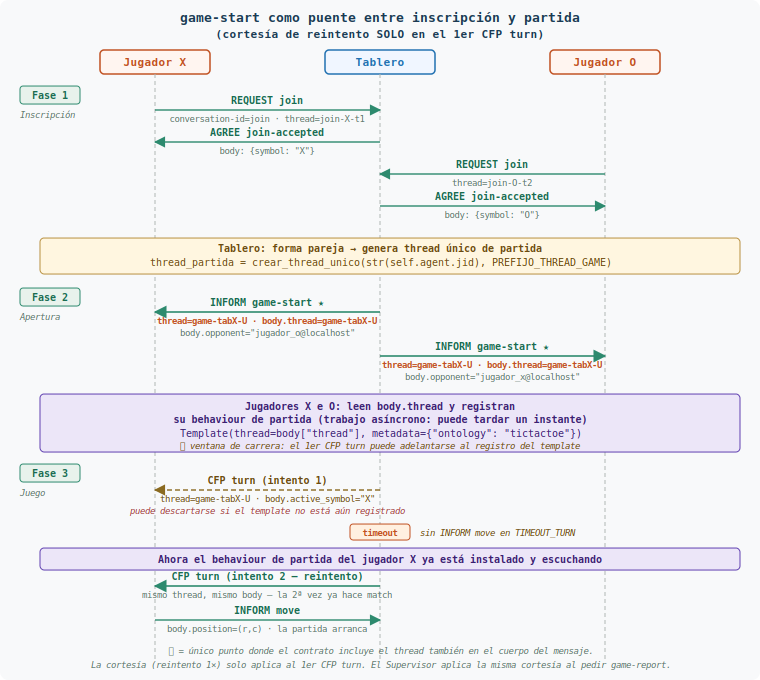
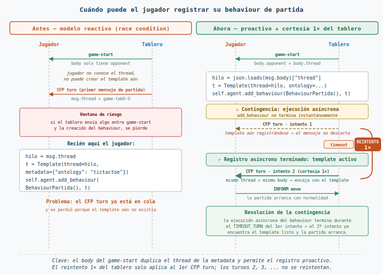

# Guía del thread único y del nuevo `game-start`

**Fecha:** 2026-04-23
**Alcance:** paquete `ontologia/`, Agente Tablero y Agente Jugador
**Destinatario:** alumnos del torneo Tic-Tac-Toe (SMA — Universidad de Jaén)

Este documento describe dos cambios en la ontología que han entrado
como respuesta al problema de *thread-id compartido entre tableros*
detectado en la prueba de laboratorio:

1. La nueva utilidad `crear_thread_unico(jid_agente, prefijo)` en
   `ontologia/ontologia.py`, pensada para evitar colisiones de thread
   entre agentes del torneo.
2. El nuevo campo obligatorio `thread` en el cuerpo del mensaje
   `game-start` (INFORM Tablero → Jugador), pensado para que el
   jugador pueda preparar el template de su behaviour de partida en el
   mismo instante en que recibe el mensaje, sin esperar al primer
   `CFP turn`.

Los dos cambios se entienden juntos: el primero garantiza la unicidad
del identificador, el segundo garantiza su entrega a tiempo.

---

## 1. Motivación

En un torneo en el que los agentes son implementados por alumnos
distintos, es posible que se produzcan inconsistencias en el thread
usado para identificar las partidas: cada alumno podría elegir un
patrón de generación propio (timestamps con distinta resolución,
contadores locales, nombres ad-hoc…) y dos tableros podrían acabar
usando el mismo valor, o un jugador podría quedarse sin saber qué
thread debe esperar antes de que llegue el primer mensaje de juego.

Para que la implementación de todos los alumnos sea coherente entre
sí, la ontología unifica la solución en dos niveles complementarios:

- **Regla general.** `crear_thread_unico` es la utilidad que el alumno
  debe emplear **siempre** que un agente necesite establecer el thread
  de una conversación (inscripción, partida, informe o cualquier otro
  protocolo que se añada en el futuro). Así se evitan de raíz tanto
  las colisiones como las omisiones, sin que cada alumno tenga que
  inventar su propio mecanismo.
- **Caso particular del `game-start`.** En este mensaje el thread no
  es un identificador cualquiera: representa el **identificador de la
  partida concreta que se juega en ese tablero**. Por eso la ontología
  lo incorpora explícitamente en el cuerpo del mensaje, de modo que
  cualquier jugador, venga del grupo que venga, sabe dónde leerlo y
  puede preparar el template de su behaviour de partida en el mismo
  instante en que recibe el mensaje.

Los dos cambios son **aditivos** (no rompen el esquema previo más allá
del campo nuevo en `game-start`) y **sencillos** para el alumno:

- una función `crear_thread_unico` de uso general para cualquier
  conversación;
- un campo adicional `thread` en el body del `game-start` que el
  constructor existente ya construye por ti.

---

## 2. La utilidad `crear_thread_unico`

### 2.1 Qué hace

Genera un identificador de thread globalmente único con el formato:

```
{prefijo}-{localpart_del_JID}-{uuid4_hex}
```

Por ejemplo:

```
game-tablero_03-7f3cab92d4e14f7b9a1c0e2f8d5b6a3c
```



Los tres componentes son complementarios:

| Componente | Aporta | Ejemplo |
|---|---|---|
| `prefijo` | Semántica (tipo de conversación) | `game`, `join`, `report` |
| `localpart` del JID emisor | Unicidad entre agentes del torneo | `tablero_03` |
| `uuid4` hexadecimal (128 bits) | Unicidad entre invocaciones del mismo agente | `7f3cab92…` |

La probabilidad de colisión combinada es, a efectos prácticos, cero
(≈ 2⁻¹²⁸ en el componente aleatorio, y además acotada por el JID).

### 2.2 API

```python
from ontologia import (
    crear_thread_unico,
    PREFIJO_THREAD_JOIN,
    PREFIJO_THREAD_GAME,
    PREFIJO_THREAD_REPORT,
)

thread_partida = crear_thread_unico(
    str(self.agent.jid), PREFIJO_THREAD_GAME,
)
```

Detalles:

- `jid_agente`: se acepta bare (`tablero_01@localhost`) o completo con
  recurso (`tablero_01@localhost/home`). Se toma siempre la parte
  local.
- `prefijo`: por defecto `"game"`. Las tres constantes
  `PREFIJO_THREAD_JOIN`, `PREFIJO_THREAD_GAME` y `PREFIJO_THREAD_REPORT`
  existen para unificar el vocabulario en todo el torneo.
- Devuelve una `str` lista para asignar a `mensaje.thread`.

### 2.3 Cuándo invocarla

La regla práctica es directa: **siempre que un agente necesite fijar
el thread de una conversación, debe obtenerlo llamando a
`crear_thread_unico`**. Con ello se evitan de raíz tanto las
colisiones entre agentes como el olvido de asignar un thread. El
cuadro siguiente resume los tres puntos donde los protocolos actuales
requieren esta invocación:

| Protocolo | Quién la invoca | Cuándo |
|---|---|---|
| `join` | Jugador | Al construir el `REQUEST join`. (Ya resuelto internamente por `crear_mensaje_join`, ver sección 2.4). |
| Partida | Tablero | Al formar pareja, justo antes de emitir el primer `game-start`. |
| `game-report` | Supervisor | Al solicitar el informe. |

Cada una de esas tres invocaciones es independiente. En ningún caso
hace falta propagar el mismo thread entre protocolos distintos: la
inscripción, la partida y el informe son conversaciones separadas y
cada una se identifica con su propio thread.

### 2.4 Cambio de firma en `crear_mensaje_join`

La función `crear_mensaje_join` ya existía en versiones anteriores de
la ontología, pero con dos limitaciones relevantes para el torneo:

- Recibía un único argumento (`jid_tablero`).
- **No fijaba el `thread`** del mensaje: era responsabilidad del
  alumno asignarlo a mano tras construir el `Message`, lo que dejaba
  la puerta abierta a thread débiles o, directamente, a olvidos que
  hacían que el tablero no pudiera correlacionar la respuesta con la
  petición original.

A partir de esta actualización, la función **unifica la solución**:
requiere también el JID del propio jugador y, con él, invoca
internamente a `crear_thread_unico(jid_jugador, PREFIJO_THREAD_JOIN)`
para poblar `mensaje.thread` antes de devolver el `Message`. De este
modo el alumno ya no tiene que preocuparse de asignar el thread del
`REQUEST join`; lo recibe hecho.

Si en la versión anterior del proyecto tu código hacía:

```python
# Antes — el alumno tenía que añadir el thread a mano
mensaje = crear_mensaje_join(jid_tablero)
mensaje.thread = algun_identificador_generado_localmente
await self.send(mensaje)
```

ahora debe actualizarse a:

```python
# Ahora — la función se encarga del thread
mensaje = crear_mensaje_join(jid_tablero, str(self.agent.jid))
await self.send(mensaje)
```

La regla sigue siendo la misma de la sección 2.3 (el thread se genera
siempre con `crear_thread_unico`); lo que cambia es que, para el
protocolo de inscripción, esa llamada queda encapsulada dentro de la
propia función de conveniencia de la ontología.

---

## 3. El nuevo `game-start`

### 3.1 Contrato

El mensaje `game-start` sigue siendo un INFORM del tablero a cada uno
de los jugadores que cierra la fase de inscripción y abre la fase de
juego. En este mensaje el thread tiene un significado concreto: es el
**identificador de la partida que se juega en ese tablero**, el que
etiquetará todos los mensajes posteriores (`turn`, `move`,
`turn-result`, `game-over`) hasta que la partida termine. Por eso se
eleva a campo explícito del cuerpo, y no queda únicamente en la
metadata FIPA. Su cuerpo incluye tres campos obligatorios:

| Campo | Tipo | Obligatorio | Valor |
|---|---|---|---|
| `action` | string (const) | sí | `"game-start"` |
| `opponent` | string (min 1) | sí | JID del rival |
| `thread` | string (min 1) | **sí (nuevo)** | Identificador de la partida (generado por el tablero con `crear_thread_unico`) |

Y su **metadata**:

| Clave | Valor |
|---|---|
| `ontology` | `"tictactoe"` |
| `performative` | `"inform"` |
| `thread` | El mismo valor que `body.thread` |

Invariante clave: `msg.thread == json.loads(msg.body)["thread"]`. El
valor del campo en el cuerpo **es exactamente el mismo** que el de la
metadata. El cuerpo no aporta información nueva; simplemente permite
que el jugador consulte el thread leyendo el body, que es lo que los
behaviours suelen hacer primero.

Este contrato es también la **base sobre la que descansa la cortesía
de reintento del turno 1** descrita en §5.3: al viajar el thread en
el cuerpo, el jugador puede registrar su behaviour de partida nada
más recibir el `game-start`, sin esperar al primer `CFP turn`. Eso
reduce drásticamente la probabilidad de que el primer turno llegue
antes del template; y para el pequeño residuo que siempre queda, el
tablero compensa con un reintento 1× **solo en ese primer turno**.

### 3.2 Flujo completo



Leyendo el diagrama de arriba abajo:

1. **Fase 1 — Inscripción.** Cada jugador emite `REQUEST join` y el
   tablero responde con `AGREE join-accepted` indicando el símbolo
   asignado. Cada inscripción tiene su propio thread
   (`join-<localpart>-<uuid>`), independiente del de la partida.
2. **Formación de pareja (banda ámbar).** Cuando el tablero tiene ya
   los dos jugadores, genera el thread único de partida con
   `crear_thread_unico(str(self.agent.jid), PREFIJO_THREAD_GAME)`.
   A partir de aquí, *todos* los mensajes de esta partida
   (`game-start`, `turn`, `move`, `turn-result`, `game-over`)
   compartirán ese mismo valor en la metadata `thread`.
3. **Fase 2 — Apertura.** El tablero emite un `INFORM game-start` a
   cada jugador. El mensaje lleva el thread tanto en la metadata como
   en el cuerpo. Es el único punto del protocolo donde el thread
   aparece duplicado: por eso los SVG marcan estos dos mensajes con
   una estrella (★).
4. **Registro del behaviour (banda morada).** Ambos jugadores leen
   `body["thread"]` y registran inmediatamente un behaviour de partida
   con el template adecuado. Ese registro es asíncrono y puede tardar
   un instante: por eso el SVG marca esa banda con el aviso de
   **ventana de carrera** — en la práctica el template se instala
   antes del primer `CFP turn`, pero no hay garantía absoluta.
5. **Fase 3 — Juego (con cortesía en el turno 1).** El tablero envía
   el primer `CFP turn`. Pueden ocurrir dos cosas:
   - **Caso normal.** El template del jugador ya está listo, el
     mensaje hace *match* y el jugador responde con su primer
     `INFORM move`. La partida arranca.
   - **Caso carrera.** El template todavía no está registrado, el
     `CFP turn` se descarta y el tablero observa un *timeout*. En ese
     caso el tablero **reenvía una única vez** el mismo `CFP turn`
     (mismo thread, mismo cuerpo); cuando llega la segunda vez el
     template ya está instalado y la partida arranca con normalidad.

   Esta cortesía de **reintento 1×** es exclusiva del primer `CFP turn`
   de cada partida (§5.3). A partir del segundo turno el canal ya está
   caliente y los mensajes `turn`, `move`, `turn-result` y `game-over`
   se despachan directamente al behaviour correcto sin reintento.

### 3.3 Constructor actualizado

```python
from ontologia import crear_cuerpo_game_start

body = crear_cuerpo_game_start(
    oponente=str(jid_jugador_o),
    thread_partida=thread_partida,
)
```

El constructor valida internamente que `oponente` y `thread_partida`
no sean cadenas vacías, así que un tablero que se olvide de pasar el
thread falla en construcción (nunca en recepción).

---

## 4. Impacto en el Agente Jugador

### 4.1 Modelo proactivo vs. reactivo

El cambio permite pasar del modelo *reactivo* (esperar al primer
`CFP turn` para descubrir el thread y crear el behaviour) al modelo
*proactivo* (crear el behaviour al recibir `game-start`, antes de
que llegue cualquier otro mensaje de partida).



El modelo proactivo **reduce drásticamente** la ventana de riesgo
entre `game-start` y el primer `CFP turn`, pero no la elimina del todo:
entre el instante en que el tablero envía el `game-start` y el instante
en que el jugador completa el registro de su behaviour de partida media
una pequeña cantidad de trabajo asíncrono (el jugador tiene que
deserializar el cuerpo, construir el template y llamar a
`add_behaviour`). Si el tablero emite el primer `CFP turn` de manera
inmediata, es posible que ese mensaje llegue al jugador antes de que
el template esté instalado y se descarte por falta de *match*.

La recomendación sigue siendo adoptar el modelo proactivo, pero
combinado con la cortesía de reintento que el tablero aplica
**únicamente en el primer `CFP turn` de cada partida** (ver §5.3).
En los turnos siguientes la comunicación ya está establecida: el
behaviour de partida del jugador está instalado y escuchando, así
que los turnos 2, 3, ... no necesitan ningún tipo de reintento.

### 4.2 Patrón de implementación

En el behaviour que espera el `game-start` (típicamente el mismo que
gestiona `join-accepted`):

```python
import json
from spade.template import Template

from ontologia import ONTOLOGIA


async def run(self):
    msg = await self.receive(timeout=TIMEOUT_JOIN)
    if msg is None:
        return

    cuerpo = json.loads(msg.body)
    if cuerpo.get("action") != "game-start":
        return

    # Campos del cuerpo — validados por la ontología del remitente,
    # pero conviene que el jugador los lea sin suponer nada más.
    thread_partida = cuerpo["thread"]
    oponente = cuerpo["opponent"]

    # Template proactivo: encaja todos los mensajes de ESTA partida
    # (turn, move confirmado, game-over) y descarta cualquier
    # mensaje de otra partida o de otro tablero.
    plantilla_partida = Template()
    plantilla_partida.thread = thread_partida
    plantilla_partida.set_metadata("ontology", ONTOLOGIA)

    self.agent.add_behaviour(
        BehaviourPartida(oponente=oponente, simbolo=self.simbolo_propio),
        plantilla_partida,
    )
```

Puntos importantes:

- El behaviour de partida **se registra antes de devolver el control**
  al bucle SPADE. En la práctica esto hace que, cuando el tablero
  envía el primer `CFP turn`, el template ya esté instalado y el
  mensaje se despache al behaviour correcto. Para el caso extremo en
  que el `CFP turn` se adelante al registro, el tablero aplica la
  cortesía de reintento descrita en §5.3 — el jugador no tiene que
  hacer nada especial: cuando llegue el reintento, su template ya
  estará listo.
- La plantilla **no debe** filtrar por `sender`. Acoplarse al JID del
  tablero hace inservible el behaviour cuando el torneo se juega
  contra tableros de otros alumnos. Filtra por `thread` (discrimina la
  partida) y por `ontology` (descarta ruido del torneo).
- El jugador **no** necesita hacer nada especial con la metadata
  `thread` del propio `game-start`; el valor viaja por ambos sitios
  (cuerpo y metadata) y son iguales.
- El jugador **tampoco** tiene que preocuparse por el reintento: si
  el tablero reenvía el primer `CFP turn`, el segundo ejemplar llega
  con el mismo thread y el mismo cuerpo y se trata exactamente igual
  que si fuese el primero. No hay lógica especial de des-duplicación
  porque el primer ejemplar, por definición, se descartó sin
  procesarse.

### 4.3 Qué NO cambia

- El protocolo de inscripción (`join` / `join-accepted` / `join-refused`)
  sigue exactamente igual.
- Los mensajes `turn`, `move`, `turn-result` y `game-over` siguen
  llevando el thread solo en la metadata, no en el cuerpo. **El
  formato del `CFP turn` no cambia**; lo que cambia es la política
  de envío del tablero, que ahora reintenta ese mensaje una vez
  cuando corresponde al primer turno de la partida (§5.3).
- El `game-report` al supervisor tampoco cambia en formato. La única
  novedad correlativa es que el supervisor aplica la misma cortesía
  de reintento 1× al pedirlo (§5.4).

---

## 5. Impacto en el Agente Tablero

### 5.1 Patrón de implementación

Al formar pareja (segundo `join-accepted` enviado), el tablero genera
el thread de partida y lo usa para emitir los dos `game-start`:

```python
from ontologia import (
    ONTOLOGIA, PREFIJO_THREAD_GAME,
    crear_cuerpo_game_start, crear_thread_unico,
    obtener_performativa,
)


thread_partida = crear_thread_unico(
    str(self.agent.jid), PREFIJO_THREAD_GAME,
)

for jid_jugador, jid_oponente in ((jid_x, jid_o), (jid_o, jid_x)):
    mensaje = Message(to=str(jid_jugador))
    mensaje.set_metadata("ontology", ONTOLOGIA)
    mensaje.set_metadata(
        "performative", obtener_performativa("game-start"),
    )
    mensaje.thread = thread_partida
    mensaje.body = crear_cuerpo_game_start(
        oponente=str(jid_oponente),
        thread_partida=thread_partida,
    )
    await self.send(mensaje)
```

A partir de aquí, todos los mensajes de la partida (`turn`, `move`
confirmado, `game-over`) se envían con `msg.thread = thread_partida`.

**Atención al primer `CFP turn`.** El envío de ese primer mensaje
de turno no es un simple `await self.send(...)`: como el jugador
puede estar todavía registrando su behaviour de partida, el tablero
debe envolver el envío en el patrón de cortesía de reintento 1×
descrito en §5.3. El resto de turnos de la partida se envían sin
reintento, con el `send` estándar.

### 5.2 Checklist de revisión

- [ ] Se genera un thread único por partida, no por tablero ni por torneo.
- [ ] El mismo `thread_partida` aparece en `msg.thread` y en
      `body["thread"]` del `game-start`.
- [ ] El mismo `thread_partida` se usa en todos los `turn`, `move`,
      `turn-result` y `game-over` de esa partida.
- [ ] Si el tablero juega varias partidas secuenciales, cada partida
      genera un thread nuevo (no se reutiliza el anterior).
- [ ] El primer `CFP turn` de la partida se emite con cortesía de
      reintento: si el jugador no contesta dentro del *timeout*,
      el tablero reenvía la misma solicitud una segunda vez (ver §5.3).

### 5.3 Cortesía ante carreras de arranque — solo en el primer movimiento

> **Ámbito muy acotado.** La cortesía de reintento que se describe aquí
> se aplica **exclusivamente al primer `CFP turn` de cada partida**,
> porque es la **única** ventana en la que puede producirse la carrera
> descrita. Una vez que el primer movimiento ha llegado al tablero, se
> considera que la comunicación de la partida está establecida y el
> resto de turnos viajan sobre un canal ya caliente: ni el tablero ni
> el jugador necesitan reintentar nada en los turnos siguientes.

Aun aplicando el modelo proactivo del jugador (§4.1), el envío del
primer `CFP turn` está expuesto a una **carrera de arranque**: el
tablero ya ha terminado de emitir los dos `game-start` y quiere
arrancar la partida, pero el jugador al que le toca mover puede estar
todavía construyendo el template y registrando su behaviour de partida.
En esa ventana, un `CFP turn` emitido demasiado pronto **no hace
*match*** con ningún template del jugador y el mensaje se descarta sin
respuesta. Desde el tablero lo que se observa es simplemente un
*timeout* en el `receive()` que espera el `move`.

La ontología no obliga al tablero a resolver esta carrera con esperas
arbitrarias (*sleeps*) ni a abrir un protocolo extra de «listo para
jugar»: basta con que el **tablero reintente la solicitud una segunda
vez** si el primer `CFP turn` agota su *timeout*. El segundo intento
suele bastar, porque para cuando se dispara ya han pasado el *timeout*
del primer envío más la latencia de ida, margen más que suficiente
para que el jugador haya completado el registro del behaviour.

Patrón en el behaviour del tablero que pide el primer movimiento:

```python
# Primer CFP turn de la partida — aplicar cortesía de reintento.
# El jugador puede no haber terminado aún de registrar su behaviour
# de partida al recibir game-start; el segundo intento cae cuando
# el template ya está instalado.
await self.send(mensaje_cfp_turn)
respuesta = await self.receive(timeout=TIMEOUT_TURN)
if respuesta is None:
    await self.send(mensaje_cfp_turn)
    respuesta = await self.receive(timeout=TIMEOUT_TURN)
if respuesta is None:
    # Dos timeouts consecutivos: el jugador no responde.
    # Tratarlo como incomparecencia (victoria por no presentación).
    ...
```

Puntos importantes del patrón:

- La cortesía **solo se aplica al primer `CFP turn`** de cada partida,
  y es la única ventana del protocolo donde puede producirse el
  problema. A partir del segundo turno el behaviour de partida del
  jugador ya está instalado y activo, la partida está arrancada y la
  comunicación se considera establecida; por eso en los turnos
  sucesivos el tablero **no debe reintentar**: un *timeout* en ese
  punto indica un problema real (bloqueo, caída del jugador, agotado
  el tiempo de deliberación...) y debe tratarse como tal, sin
  reenvíos enmascaradores.
- El mensaje reenviado es **literalmente el mismo**: mismo `thread`,
  mismo cuerpo, misma performativa. No hay que regenerar el thread
  de partida ni cambiar el `active_symbol`.
- Dos *timeouts* consecutivos se interpretan como incomparecencia y
  el tablero debe cerrar la partida por no presentación, igual que
  antes de introducir la cortesía.

### 5.4 La misma cortesía en el `game-report`

La carrera de arranque no es exclusiva del primer `CFP turn`. El
supervisor, cuando pide al tablero el `REQUEST game-report` al
terminar la partida, puede encontrarse con que el tablero todavía no
tiene registrado el behaviour que atiende la solicitud (acaba de
cerrar la partida, serializar el resumen y no ha vuelto aún al bucle
de recepción de informes). Para esa interacción se aplica la misma
política: si el primer `REQUEST game-report` agota su *timeout*, el
supervisor reenvía una segunda vez la misma solicitud (mismo thread,
mismo cuerpo) antes de dar el informe por no entregado.

Dos *timeouts* consecutivos en esta etapa también se interpretan como
incomparecencia del tablero: el supervisor registra la partida como
sin informe y continúa con el resto del torneo sin bloquearse.

---

## 6. Errores frecuentes a evitar

| Error | Consecuencia | Corrección |
|---|---|---|
| Generar el thread como `f"game-{int(time.time())}"` | Dos tableros lo colisionan en la misma segundo. | Usar `crear_thread_unico`. |
| Generar el thread una sola vez en `setup()` del tablero | Todas las partidas de ese tablero comparten thread. | Generarlo al formar cada pareja. |
| Olvidarse del campo `thread` en el body del `game-start` | El mensaje falla en validación (`_validar_y_serializar` lanza `ValueError`). | Usar el constructor `crear_cuerpo_game_start`. |
| Registrar el behaviour de partida en el primer `CFP turn` | El primer turno puede llegar antes de que el template exista. | Registrarlo al recibir `game-start`, con el thread leído del cuerpo. |
| Filtrar la plantilla por `sender=jid_tablero` | Rompe la interoperabilidad en torneo. | Filtrar por `thread` y `ontology`. |
| Dar el primer `CFP turn` por fallido al primer *timeout* | Una carrera de arranque (jugador todavía registrando el template) se confunde con incomparecencia. | Reintentar el primer `CFP turn` una segunda vez antes de cerrar la partida (§5.3). La misma cortesía se aplica al `REQUEST game-report` del supervisor (§5.4). |

---

## 7. Verificación con tests

Los tests de la ontología cubren los casos aditivos:

- `test_game_start_incluye_thread_en_body`
- `test_game_start_con_thread_generado_dinamicamente`
- `test_game_start_thread_vacio_lanza_error`
- `test_game_start_sin_thread_en_body_falla_validacion`

Para ejecutarlos:

```bash
pytest tests/test_ontologia.py -v
```

El alumno debería añadir además un test del behaviour del jugador que
compruebe:

1. Tras recibir `game-start`, `self.agent.behaviours` contiene un
   behaviour cuyo template filtra exactamente el `thread` recibido.
2. Un `CFP turn` con ese thread llega al behaviour de partida; un
   `CFP turn` con otro thread **no** llega.

---

## 8. Referencias cruzadas

Los dos cambios descritos en esta guía (la utilidad
`crear_thread_unico` y el nuevo campo `thread` del `game-start`)
afectan a varios ficheros del proyecto: hay código Python que los
implementa, hay ficheros de esquema que los declaran, hay
documentación previa que queda complementada por esta guía y hay
diagramas que apoyan visualmente la explicación. Este apartado reúne
todos esos puntos de entrada y describe brevemente qué contiene cada
uno, para que sirva de **índice de consulta rápida**: cuando
necesites comprobar el detalle exacto de un campo, la firma de un
constructor o la secuencia completa de un protocolo, empieza por la
referencia más apropiada en lugar de releer la guía entera.

### Código fuente de la ontología

- `ontologia/ontologia.py` — módulo principal. Aquí vive la función
  `crear_thread_unico`, las constantes `PREFIJO_THREAD_JOIN`,
  `PREFIJO_THREAD_GAME` y `PREFIJO_THREAD_REPORT`, y el constructor
  `crear_cuerpo_game_start(oponente, thread_partida)`.
- `ontologia/ontologia_tictactoe.schema.json` — JSON Schema
  formal de todos los mensajes. El subesquema `MensajeGameStart`
  declara los tres campos obligatorios actuales: `action`, `opponent`
  y `thread`.
- `ontologia/ontologia_campos.json` — lista resumida de los campos
  obligatorios de cada acción. Es la que usa `validar_cuerpo` en el
  nivel 2 de validación para comprobar presencia.

### Documentación relacionada

- `ACTUALIZACION-ONTOLOGIA.md` — registro histórico de los cambios de
  la ontología, incluida la nota de 2026-04-23 que enlaza con esta
  guía. Consúltalo si necesitas saber **qué** ha cambiado desde una
  versión previa del proyecto.
- `doc/GUIA_TABLERO_TORNEO.md` — guía específica del agente Tablero.
  Incluye la tabla resumen de metadatos por tipo de mensaje y los
  protocolos de inscripción e informe al supervisor. Esta guía del
  thread complementa esa tabla con el nuevo contrato del `game-start`.

### Diagramas SVG usados en esta guía

Cada figura ilustra una parte concreta del cambio; están referenciados
en las secciones anteriores y se almacenan en `doc/svg/`:

- `doc/svg/thread-unico-composicion.svg` — estructura interna de un
  thread generado por `crear_thread_unico` (sección 2.1).
- `doc/svg/secuencia-game-start-thread.svg` — diagrama de secuencia
  del flujo completo inscripción → `game-start` → primer `CFP turn`
  (sección 3.2).
- `doc/svg/comparativa-template-jugador.svg` — comparativa entre el
  modelo reactivo y el proactivo para el registro del behaviour de
  partida por parte del jugador (sección 4.1).
