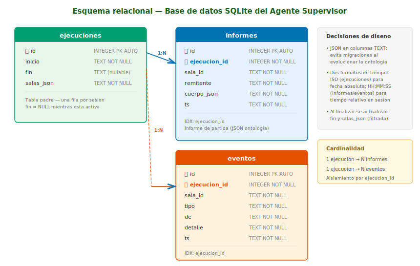
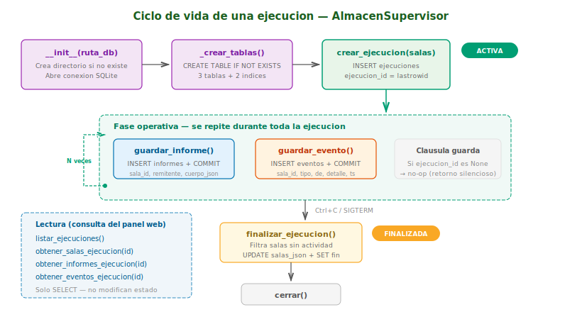
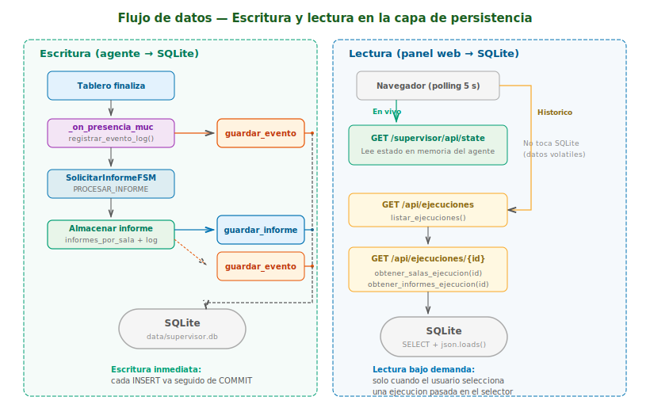

# Análisis y Diseño — Persistencia del Agente Supervisor

**Módulo:** [`almacen_supervisor.py`](almacen_supervisor.py)

**Documentación del agente:** [`doc/DOCUMENTACION_SUPERVISOR.md`](../doc/DOCUMENTACION_SUPERVISOR.md)

---

## 1. Propósito

La clase `AlmacenSupervisor` proporciona una **capa de persistencia
SQLite** que permite al agente supervisor conservar los informes de
partida, los eventos del registro y los metadatos de cada sesión de
ejecución entre reinicios del sistema. Sin esta capa, todos los datos
se perderían al detener el agente, ya que las estructuras en memoria
(`informes_por_sala`, `log_por_sala`) son volátiles.

La persistencia cumple dos funciones pedagógicas:

1. **Evaluación diferida:** El profesor puede revisar los resultados
   de una sesión de laboratorio después de que el sistema multiagente
   haya terminado, utilizando el selector de ejecuciones del panel web.
2. **Trazabilidad:** Cada informe y evento queda asociado a una
   ejecución concreta, lo que permite comparar el rendimiento de los
   alumnos entre sesiones.

---

## 2. Esquema de la base de datos

La base de datos utiliza tres tablas con relaciones de clave foránea.
El diseño prioriza la simplicidad y la flexibilidad sobre la
normalización estricta: los datos estructurados (informes de partida,
configuración de salas) se almacenan como JSON en columnas TEXT para
evitar migraciones de esquema cuando la ontología evolucione.



### 2.1 Tabla `ejecuciones`

Registra cada sesión de ejecución del supervisor. Una ejecución se
abre al arrancar el agente y se cierra al recibir la señal de parada.

| Columna | Tipo | Restricción | Descripción |
|---------|------|-------------|-------------|
| `id` | INTEGER | PRIMARY KEY AUTOINCREMENT | Identificador único de la ejecución |
| `inicio` | TEXT | NOT NULL | Fecha y hora de inicio en formato ISO 8601 |
| `fin` | TEXT | (nullable) | Fecha y hora de fin en formato ISO 8601. `NULL` mientras la ejecución está activa |
| `salas_json` | TEXT | NOT NULL | Array JSON con la configuración de las salas monitorizadas (`id` y `jid` de cada sala) |

**Observaciones:**

- Es la **tabla padre** del esquema: `informes` y `eventos` la
  referencian mediante clave foránea.
- El campo `fin` sirve como indicador de estado: si es `NULL`, la
  ejecución está en curso.
- `salas_json` almacena la configuración tal como estaba al arrancar,
  lo que permite reconstruir el contexto de la ejecución incluso si
  las salas se modifican posteriormente.

### 2.2 Tabla `informes`

Almacena los informes de partida recibidos mediante el protocolo
FIPA-Request. Cada fila representa un informe enviado por un agente
tablero al supervisor.

| Columna | Tipo | Restricción | Descripción |
|---------|------|-------------|-------------|
| `id` | INTEGER | PRIMARY KEY AUTOINCREMENT | Identificador único del informe |
| `ejecucion_id` | INTEGER | NOT NULL, FK → `ejecuciones(id)` | Ejecución a la que pertenece el informe |
| `sala_id` | TEXT | NOT NULL | Identificador de la sala MUC donde se jugó la partida |
| `remitente` | TEXT | NOT NULL | JID del agente tablero que envió el informe |
| `cuerpo_json` | TEXT | NOT NULL | Cuerpo completo del informe en formato JSON (campos de la ontología) |
| `ts` | TEXT | NOT NULL | Hora de recepción del informe (`HH:MM:SS`) |

**Índice:** `idx_informes_ejecucion` sobre `ejecucion_id` para
acelerar las consultas por ejecución.

**Contenido de `cuerpo_json`:** Incluye todos los campos de la
ontología `tictactoe` tal como se reciben en el INFORM:

```json
{
    "action": "game-report",
    "result": "win",
    "winner": "X",
    "players": {
        "X": "jugador_ana@sinbad2.ujaen.es",
        "O": "jugador_luis@sinbad2.ujaen.es"
    },
    "turns": 7,
    "board": ["X", "O", "X", "", "X", "O", "O", "X", ""],
    "reason": null,
    "ts": "14:32:50"
}
```

### 2.3 Tabla `eventos`

Registra los eventos cronológicos del registro del supervisor: informes
recibidos, partidas abortadas, cambios de presencia y desconexiones.

| Columna | Tipo | Restricción | Descripción |
|---------|------|-------------|-------------|
| `id` | INTEGER | PRIMARY KEY AUTOINCREMENT | Identificador único del evento |
| `ejecucion_id` | INTEGER | NOT NULL, FK → `ejecuciones(id)` | Ejecución a la que pertenece el evento |
| `sala_id` | TEXT | NOT NULL | Identificador de la sala MUC donde ocurrió el evento |
| `tipo` | TEXT | NOT NULL | Tipo de evento: `informe`, `abortada`, `presencia`, `salida`, `timeout` |
| `de` | TEXT | NOT NULL | Nick o JID del agente que origina el evento |
| `detalle` | TEXT | NOT NULL | Descripción legible del evento |
| `ts` | TEXT | NOT NULL | Hora del evento (`HH:MM:SS`) |

**Índice:** `idx_eventos_ejecucion` sobre `ejecucion_id`.

### 2.4 Relaciones y cardinalidad

```
ejecuciones (1) ──────── (N) informes
ejecuciones (1) ──────── (N) eventos
```

Cada ejecución puede tener cero o más informes y cero o más eventos.
Los informes y eventos de una ejecución están **completamente
aislados** de los de otra: las consultas siempre filtran por
`ejecucion_id`.

---

## 3. Ciclo de vida de una ejecución

El almacén gestiona el ciclo de vida completo de una sesión de
supervisión, desde la apertura de la conexión hasta el cierre
ordenado.



### 3.1 Fases del ciclo

| Fase | Método | Descripción |
|------|--------|-------------|
| **Inicialización** | `__init__(ruta_db)` | Crea el directorio si no existe, abre la conexión SQLite y ejecuta `_crear_tablas()` |
| **Creación de tablas** | `_crear_tablas()` | Ejecuta `CREATE TABLE IF NOT EXISTS` para las 3 tablas y los 2 índices |
| **Apertura de ejecución** | `crear_ejecucion(salas)` | Inserta una fila en `ejecuciones` con `fin=NULL` y guarda el `id` devuelto en `self.ejecucion_id` |
| **Operación** | `guardar_informe()`, `guardar_evento()` | Insertan filas en `informes` y `eventos` vinculadas a la ejecución activa |
| **Cierre de ejecución** | `finalizar_ejecucion()` | Establece `fin` con la hora actual (`UPDATE`) |
| **Cierre de conexión** | `cerrar()` | Cierra la conexión SQLite |

### 3.2 Cláusula guarda

Los métodos `guardar_informe()` y `guardar_evento()` comprueban que
`self.ejecucion_id` no sea `None` antes de insertar. Si no hay
ejecución activa, retornan silenciosamente sin lanzar excepciones.
Este diseño evita errores durante las pruebas y durante el breve
intervalo entre la creación del almacén y la apertura de la primera
ejecución.

---

## 4. Flujo de datos: escritura y lectura

La persistencia participa en dos flujos distintos:

1. **Escritura** — El agente escribe datos conforme los recibe
   (informes y eventos), de forma síncrona e inmediata.
2. **Lectura** — El panel web consulta los datos almacenados cuando
   el usuario selecciona una ejecución pasada.



### 4.1 Flujo de escritura

El agente escribe en la base de datos en dos puntos:

1. **Al detectar cambios de presencia MUC**
   (`_on_presencia_muc`): registra eventos de tipo `entrada`,
   `salida` y `presencia` (cambios de estado de tableros) en el
   registro mediante `guardar_evento()`.

2. **Al recibir un informe de partida** (`PROCESAR_INFORME` del
   FSM): almacena el informe completo con `guardar_informe()` y
   registra un evento con `guardar_evento()`.

Cada operación de escritura ejecuta un `INSERT` seguido de `COMMIT`
inmediato. No se acumulan transacciones pendientes, lo que garantiza
que los datos sobrevivan a una interrupción abrupta del proceso.

### 4.2 Flujo de lectura

El panel web accede a los datos de dos formas:

- **En vivo** (`GET /supervisor/api/state`): lee directamente las
  estructuras en memoria del agente (`informes_por_sala`,
  `ocupantes_por_sala`, `log_por_sala`). **No accede a SQLite.**

- **Histórico** (`GET /supervisor/api/ejecuciones/{id}`): lee los
  datos de una ejecución pasada desde SQLite mediante los métodos
  `obtener_salas_ejecucion()`, `obtener_informes_ejecucion()` y
  `obtener_eventos_ejecucion()`. El JSON almacenado se deserializa
  con `json.loads()` y se devuelve en el mismo formato que la API
  en vivo, para que el frontend no necesite distinguir entre ambos
  modos.

---

## 5. API de la clase `AlmacenSupervisor`

### 5.1 Métodos de escritura

| Método | Parámetros | Descripción |
|--------|------------|-------------|
| `crear_ejecucion(salas)` | `salas: list[dict]` — lista de salas con `id` y `jid` | Abre una nueva ejecución. Devuelve el `id` asignado. |
| `finalizar_ejecucion()` | (ninguno) | Cierra la ejecución activa estableciendo `fin`. No-op si no hay ejecución. |
| `guardar_informe(sala_id, remitente, cuerpo)` | `sala_id: str`, `remitente: str`, `cuerpo: dict` | Persiste un informe de partida. No-op si no hay ejecución. |
| `guardar_evento(sala_id, tipo, de, detalle, ts)` | `sala_id: str`, `tipo: str`, `de: str`, `detalle: str`, `ts: str` | Persiste un evento del registro. No-op si no hay ejecución. |

### 5.2 Métodos de lectura

| Método | Parámetros | Retorno |
|--------|------------|---------|
| `listar_ejecuciones()` | (ninguno) | `list[dict]` — ejecuciones con `id`, `inicio`, `fin`, `num_salas` (orden: más reciente primero) |
| `obtener_salas_ejecucion(id)` | `ejecucion_id: int` | `list[dict]` — configuración de salas de esa ejecución |
| `obtener_informes_ejecucion(id)` | `ejecucion_id: int` | `dict[str, dict[str, dict]]` — informes anidados `{sala_id: {remitente: cuerpo}}` |
| `obtener_eventos_ejecucion(id)` | `ejecucion_id: int` | `dict[str, list[dict]]` — eventos anidados `{sala_id: [evento, ...]}` (orden cronológico inverso) |

### 5.3 Gestión de conexión

| Método | Descripción |
|--------|-------------|
| `__init__(ruta_db)` | Abre conexión con `check_same_thread=False` y `row_factory=sqlite3.Row` |
| `cerrar()` | Cierra la conexión SQLite |

---

## 6. Decisiones de diseño

### 6.1 JSON en columnas TEXT

Los campos `salas_json` y `cuerpo_json` almacenan datos
estructurados como cadenas JSON en lugar de tablas normalizadas.
Esta decisión permite:

- **Flexibilidad:** Si la ontología añade nuevos campos al informe
  (por ejemplo, un campo `strategy` con la estrategia usada), no
  es necesario migrar el esquema de la base de datos.
- **Consistencia:** El cuerpo del informe se almacena exactamente
  como se recibe en el INFORM FIPA-ACL, sin transformaciones.
- **Simplicidad:** La lectura reconstruye el diccionario original
  con un único `json.loads()`.

**Contrapartida:** No es posible hacer consultas SQL sobre campos
internos del JSON (por ejemplo, filtrar informes por resultado). Sin
embargo, estas consultas se realizan en el frontend con JavaScript,
no en la base de datos.

### 6.2 Doble representación temporal

| Contexto | Formato | Ejemplo | Razón |
|----------|---------|---------|-------|
| Ejecuciones (`inicio`, `fin`) | ISO 8601 | `2026-04-08T16:05:23.456` | Fecha absoluta para identificar la sesión |
| Informes y eventos (`ts`) | `HH:MM:SS` | `16:05:23` | Hora relativa dentro de la sesión, más legible en el panel |

### 6.3 Escritura inmediata (eager commit)

Cada operación de escritura ejecuta `COMMIT` inmediatamente después
del `INSERT` o `UPDATE`. Este patrón garantiza que:

- Los datos nunca se pierden si el proceso se interrumpe.
- No se acumulan transacciones pendientes en memoria.
- Las lecturas concurrentes desde el panel web siempre ven los
  datos más recientes.

### 6.4 Datos inmutables

Una vez escritos, los informes y eventos **no se modifican ni se
eliminan**. La única operación `UPDATE` de todo el sistema es
`finalizar_ejecucion()`, que establece el campo `fin` de la
ejecución activa. Este diseño simplifica la lógica y evita
inconsistencias.

### 6.5 Seguridad ante inyección SQL

Todas las consultas utilizan **parámetros posicionales** (`?`) en
lugar de interpolación de cadenas:

```python
cursor.execute(
    "INSERT INTO informes (...) VALUES (?, ?, ?, ?, ?)",
    (self.ejecucion_id, sala_id, remitente, cuerpo_json, ts),
)
```

Este patrón impide ataques de inyección SQL incluso si el contenido
de los informes o los JIDs contienen caracteres especiales.

---

## 7. Configuración

### 7.1 Ruta de la base de datos

Por defecto: `data/supervisor.db` (relativa a la raíz del proyecto).

El constructor `__init__()` crea automáticamente el directorio
intermedio si no existe (`os.makedirs(exist_ok=True)`).

Se puede personalizar de tres formas:

- **Argumento del lanzador:** `python supervisor_main.py --db ruta/mi_bd.db`
- **Parámetro del agente** en `agents.yaml`:
  `parametros: { ruta_db: data/otra.db }`
- **Directamente en código** (solo para pruebas):
  `almacen = AlmacenSupervisor("tests/tmp.db")`

#### Archivos de persistencia específicos por propósito

El uso de `--db` con rutas distintas permite mantener las ejecuciones
organizadas por propósito. Cada fichero SQLite es independiente y
acumula solo las ejecuciones realizadas con esa ruta, lo que facilita
la revisión posterior: el selector de ejecuciones del panel web
muestra únicamente las sesiones almacenadas en el fichero activo,
sin mezclar datos de contextos distintos.

Por ejemplo, separar el fichero del torneo (`data/torneo_lab.db`)
del fichero de las pruebas de laboratorio (`data/supervisor.db`)
permite al profesor consultar después solo los resultados del torneo,
sin que aparezcan ejecuciones de pruebas individuales que no son
relevantes para la clasificación:

```text
data/supervisor.db        ← pruebas individuales (modo laboratorio)
data/torneo_lab.db        ← torneo conjunto (modo torneo)
data/torneo_2026-04-08.db ← torneo de una fecha concreta
```

### 7.2 Exclusión del control de versiones

El directorio `data/` está incluido en `.gitignore` para evitar
que los ficheros de base de datos se suban al repositorio.

---

## 8. Pruebas

La capa de persistencia cuenta con **25 pruebas unitarias** en
[`tests/test_almacen_supervisor.py`](../tests/test_almacen_supervisor.py).
Cada prueba utiliza un fichero SQLite temporal que se elimina al
finalizar.

| Clase de prueba | Qué se comprueba |
|---------------|------------------|
| `TestInicializacion` | Creación del fichero, creación de directorios intermedios, `ejecucion_id` inicial es `None` |
| `TestCrearEjecucion` | Devuelve `id` positivo, actualiza el atributo, ids distintos para ejecuciones sucesivas, configuración de salas persistida |
| `TestFinalizarEjecucion` | Establece `fin`, ejecución activa tiene `fin=NULL`, finalizar sin ejecución es no-op |
| `TestGuardarInforme` | Informe recuperable con los mismos datos, varios informes en la misma sala o en salas distintas, guardar sin ejecución es no-op |
| `TestGuardarEvento` | Evento recuperable con todos los campos, orden cronológico inverso, eventos de salas distintas aislados |
| `TestListarEjecuciones` | Lista vacía sin ejecuciones, una devuelve un elemento, varias en orden descendente, cada entrada tiene los campos esperados |
| `TestAislamientoEjecuciones` | Informes y eventos de una ejecución no aparecen al consultar otra |

---

## 9. Limitaciones conocidas

1. **Sin eliminación de datos.** No existen métodos para borrar
   ejecuciones, informes o eventos. La base de datos crece
   indefinidamente. Para limpiar datos antiguos, el profesor debe
   eliminar manualmente el fichero `.db`.

2. **Sin concurrencia de escritura.** La conexión SQLite se comparte
   con `check_same_thread=False`, pero no se usa `WAL` mode ni
   bloqueos explícitos. En la práctica no hay conflictos porque el
   agente SPADE es monohilo para las escrituras.

3. **Sin cascada en eliminación.** Las claves foráneas no tienen
   `ON DELETE CASCADE`. Eliminar una fila de `ejecuciones` dejaría
   huérfanos en `informes` y `eventos`. Sin embargo, como no hay
   operaciones de eliminación, esto no es un problema en la práctica.
