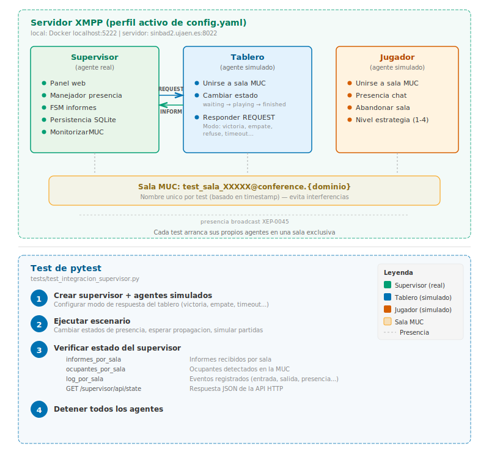

# Tests de integración del Agente Supervisor

**Fichero de tests:** [`test_integracion_supervisor.py`](test_integracion_supervisor.py)

**Agentes simulados:** [`simuladores/`](simuladores/)

---

## Índice

1. [Objetivo](#objetivo)
2. [Requisitos previos](#requisitos-previos)
3. [Arquitectura de los tests](#arquitectura-de-los-tests)
4. [Agentes simulados](#agentes-simulados)
5. [Escenarios de test](#escenarios-de-test)
6. [Ejecución](#ejecución)
7. [Resolución de problemas](#resolución-de-problemas)

---

## Objetivo

Los tests de integración verifican el funcionamiento **completo** del
agente supervisor en un entorno que replica las condiciones reales de
una sesión de laboratorio. A diferencia de los tests unitarios (que
prueban métodos aislados con objetos simulados), estos tests:

- Arrancan agentes **SPADE reales** conectados a un servidor XMPP.
- Los agentes se unen a **salas MUC** y se comunican con presencias
  y mensajes FIPA-Request.
- El supervisor ejecuta su **panel web** y se puede consultar
  la API HTTP para verificar el estado.

Esto permite detectar problemas que los tests unitarios no cubren:
fallos de timing, problemas de correlación de mensajes (thread),
errores en el parseo de stanzas MUC, y comportamientos emergentes
de la interacción entre múltiples agentes.

---

## Requisitos previos

### Infraestructura XMPP y dependencias

Los tests de integración requieren un servidor XMPP accesible y las
dependencias del proyecto instaladas. Consulta la sección
[**3.3. Infraestructura XMPP**](../README.md#33-infraestructura-xmpp)
y el fichero
[**`requirements.txt`**](../README.md#73-fichero-requirementstxt)
del README principal del proyecto para los detalles de entornos
(local con Docker / servidor de la asignatura), perfiles de conexión
y paquetes necesarios.

Los tests se ejecutan contra el servidor XMPP configurado en el
**perfil activo** de `config/config.yaml`. Se puede forzar un perfil
sin modificar el fichero mediante la variable de entorno `XMPP_PERFIL`:

```bash
XMPP_PERFIL=local pytest tests/test_integracion_supervisor.py -v
XMPP_PERFIL=servidor pytest tests/test_integracion_supervisor.py -v
```

> **Nota:** Si el servidor configurado no está disponible, los
> tests se omiten automáticamente indicando el host y puerto.

### Puerto web

Los tests usan el puerto **10099** para el panel web del
supervisor (distinto al 10090 de producción). No debe estar ocupado.

---

## Arquitectura de los tests



Cada test usa una **sala MUC con nombre único** (basado en
timestamp) para evitar interferencias entre tests.

---

## Agentes simulados

### TableroSimulado

Simula un agente tablero del sistema. Se une a la sala MUC con
estado `waiting` y responde a las solicitudes `game-report` del
supervisor según el **modo de respuesta** configurado.

**Modos disponibles:**

| Modo | Comportamiento | Escenario que simula |
|------|---------------|---------------------|
| `"victoria"` | INFORM con informe de victoria válido | Partida normal ganada por X |
| `"empate"` | INFORM con informe de empate válido | Partida que termina en tablas |
| `"abortada"` | INFORM con informe abortada (both-timeout) | Ambos jugadores no respondieron |
| `"refuse"` | REFUSE con razón `not-finished` | Tablero que aún no ha terminado |
| `"timeout"` | No responde al REQUEST | Tablero desconectado o bloqueado |
| `"json_invalido"` | INFORM con cuerpo no JSON | Tablero con ontología incorrecta |
| `"esquema_invalido"` | INFORM con JSON incompleto | Tablero con campos ausentes |
| `"agree_luego_inform"` | AGREE + INFORM (dos pasos) | Protocolo FIPA-Request completo |
| `"abortada_timeout_llm"` | INFORM abortada con `reason: "timeout"` | Jugador LLM no responde a tiempo |
| `"abortada_movimiento_invalido"` | INFORM abortada con `reason: "invalid"` | LLM genera movimiento inválido |

**Métodos públicos:**

- `cambiar_estado_muc(estado)` — cambia la presencia MUC del
  tablero (`"waiting"`, `"playing"`, `"finished"`).

### JugadorSimulado

Simula un agente jugador. Se une a la sala MUC con presencia
`show=chat` y permanece conectado. Admite un atributo
`nivel_estrategia` (1-4) que identifica la estrategia simulada:

| Nivel | Estrategia | Uso en tests |
|-------|-----------|-------------|
| 1 | Posicional | Jugador básico por defecto |
| 2 | Reglas | Jugador con heurísticas |
| 3 | Minimax | Jugador óptimo |
| 4 | LLM | Jugador con modelo de lenguaje (escenarios LLM) |

El nivel de estrategia es informativo: no cambia el comportamiento
del agente simulado, pero identifica el rol del jugador en el
escenario de test.

**Métodos públicos:**

- `abandonar_sala()` — envía presencia `unavailable` para simular
  la desconexión del jugador.

---

## Escenarios de test

### Partidas normales (TestPartidaNormal)

| Test | Qué simula | Qué verifica |
|------|-----------|-------------|
| `test_partida_victoria` | Tablero: waiting→playing→finished, responde con victoria | Informe almacenado con `result="win"`, `winner="X"` |
| `test_partida_empate` | Tablero: finished, responde con empate | Informe con `result="draw"`, `winner=None` |
| `test_partida_abortada` | Tablero: finished, responde con abortada | Informe con `result="aborted"`, `reason="both-timeout"` |

### Protocolo de dos pasos (TestProtocoloDePasos)

| Test | Qué simula | Qué verifica |
|------|-----------|-------------|
| `test_agree_luego_inform` | Tablero responde AGREE, luego INFORM | Informe recibido correctamente por el camino AGREE→ESPERAR_INFORME→PROCESAR_INFORME |

### Errores (TestErrores)

| Test | Qué simula | Qué verifica |
|------|-----------|-------------|
| `test_timeout_sin_respuesta` | Tablero no responde | Evento `timeout` en el log, 0 informes |
| `test_json_invalido` | Tablero envía texto no JSON | 0 informes, evento `error` en el log |
| `test_esquema_invalido` | Tablero envía JSON sin campos obligatorios | 0 informes, evento `error` en el log |
| `test_refuse` | Tablero responde REFUSE | 0 informes, evento `advertencia` en el log con motivo |
| `test_informes_pendientes_al_detener` | Tablero no responde y el supervisor se detiene antes del timeout | Evento `advertencia` en el log indicando informe pendiente |

### Presencia MUC (TestPresenciaMUC)

| Test | Qué simula | Qué verifica |
|------|-----------|-------------|
| `test_entrada_de_agentes` | Jugador y tablero se unen | Ambos en `ocupantes_por_sala`, evento `entrada` en log |
| `test_salida_de_agente` | Jugador se une y luego abandona | Evento `salida` en log |
| `test_cambio_estado_tablero_en_log` | Tablero: waiting→playing→finished | Transiciones registradas en el log |

### Visibilidad progresiva de salas (TestVisibilidadProgresivaSalas)

Simula un escenario de laboratorio donde los alumnos se incorporan
en momentos distintos a lo largo de la sesión. Verifica que la API
solo devuelve salas con actividad y que estas persisten tras la
desconexión.

| Test | Qué simula | Qué verifica |
|------|-----------|-------------|
| `test_sala_sin_agentes_no_tiene_ocupantes` | Sala sin ningún agente conectado | Lista de ocupantes vacía en la API |
| `test_salas_aparecen_conforme_se_unen_agentes` | 3 salas; alumnos se unen a sala_a, luego sala_c, luego sala_b | Cada sala solo tiene ocupantes cuando su agente se une; las demás siguen vacías |
| `test_sala_persiste_tras_desconexion_agentes` | Jugador se une y luego abandona la sala | La sala sigue visible en la API (0 ocupantes pero eventos en el log) |
| `test_salas_sin_actividad_no_se_persisten` | Supervisor con 2 salas, actividad solo en una | Ambas en API en vivo; en BD solo la sala con actividad |

### Múltiples salas (TestMultiplesSalas)

| Test | Qué simula | Qué verifica |
|------|-----------|-------------|
| `test_dos_salas_independientes` | Dos salas con un tablero cada una | Cada sala tiene su propio informe independiente |

### API Web (TestAPIWeb)

| Test | Qué simula | Qué verifica |
|------|-----------|-------------|
| `test_api_state_con_informe` | Partida con victoria | `GET /supervisor/api/state` devuelve el informe en JSON |
| `test_api_state_con_ocupantes` | Jugador en la sala | `GET /supervisor/api/state` devuelve el ocupante |

### Escenarios LLM (TestEscenariosLLM)

Estos tests simulan partidas donde algún jugador utiliza estrategia
LLM (nivel 4). Los fallos típicos del LLM (tiempo de espera del modelo,
movimiento inválido generado) se reflejan como partidas abortadas
con motivos específicos que el supervisor debe capturar.

| Test | Qué simula | Qué verifica |
|------|-----------|-------------|
| `test_abortada_por_timeout_llm` | Jugador LLM no responde a tiempo; tablero aborta con `reason="timeout"` | Informe con `result="aborted"`, `reason="timeout"`, rival gana |
| `test_abortada_por_movimiento_invalido_llm` | LLM genera movimiento inválido; tablero aborta con `reason="invalid"` | Informe con `result="aborted"`, `reason="invalid"` |
| `test_ambos_jugadores_llm_timeout` | Dos jugadores LLM no responden; tablero aborta con `reason="both-timeout"` | Informe con `result="aborted"`, `reason="both-timeout"`, `winner=None` |
| `test_victoria_normal_contra_jugador_ia` | Partida normal (victoria) entre jugador minimax (nivel 3) y jugador LLM (nivel 4) | Informe estándar de victoria; ambos jugadores visibles como ocupantes |

### Incidencias semánticas (TestIncidenciasSemanticas)

Estos tests verifican que el supervisor detecta y registra como
`LOG_INCONSISTENCIA` las anomalías semánticas en informes que
pasan la validación de esquema de la ontología. Comprueban la
validación cruzada implementada en M-13 (resuelve D-04).

Los modos de `TableroSimulado` utilizados envían informes con
anomalías deliberadas: turnos imposibles, tablero sin línea
ganadora, jugador contra sí mismo, empate con celdas vacías, y
jugadores no observados en la sala.

| Test | Qué simula | Qué verifica |
|------|-----------|-------------|
| `test_victoria_con_turnos_anomalos` | Tablero reporta victoria con 2 turnos (imposible: mínimo 5) | Informe almacenado + `LOG_INCONSISTENCIA` con «turnos» en detalle |
| `test_victoria_sin_linea_ganadora` | Tablero reporta victoria pero el board no tiene línea ganadora | `LOG_INCONSISTENCIA` con «línea ganadora» en detalle |
| `test_jugador_contra_si_mismo` | Informe con `players.X == players.O` | `LOG_INCONSISTENCIA` con «mismo agente» en detalle |
| `test_empate_con_celdas_vacias` | Empate declarado pero tablero con celdas vacías | `LOG_INCONSISTENCIA` con «vacía» en detalle |
| `test_jugadores_no_observados_en_sala` | Jugadores del informe no fueron detectados como ocupantes MUC (D-04) | `LOG_INCONSISTENCIA` con «no fue observado» en detalle |
| `test_incidencias_visibles_en_api` | Tablero con turnos anómalos | `GET /supervisor/api/state` devuelve el log con eventos de tipo `inconsistencia` |

---

## Ejecución

### Con el perfil activo de config.yaml

```bash
# Usa el servidor configurado en perfil_activo de config.yaml
pytest tests/test_integracion_supervisor.py -v
```

### Forzando un perfil concreto

```bash
# Contra el Docker local (localhost:5222)
XMPP_PERFIL=local pytest tests/test_integracion_supervisor.py -v

# Contra el servidor de la asignatura (sinbad2.ujaen.es:8022)
XMPP_PERFIL=servidor pytest tests/test_integracion_supervisor.py -v
```

### Un escenario concreto

```bash
pytest tests/test_integracion_supervisor.py::TestErrores::test_timeout_sin_respuesta -v
```

### Solo tests que no requieren XMPP (unitarios)

```bash
pytest tests/ --ignore=tests/test_integracion_supervisor.py -v
```

### Todos los tests (unitarios + integración)

```bash
pytest tests/ -v
```

---

## Revisión de resultados con el modo consulta

Los tests de integración persisten todos los informes y eventos en el
fichero `data/integracion.db`. Esto permite revisar los resultados
después de la ejecución, sin necesidad de que el servidor XMPP ni los
agentes estén activos, utilizando el supervisor en modo consulta:

```bash
python supervisor_main.py --modo consulta --db data/integracion.db
```

El panel se abre en `http://localhost:10090/supervisor`. El selector
de ejecuciones de la cabecera muestra cada ejecución de tests como una
entrada independiente con su fecha y hora, y permite navegar por los
informes, eventos y clasificación de cada una.

Para empezar con una base de datos limpia antes de una nueva sesión
de tests, basta con eliminar el fichero:

```bash
rm -f data/integracion.db
```

---

## Resolución de problemas

### Los tests se omiten con "Servidor XMPP no disponible"

El servidor configurado no está accesible. Según el perfil:

- **Perfil `local`**: verificar que el contenedor Docker de Prosody
  está ejecutándose en `localhost:5222`.

  ```bash
  docker ps | grep prosody
  # Si no aparece:
  docker start prosody
  ```

- **Perfil `servidor`**: verificar la conexión a la red UJA o VPN.

  ```bash
  # Comprobar conectividad
  nc -zv sinbad2.ujaen.es 8022
  ```

### `OSError: [Errno 48] Address already in use` (puerto 10099)

Otro proceso está usando el puerto del panel de test. Solución:

```bash
lsof -i :10099
kill <PID>
```

### `TimeoutError` o `AssertionError: Condición no cumplida`

Las presencias MUC tardan más de lo esperado en propagarse. Causas:

- **Perfil `servidor`**: la latencia de red es mayor. Los tests
  ya usan tiempos más holgados para el perfil servidor, pero
  si el servidor está sobrecargado, puede ser insuficiente.
- **Perfil `local`**: reiniciar el contenedor Docker de Prosody.
- En ambos casos, se pueden aumentar `PAUSA_PRESENCIA` y
  `TIMEOUT_TEST` en el fichero de tests.

### Los agentes no se registran en el servidor

Verificar que `auto_register: true` está configurado en el perfil
correspondiente de `config/config.yaml`. Tanto el Docker local como
sinbad2.ujaen.es permiten auto-registro por defecto.

### Tests que fallan intermitentemente

Los tests de integración dependen del timing de la red. Con el
perfil `servidor`, la latencia es mayor y los tests usan tiempos
más holgados automáticamente. Si un test falla una vez pero pasa
al repetirlo, es un problema de timing que se mitiga con la
función `esperar_condicion()`.

### Diferencias entre perfiles

Algunos comportamientos pueden diferir entre Docker local y
sinbad2.ujaen.es:

- **Prosody local** puede no exponer el JID real en el item MUC
  (salas semi-anónimas). El supervisor usa un mecanismo de reserva al JID
  MUC con nick en ese caso.
- **sinbad2.ujaen.es** expone los JIDs reales de los ocupantes,
  lo que permite una identificación más precisa.
