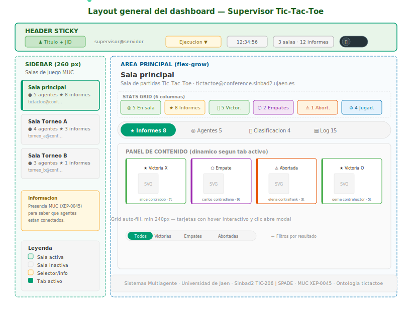
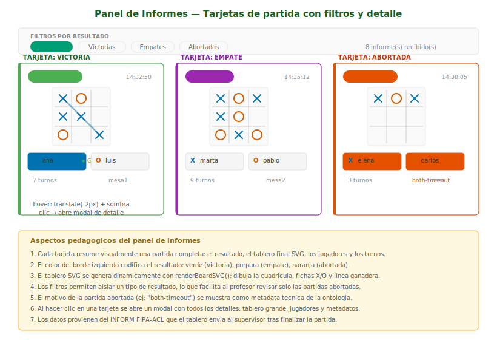
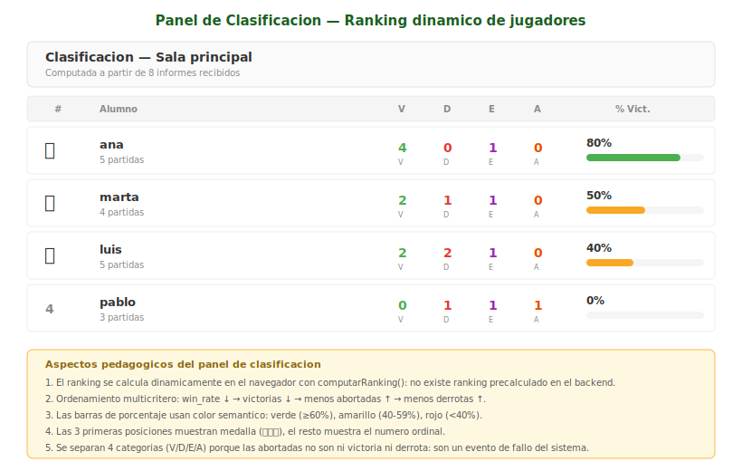
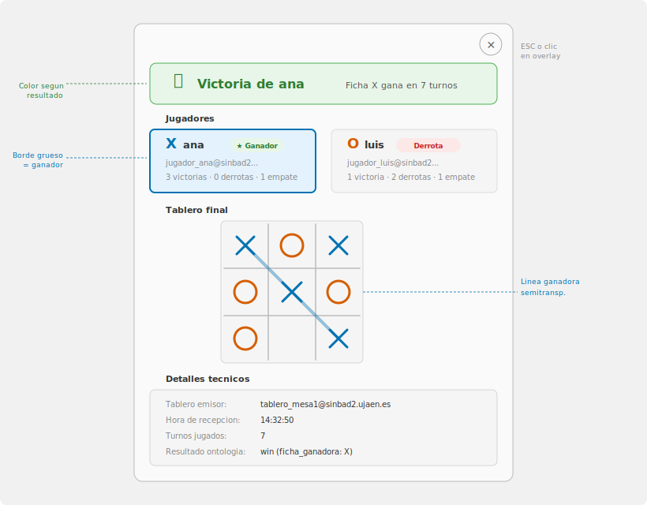
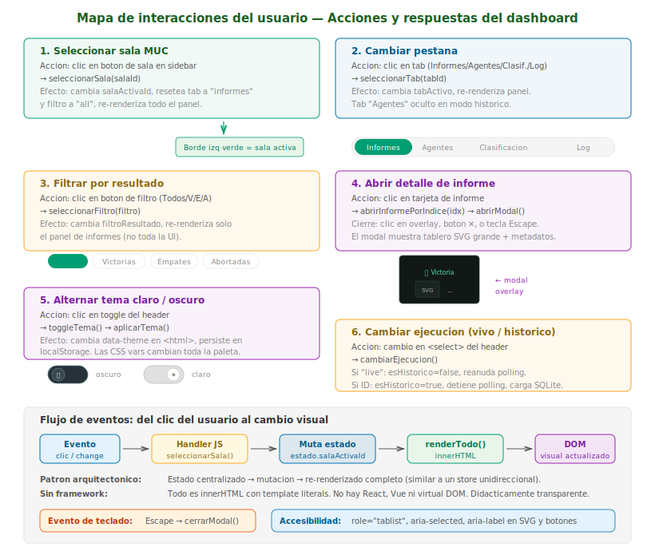
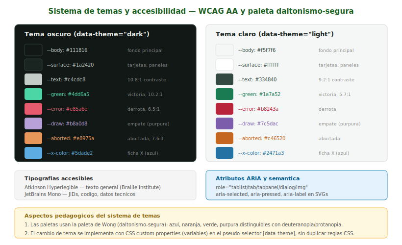
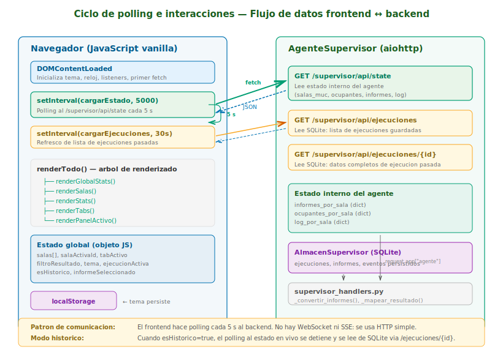

# Análisis y Diseño — Interfaz web del Agente Supervisor

**Módulo:** [`supervisor_handlers.py`](supervisor_handlers.py)

**Documentación del agente:** [`doc/DOCUMENTACION_SUPERVISOR.md`](../doc/DOCUMENTACION_SUPERVISOR.md)

---

## Análisis de requisitos

### Problema que resuelve

En un sistema multiagente donde múltiples tableros y jugadores operan
de forma concurrente en varias salas MUC, el profesor necesita una
visión global para:

1. **Supervisar** qué agentes están conectados a cada sala.
2. **Revisar** los resultados de las partidas conforme finalizan.
3. **Clasificar** a los alumnos según su rendimiento.
4. **Diagnosticar** incidencias (partidas abortadas, tiempos de espera).
5. **Consultar** ejecuciones pasadas sin necesidad del sistema activo.

### Actores

| Actor         | Descripción                                      |
|---------------|--------------------------------------------------|
| **Profesor**  | Observa el panel de control en un navegador.      |
| **Supervisor**| Agente SPADE que alimenta los datos vía HTTP.     |
| **Tableros**  | Envían informes FIPA-ACL al supervisor.           |
| **Jugadores** | Participan en partidas; visibles por presencia.   |

### Requisitos funcionales

| Código | Requisito                                             |
|--------|-------------------------------------------------------|
| RF-01  | Visualizar la lista de salas MUC monitorizadas.       |
| RF-02  | Mostrar los ocupantes de cada sala con su rol.        |
| RF-03  | Presentar los informes de partida como tarjetas.      |
| RF-04  | Filtrar informes por tipo de resultado.               |
| RF-05  | Mostrar el detalle de un informe en un modal.         |
| RF-06  | Calcular y mostrar la clasificación de jugadores.     |
| RF-07  | Presentar un registro cronológico de eventos.          |
| RF-08  | Alternar entre tema oscuro y claro.                   |
| RF-09  | Consultar ejecuciones históricas desde SQLite.        |
| RF-10  | Actualizar los datos automáticamente (consulta periódica). |

### Requisitos no funcionales

| Código  | Requisito                                            |
|---------|------------------------------------------------------|
| RNF-01  | Accesibilidad WCAG AA (contraste ≥ 4.5:1).          |
| RNF-02  | Sin dependencias externas de JavaScript.             |
| RNF-03  | Paleta de colores segura para daltonismo (Wong).     |
| RNF-04  | Diseño adaptable a pantallas < 600 px.               |
| RNF-05  | Latencia de actualización ≤ 5 segundos.              |

---

## Diseño de la interfaz

### Arquitectura de componentes

La interfaz sigue un patrón de **estado centralizado con representación
completa**, similar conceptualmente a un almacén unidireccional
(Redux/Vuex) pero implementado en JavaScript vanilla para máxima
transparencia didáctica.

```
Evento del usuario (clic, change, keydown)
     │
     ▼
Handler JS (seleccionarSala, seleccionarTab, ...)
     │
     ▼
Mutación del estado global (objeto `estado`)
     │
     ▼
renderTodo() → innerHTML actualiza el DOM
     │
     ├── renderGlobalStats()
     ├── renderSalas()
     ├── renderStats()
     ├── renderTabs()
     └── renderPanelActivo()
            ├── renderInformesPanel()
            ├── renderAgentesPanel()
            ├── renderRankingPanel()
            ├── renderIncidenciasPanel()
            └── renderLogPanel()
```

### Layout general

El panel se organiza con un layout **sidebar + área principal**
usando flexbox. La cabecera es fija para mantener siempre visible
el estado global del supervisor.



**Componentes del layout:**

| Zona              | Contenido                                       |
|-------------------|-------------------------------------------------|
| **Header fijo**   | Título, JID del supervisor, selector de          |
|                   | ejecución, reloj, stats globales, conmutador de tema. |
| **Sidebar**       | Lista de salas MUC con indicadores de agentes   |
|                   | e informes. Caja informativa sobre XEP-0045.    |
| **Área principal**| Cabecera de la sala activa, cuadrícula de stats, |
|                   | tabs de navegación y panel de contenido.        |
| **Footer**        | Créditos de la asignatura y tecnologías usadas. |

### Panel de Informes

Cada partida finalizada genera un informe que el supervisor recibe
como mensaje INFORM del protocolo FIPA-Request. Estos informes se
presentan como una **cuadrícula de tarjetas** (`auto-fill`, mínimo
240 px) que el usuario puede filtrar por tipo de resultado.



**Elementos de cada tarjeta:**

1. **Etiqueta de resultado** — Etiqueta coloreada: `★ Victoria X` (verde),
   `⬡ Empate` (púrpura), `⚠ Abortada` (naranja).
2. **Timestamp** — Hora de recepción del informe (`HH:MM:SS`).
3. **Tablero SVG miniatura** — Representación del estado final del
   tablero generada dinámicamente por `renderBoardSVG()`. Incluye las
   fichas X y O con colores diferenciados y, en caso de victoria, una
   línea semitransparente sobre la combinación ganadora.
4. **Jugadores** — Nombre corto de cada alumno (extraído del JID)
   con indicador de ganador si aplica.
5. **Pie** — Número de turnos, motivo de la partida abortada (si
   aplica) e identificador del tablero emisor.
6. **Borde lateral** — Color que codifica el resultado (verde, púrpura
   o naranja) para reconocimiento visual rápido.

### Panel de Clasificación

La clasificación se calcula **dinámicamente en el navegador** a partir
de los informes recibidos. No existe un ranking precalculado en el
servidor: la función `computarRanking()` agrega estadísticas por alumno
cada vez que se vuelve a representar.



**Criterios de ordenamiento** (multicritero descendente):

1. `win_rate` — Porcentaje de victorias sobre partidas jugadas.
2. `victorias` — Número absoluto de victorias (desempate).
3. `abortadas` — Menos abortadas es mejor (penalización).
4. `derrotas` — Menos derrotas es mejor (último criterio).

**Elementos visuales del ranking:**

- Las 3 primeras posiciones muestran medalla (🥇🥈🥉).
- Cuatro columnas de estadísticas: **V** (victorias), **D** (derrotas),
  **E** (empates), **A** (abortadas), con colores semánticos.
- Barra de porcentaje con color adaptativo:
  - **Verde** (≥ 60%) — rendimiento alto.
  - **Amarillo** (40–59%) — rendimiento medio.
  - **Rojo** (< 40%) — rendimiento bajo.

### Modal de detalle de informe

Al hacer clic en una tarjeta de informe se abre un **diálogo modal**
con la información completa de la partida. El modal presenta el
tablero SVG en tamaño grande (180 px), las tarjetas de ambos jugadores
con indicación de ganador/perdedor, y los metadatos técnicos del
informe.



**Secciones del modal:**

1. **Banner de resultado** — Fondo coloreado con icono y texto
   descriptivo (ej: `🏆 Victoria de ana`).
2. **Tarjetas de jugadores** — JID completo, ficha asignada (X/O),
   etiqueta de ganador/perdedor, estadísticas acumuladas del alumno.
3. **Tablero SVG** — Representación visual completa con fichas,
   cuadrícula y línea ganadora si aplica.
4. **Detalles técnicos** — JID del tablero emisor, hora de recepción,
   turnos jugados, resultado de la ontología, motivo (si abortada).

### Panel de Agentes

Muestra los ocupantes de la sala MUC activa agrupados por rol:

- **Agentes tablero** — Identificados por el prefijo `tablero_` en
  el nick MUC. Color azul.
- **Agentes jugador** — Los demás ocupantes que no son tablero ni
  supervisor. Color naranja.
- **Supervisor** — El propio agente supervisor con nick `supervisor`.
  Color verde.

Cada ocupante muestra su nick, una etiqueta de rol coloreada y el dominio
del JID. Este panel se alimenta del `MonitorizarMUCBehaviour`, que
actualiza `ocupantes_por_sala` cada 10 segundos.

> **Nota:** En modo histórico la pestaña de Agentes se oculta
> automáticamente, ya que los datos de presencia MUC son volátiles
> y no se persisten en SQLite.

### Panel de Registro

Lista cronológica (más reciente primero) de los eventos observados
por el supervisor en la sala activa. Cada entrada del registro muestra:

| Campo     | Descripción                                        |
|-----------|----------------------------------------------------|
| Timestamp | Hora del evento (`HH:MM:SS`).                      |
| Icono     | Glifo visual codificado por tipo.                   |
| Tipo      | Etiqueta codificada por color (ver tabla            |
|           | de tipos de evento más abajo).                     |
| Origen    | Nick del agente que genera el evento.               |
| Detalle   | Texto descriptivo del evento.                       |

Los tipos de evento y su codificación visual (definidos como constantes
``LOG_*`` en ``supervisor_behaviours.py`` y renderizados por
``obtenerConfigLog()`` en ``supervisor.js``):

| Tipo          | Icono | Color    | Significado                            |
|---------------|-------|----------|----------------------------------------|
| `entrada`     | ⊕     | verde    | Nuevo agente se une a la sala MUC.     |
| `salida`      | ⊖     | rojo     | Agente abandonó la sala MUC.           |
| `presencia`   | ↔     | verde    | Cambio de estado de un tablero         |
|               |       |          | (ej: waiting → playing → finished).    |
| `solicitud`   | ▸     | naranja  | Informe de partida solicitado al       |
|               |       |          | tablero.                               |
| `informe`     | ★     | amarillo | Informe de partida recibido.           |
| `abortada`    | ⚠     | naranja  | Partida abortada por incidencia.       |
| `timeout`     | ⏱     | naranja  | Tablero sin respuesta en el plazo.     |
| `error`       | ✖     | rojo     | Fallo en la comunicación del informe:  |
|               |       |          | JSON inválido, esquema incorrecto o    |
|               |       |          | tablero desconectado con informe       |
|               |       |          | pendiente.                             |
| `advertencia` | ⚑     | amarillo | Informe solicitado no recibido: el     |
|               |       |          | tablero lo rechazó o el supervisor     |
|               |       |          | finalizó antes de recibirlo. El        |
|               |       |          | detalle identifica el informe.         |
| `inconsistencia`| ⚐   | naranja  | Anomalía semántica detectada en un     |
|               |       |          | informe válido: turnos imposibles,     |
|               |       |          | tablero sin línea ganadora, jugador    |
|               |       |          | contra sí mismo, jugadores no          |
|               |       |          | observados en la sala o informe        |
|               |       |          | duplicado.                             |

#### Paginación del log

El panel de registro implementa paginación progresiva para mejorar
el rendimiento en sesiones largas (resuelve D-09). Se renderizan
los primeros 50 eventos y se muestra un botón «Cargar más (N
restantes)» que incrementa la ventana en bloques de 50. El estado
`logEventosMostrados` se resetea al cambiar de sala.

### Panel de Incidencias

Vista de diagnóstico que filtra y agrupa los eventos de severidad
alta del log. Separa la trazabilidad cronológica completa (panel
de Registro) del diagnóstico de problemas (panel de Incidencias).

**Tipos de evento mostrados:** `error`, `advertencia`, `timeout`,
`abortada`, `inconsistencia`.

**Estructura del panel:**

1. **Resumen de contadores** — Badges con icono, número y etiqueta
   para cada tipo de incidencia. Los tipos sin eventos se atenúan
   visualmente (`opacity: 0.4`).
2. **Lista cronológica** — Misma representación que el log pero
   filtrada a los eventos relevantes. Cada fila tiene un borde
   lateral naranja para diferenciarla visualmente del log completo.
3. **Mensaje vacío** — Si no hay incidencias, se muestra un
   mensaje indicándolo.

**Concepto pedagógico:** La pestaña de Incidencias permite al
profesor identificar rápidamente los tableros con problemas sin
tener que buscar entre cientos de eventos de presencia en el log.
Las validaciones semánticas (M-13) alimentan esta pestaña con
detecciones que van más allá de lo que el esquema de la ontología
puede verificar.

---

## Interacciones del usuario

El panel ofrece 7 interacciones principales, todas implementadas
con escuchas de eventos registradas en `DOMContentLoaded`. No se
utilizan entornos de trabajo externos: toda la lógica es JavaScript
vanilla con `innerHTML` y plantillas literales.



### 1. Seleccionar sala MUC

- **Acción:** Clic en un botón de sala en la sidebar.
- **Función:** `seleccionarSala(salaId)`
- **Efecto:** Cambia `estado.salaActivaId`, resetea la pestaña activa
  a `"informes"` y el filtro a `"all"`, y vuelve a representar toda
  la interfaz.
- **Feedback visual:** La sala seleccionada muestra un borde izquierdo
  verde sólido y fondo resaltado.
- **Concepto pedagógico:** Cada sala MUC es un espacio de comunicación
  independiente en XMPP (XEP-0045). El supervisor se suscribe a
  **todas** las salas configuradas pero el panel muestra una a la
  vez para evitar sobrecarga visual.

### 2. Cambiar pestaña

- **Acción:** Clic en un tab (Informes, Agentes, Clasificación, Incidencias, Registro).
- **Función:** `seleccionarTab(tabId)`
- **Efecto:** Cambia `estado.tabActivo` y vuelve a representar el
  panel de contenido con el representador correspondiente.
- **Feedback visual:** El tab activo muestra fondo sólido verde con
  texto blanco. Los inactivos son transparentes con texto gris.
- **Concepto pedagógico:** Los cinco paneles representan las cinco
  dimensiones de la supervisión: **resultados** (informes),
  **presencia** (agentes), **rendimiento** (clasificación),
  **diagnóstico** (incidencias) y **trazabilidad** (registro).

### 3. Filtrar informes por resultado

- **Acción:** Clic en un botón de filtro (Todos, Victorias, Empates,
  Abortadas).
- **Función:** `seleccionarFiltro(filtro)`
- **Efecto:** Cambia `estado.filtroResultado` y vuelve a representar
  **solo** el panel de informes (optimización: no representa de nuevo
  sidebar ni tabs).
- **Feedback visual:** El filtro activo muestra fondo semitransparente
  del color del tipo de resultado.
- **Concepto pedagógico:** Los filtros permiten al profesor aislar
  rápidamente las partidas abortadas para diagnosticar problemas en
  los agentes de los alumnos (ej: `both-timeout` indica que ambos
  jugadores no respondieron al CFP del tablero).

### 4. Abrir detalle de informe (modal)

- **Acción:** Clic en una tarjeta de informe.
- **Función:** `abrirInformePorIndice(idx)` → `abrirModal(informe)`
- **Efecto:** Establece `estado.informeSeleccionado`, representa el
  modal con `renderModal()` y elimina la clase CSS `hidden` de la
  superposición.
- **Cierre del modal** (3 formas):
  - Clic en el fondo oscuro (superposición).
  - Clic en el botón ✕.
  - Tecla **Escape** (evento `keydown` global).
- **Concepto pedagógico:** El modal expone los campos del informe
  tal como se reciben en el INFORM FIPA-ACL: `result`, `winner`,
  `players`, `board`, `turns`, `reason`. El manejador
  `_convertir_informes()` mapea estos campos de la ontología
  (`win` → `victoria`, `draw` → `empate`, `aborted` → `abortada`)
  al formato que consume la interfaz.

### 5. Alternar tema claro / oscuro

- **Acción:** Clic en el conmutador del header (🌙 / ☀️).
- **Función:** `toggleTema()` → `aplicarTema(tema)`
- **Efecto:** Cambia el atributo `data-theme` en `<html>`, actualiza
  el icono del conmutador y persiste la elección en `localStorage`.
- **Mecanismo CSS:** Todas las reglas de color usan CSS custom
  properties (`var(--green)`, `var(--error)`, etc.) definidas en dos
  bloques de selectores: `[data-theme="dark"]` y
  `[data-theme="light"]`. El cambio de atributo hace que **todas**
  las variables se recomputen instantáneamente sin JavaScript
  adicional.



- **Concepto pedagógico:** Las paletas de colores siguen la
  **paleta de Wong** (Nature Methods, 2011), diseñada para ser
  distinguible con los tipos más comunes de daltonismo (deuteranopia
  y protanopia). Las tipografías **Atkinson Hyperlegible** (del
  Braille Institute) y **JetBrains Mono** priorizan la legibilidad
  en tamaños pequeños y para personas con baja visión.

### 6. Cambiar ejecución (vivo / histórico)

- **Acción:** Cambio en el `<select>` del header.
- **Función:** `cambiarEjecucion()`
- **Efecto:**
  - Si se selecciona **"En vivo"**: `estado.esHistorico = false`,
    se reanuda la consulta periódica a `/supervisor/api/state`.
  - Si se selecciona una **ejecución pasada**: `estado.esHistorico = true`,
    se detiene la consulta periódica y se cargan los datos de esa ejecución
    desde `/supervisor/api/ejecuciones/{id}` (SQLite).
- **Feedback visual:** Un banner amarillo `"Modo histórico"` aparece
  sobre la cabecera de la sala. La pestaña de Agentes se oculta.
- **Concepto pedagógico:** La persistencia en SQLite
  (`AlmacenSupervisor`) permite que el profesor revise los resultados
  de sesiones pasadas sin necesidad de que el sistema multiagente
  esté activo. Esto es útil para evaluación fuera de las sesiones de
  laboratorio.

---

## Comunicación en tiempo real y flujo de datos

La comunicación entre la interfaz y el servidor utiliza
**Server-Sent Events (SSE)** como canal principal (M-05), con
**polling HTTP** como fallback automático cuando SSE no está
disponible.



### SSE (canal principal)

El endpoint `GET /supervisor/api/stream` mantiene una conexión
HTTP abierta y envía eventos en formato SSE estándar. El servidor
deposita eventos en las colas de suscriptores cada vez que
`registrar_evento_log()` se invoca.

- **Estado inicial**: al conectar, el servidor envía el estado
  completo como primer evento (`event: state`).
- **Eventos incrementales**: cada cambio (nuevo informe, evento
  de log, cambio de ocupantes) genera un evento SSE.
- **Keepalive**: un comentario `: keepalive` cada 15 s mantiene
  la conexión a través de proxies y firewalls.
- **Reconexión**: `EventSource` reconecta automáticamente si la
  conexión se pierde.
- **Fallback**: mientras SSE no está conectado, el polling de
  5 s se activa como respaldo.

### Ciclos activos (polling como fallback)

| Ciclo                  | Intervalo | Ruta                              | Propósito                        |
|------------------------|-----------|-----------------------------------|----------------------------------|
| Estado en vivo         | 5 s       | `GET /supervisor/api/state`       | Fallback: solo si SSE no conectado. |
| Lista de ejecuciones   | 30 s      | `GET /supervisor/api/ejecuciones` | Actualizar selector histórico.   |
| Reloj                  | 1 s       | (local)                           | Hora en el header.               |

### Formato de la respuesta JSON

La ruta `/supervisor/api/state` devuelve una estructura con todas
las salas y su contenido:

```json
{
  "salas": [
    {
      "id": "tictactoe",
      "nombre": "Sala principal",
      "jid": "tictactoe@conference.sinbad2.ujaen.es",
      "descripcion": "Sala de partidas Tic-Tac-Toe",
      "ocupantes": [
        {
          "nick": "tablero_mesa1",
          "jid": "tablero_mesa1@sinbad2.ujaen.es",
          "rol": "tablero",
          "estado": "online"
        }
      ],
      "informes": [
        {
          "id": "informe_001",
          "tablero": "tablero_mesa1",
          "ts": "14:32:50",
          "resultado": "victoria",
          "ficha_ganadora": "X",
          "jugadores": {
            "X": "jugador_ana@sinbad2.ujaen.es",
            "O": "jugador_luis@sinbad2.ujaen.es"
          },
          "turnos": 7,
          "tablero_final": ["X","O","X","","X","O","O","X",""]
        }
      ],
      "log": [
        {
          "ts": "14:32:50",
          "tipo": "informe",
          "de": "tablero_mesa1",
          "detalle": "Victoria de X (ana) contra luis · 7 turnos"
        }
      ]
    }
  ],
  "timestamp": "14:33:22"
}
```

### Mapeo ontología → panel

Los manejadores de `supervisor_handlers.py` transforman los campos de
la ontología FIPA-ACL al formato que consume la interfaz:

| Campo ontología | Campo panel       | Ejemplo                 |
|-----------------|-------------------|-------------------------|
| `result`        | `resultado`       | `"win"` → `"victoria"`  |
| `winner`        | `ficha_ganadora`  | `"X"` → `"X"`           |
| `players`       | `jugadores`       | `{"X": "jid", "O": "…"}`|
| `board`         | `tablero_final`   | Array de 9 celdas       |
| `turns`         | `turnos`          | `7` → `7`               |
| `reason`        | `reason`          | `"both-timeout"`        |

---

## Rutas HTTP

El servidor web se ejecuta con **aiohttp** en el puerto configurado
(por defecto `10090`). Las rutas se registran en `registrar_rutas_supervisor()`.

| Método | Ruta                              | Manejador                     | Descripción                    |
|--------|-----------------------------------|-------------------------------|--------------------------------|
| GET    | `/supervisor`                     | `handler_supervisor_index`    | Panel HTML.                    |
| GET    | `/supervisor/api/state`           | `handler_supervisor_state`    | Estado en vivo (JSON).         |
| GET    | `/supervisor/api/ejecuciones`     | `handler_listar_ejecuciones`  | Lista de ejecuciones (JSON).   |
| GET    | `/supervisor/api/ejecuciones/{id}`| `handler_datos_ejecucion`     | Ejecución pasada (JSON).       |
| GET    | `/supervisor/api/stream`          | `handler_sse_stream`          | SSE en tiempo real (M-05).     |
| GET    | `/supervisor/api/csv/{tipo}`      | `handler_csv_en_vivo`         | CSV en vivo (ranking/log/incidencias). |
| GET    | `/supervisor/api/ejecuciones/{id}/csv/{tipo}` | `handler_csv_ejecucion` | CSV de ejecución pasada. |
| GET    | `/supervisor/static/<fichero>`    | (estáticos)                   | CSS, JS, imágenes.             |

Los endpoints CSV requieren el parámetro de query `sala` con el ID
de la sala. Los tipos válidos son `ranking`, `log` e `incidencias`.
La respuesta incluye `Content-Disposition: attachment` con nombre
de fichero descriptivo.

Los manejadores acceden al agente supervisor a través de
`request.app["agente"]`, inyectado al registrar las rutas. Los tests
pueden crear un servidor de test con estado simulado sin necesidad de
un agente SPADE real.

---

## Estado global de la interfaz

El objeto `estado` centraliza toda la información que determina qué
se muestra en la interfaz:

```javascript
const estado = {
    salas: [],              // Datos de todas las salas (del servidor)
    salaActivaId: null,     // ID de la sala seleccionada
    tabActivo: "informes",  // Pestaña activa
    filtroResultado: "all", // Filtro de informes
    informeSeleccionado: null, // Informe abierto en el modal
    tema: "dark",           // Tema visual (persiste en localStorage)
    ejecucionActiva: "live",   // "live" o ID numérico
    ejecuciones: [],           // Lista de ejecuciones disponibles
    esHistorico: false,        // true en modo histórico
};
```

Toda interacción del usuario sigue el mismo flujo:

1. **Evento** — El usuario hace clic o cambia un selector.
2. **Manejador** — Una función JS modifica uno o más campos de `estado`.
3. **Representación** — Se invoca `renderTodo()` (o un representador
   parcial para optimización).
4. **DOM** — Los elementos se actualizan vía `innerHTML`.

---

## Accesibilidad y temas

- Los colores cumplen **WCAG AA** (contraste ≥ 4.5:1 para texto normal).
- Los SVGs de tablero incluyen `role="img"` y `aria-label` descriptivo.
- Los tabs usan `role="tablist"` y `aria-selected`.
- Los filtros usan `aria-pressed`.
- El modal usa `role="dialog"` y `aria-label`.

El panel no usa React, Vue, jQuery ni ninguna otra biblioteca
JavaScript. Todo es JavaScript vanilla (`"use strict"`) con
`async/await` para las peticiones `fetch`.

### Diseño adaptable

- En pantallas menores de 900 px, la cuadrícula de stats pasa de
  6 columnas a 3.
- En pantallas menores de 600 px, la sidebar se convierte en barra
  horizontal superior y el área principal ocupa todo el ancho.

---

## Relación con la arquitectura del supervisor

El panel es la **capa de presentación** del Agente Supervisor.
La relación con los demás componentes se describe en detalle en
[`doc/DOCUMENTACION_SUPERVISOR.md`](../doc/DOCUMENTACION_SUPERVISOR.md)
y los diagramas de arquitectura en
[`doc/svg/`](../doc/svg/).

```
XMPP Server (MUC rooms)
    │  presencia XEP-0045
    ▼
AgenteSupervisor
    ├── on_available (función de respuesta) → SolicitarInformeFSM
    ├── MonitorizarMUCBehaviour (10 s)
    ├── AlmacenSupervisor (SQLite)
    └── Servidor Web (aiohttp, puerto 10090)
            │  consulta periódica HTTP (5 s)
            ▼
        Navegador (este panel)
```
